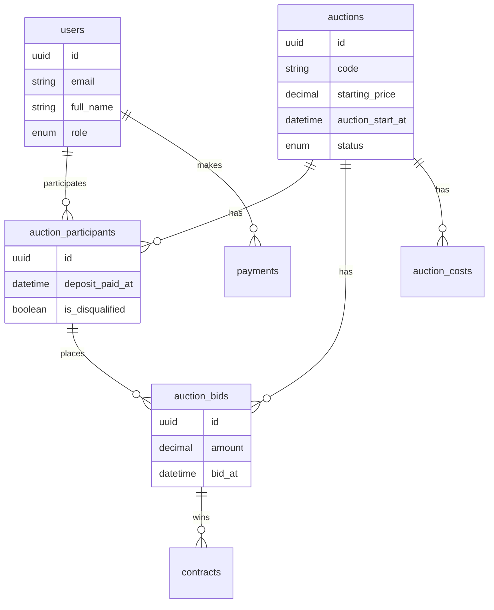
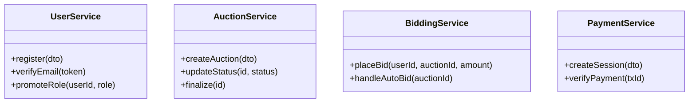
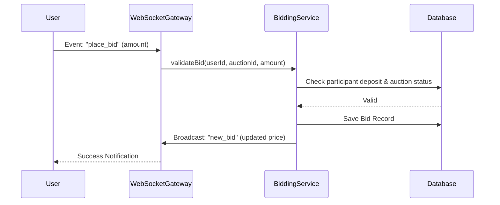

# BÁO CÁO ĐỒ ÁN MÔN HỌC: HỆ THỐNG ĐẤU GIÁ TRỰC TUYẾN (AUCTION HUB)

## GIỚI THIỆU
[Cần tự bổ sung - Giới thiệu tổng quan về tình hình công nghệ phần mềm và web]

## CHƯƠNG 1. TỔNG QUAN

### 1.1. Khảo sát hiện trạng
* **Nhu cầu thực tế:** [Cần tự bổ sung]
* **Các phần mềm cùng loại:** [Cần tự bổ sung]
* **Hạn chế của hệ thống cũ (nếu có):** [Cần tự bổ sung]

### 1.2. Cơ sở lý thuyết và Công nghệ sử dụng

* **Công nghệ Front-end:**
    * **Next.js (v15.5.5):** Framework React mạnh mẽ hỗ trợ Server-Side Rendering (SSR) và Static Site Generation (SSG), giúp tối ưu SEO và hiệu năng tải trang.
    * **Tailwind CSS (v3.4):** Framework CSS ưu tiên tiện ích (utility-first) giúp xây dựng giao diện nhanh chóng và nhất quán.
    * **Shadcn/UI & Radix UI:** Bộ thư viện component headless chất lượng cao, dễ tùy chỉnh, đảm bảo tính truy cập (accessibility).
    * **React Hook Form & Zod:** Quản lý form và validate dữ liệu phía client hiệu quả.
    * **Socket.IO Client:** Xử lý kết nối thời gian thực để cập nhật giá đấu ngay lập tức.

* **Công nghệ Back-end:**
    * **NestJS (v11.0):** Framework Node.js kiến trúc module, hỗ trợ TypeScript, giúp xây dựng hệ thống server chặt chẽ, dễ bảo trì và mở rộng.
    * **Prisma ORM (v6.17):** Công cụ ORM hiện đại giúp thao tác với cơ sở dữ liệu an toàn (type-safe) và trực quan.
    * **Socket.IO (Gateway):** Xử lý các kết nối WebSocket cho tính năng đấu giá trực tiếp (Live Bidding).
    * **BullMQ:** Quản lý hàng đợi (Message Queue) để xử lý các tác vụ nền (background jobs) như gửi email, xử lý kết thúc đấu giá.
    * **Stripe:** Tích hợp cổng thanh toán quốc tế (tìm thấy trong dependencies).

* **Hệ quản trị Cơ sở dữ liệu (DBMS):**
    * **PostgreSQL:** Hệ quản trị CSDL quan hệ mạnh mẽ, mã nguồn mở, hỗ trợ tốt các giao dịch phức tạp và dữ liệu JSONB.

* **Các thư viện/API nổi bật khác:**
    * **Passport & JWT:** Xác thực và phân quyền người dùng (Authentication & Authorization).
    * **Cloudinary:** Lưu trữ và quản lý hình ảnh/tài liệu tài sản.
    * **PDFKit:** Xuất các biểu mẫu, hợp đồng dưới dạng PDF.
    * **Nodemailer:** Gửi email thông báo tự động.

## CHƯƠNG 2. XÁC ĐỊNH VÀ PHÂN TÍCH YÊU CẦU

### 2.1. Yêu cầu chức năng
Hệ thống cung cấp các nhóm chức năng chính sau:

*   **Quản lý Tài khoản & Xác thực:** Đăng ký, Đăng nhập, Xác thực Email, Quên mật khẩu, Xác minh danh tính (KYC).
*   **Quản lý Đấu giá:** Tạo/Sửa/Xóa cuộc đấu giá, Quản lý tài sản (hình ảnh, mô tả, địa điểm), Thiết lập quy chế (giá khởi điểm, bước giá, tiền đặt trước).
*   **Tham gia Đấu giá:** Đăng ký tham gia, Nộp hồ sơ xét duyệt, Nộp tiền đặt trước (Deposit).
*   **Đấu giá Trực tuyến:** Vào phòng đấu giá, Đặt giá thủ công, Đặt giá tự động (Auto Bid), Theo dõi lịch sử đấu giá Real-time.
*   **Tài chính & Thanh toán:** Thanh toán các loại phí, Xử lý hoàn tiền (Refund), Ghi nhận giao dịch.
*   **Quản lý Hệ thống:** Cấu hình biến hệ thống, Quản lý vị trí địa lý (Locations), Quản lý bài viết/tin tức.

### 2.2. Yêu cầu phi chức năng
*   **Bảo mật:** 
    *   Mã hóa mật khẩu bằng **Bcrypt**.
    *   Xác thực qua **JWT**.
    *   Phân quyền Role-based Access Control (RBAC).
*   **Hiệu năng:** Xử lý bất đồng bộ qua Queue, cập nhật dữ liệu realtime qua WebSocket.
*   **Giao diện:** [Cần tự bổ sung]

### 2.3. Mô hình hóa yêu cầu (Use Case)
*   **Danh sách Actor:** Admin, Auctioneer (Người tổ chức), Bidder (Người đấu giá), Guest.

*   **Sơ đồ Use Case (Mermaid):**

```mermaid
usecaseDiagram
    actor "Bidder" as B
    actor "Admin" as A
    actor "Auctioneer" as AU

    package "Hệ thống Đấu giá" {
        usecase "Đăng nhập / Đăng ký" as UC1
        usecase "Đăng ký tham gia đấu giá" as UC2
        usecase "Đặt giá (Bidding)" as UC3
        usecase "Tạo cuộc đấu giá" as UC4
        usecase "Duyệt hồ sơ & Tiền cọc" as UC5
        usecase "Quản lý hệ thống" as UC6
    }

    B --> UC1
    B --> UC2
    B --> UC3
    
    AU --> UC1
    AU --> UC4
    AU --> UC5

    A --> UC1
    A --> UC6
    A --> UC5
```

*   **Đặc tả Use Case chi tiết:** [Cần tự bổ sung tên các Use Case chính cần viết]

## CHƯƠNG 3. THIẾT KẾ

### 3.1. Thiết kế dữ liệu (Database Design)

*   **Sơ đồ ERD (Mermaid):**



*   **Mô tả chi tiết:** Hệ thống sử dụng PostgreSQL với Schema được quản lý bởi Prisma. Các bảng chính bao gồm `users`, `auctions`, `auction_participants`, `auction_bids`, `payments`, `contracts`.

### 3.2. Thiết kế xử lý (Class Diagram)

*   **Sơ đồ Class (Mermaid):**



### 3.3. Sơ đồ tuần tự (Sequence Diagram)
*   **Chức năng:** Đặt giá (Place Bid)



### 3.4. Thiết kế giao diện
[Cần tự bổ sung - Chèn hình ảnh giao diện thực tế của ứng dụng]

## CHƯƠNG 4. TỔNG KẾT

### 4.1. Kết quả đạt được
*   Hoàn thiện hệ thống Đấu giá trực tuyến với đầy đủ quy trình nghiệp vụ.
*   Ứng dụng kiến trúc Micro-services/Modular Monolith với NestJS.
*   Xử lý dữ liệu thời gian thực cho phiên đấu giá.
*   Tích hợp thanh toán và quản lý hồ sơ tài liệu an toàn.

### 4.2. Hạn chế và Hướng phát triển
*   **Hạn chế:** [Cần tự bổ sung]
*   **Hướng phát triển:** [Cần tự bổ sung]

## TÀI LIỆU THAM KHẢO
1. NestJS Documentation: https://docs.nestjs.com/
2. Next.js Documentation: https://nextjs.org/
3. Prisma ORM: https://www.prisma.io/
4. Socket.io: https://socket.io/
