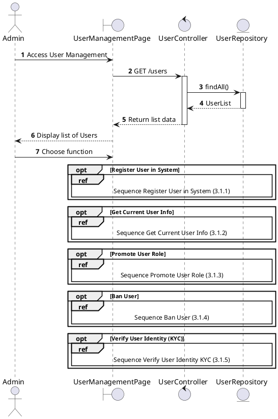
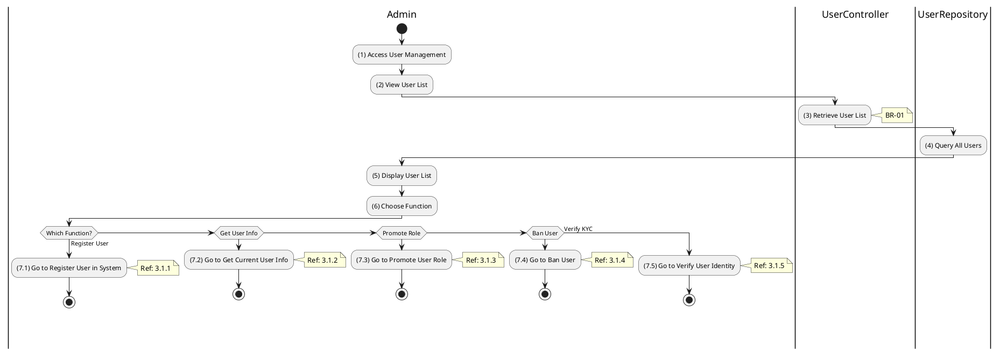

# Use Case 3.1.0: Manage User

## 1. Use Case Description

| Field              | Content                                                                                                                               |
| :----------------- | :------------------------------------------------------------------------------------------------------------------------------------ |
| **Name**           | Manage User                                                                                                                           |
| **Description**    | This use case allows the **Admin** to choose one of the corresponding functions of CRUD to adjust **User** information in the system. |
| **Actor**          | **Admin**, **Super Admin**                                                                                                            |
| **Trigger**        | When the **Admin** clicks on the "**User**" button on the navigation sidebar.                                                         |
| **Pre-condition**  | 1. **Admin**'s device must be connected to the internet. 2. **Admin** is signed in with their account.                             |
| **Post-condition** | The **User** information is updated to the corresponding function that the **Admin** executes.                                        |

---

## 2. Sequence Flow

---

## 3. Activities Flow (Swimlanes)

---

## 4. Business Rules

| Activity | BR Code   | Description                                                                                                                                                                                                                                                                                                                                                                                                                                                                                                                                                                                                                                                                                                                                                                                                                                                                     |
| :------- | :-------- | :------------------------------------------------------------------------------------------------------------------------------------------------------------------------------------------------------------------------------------------------------------------------------------------------------------------------------------------------------------------------------------------------------------------------------------------------------------------------------------------------------------------------------------------------------------------------------------------------------------------------------------------------------------------------------------------------------------------------------------------------------------------------------------------------------------------------------------------------------------------------------ |
| **(5)**  | **BR-01** | **Displaying Rules:** ❖ The system displays a “UserManagementPage” screen. (Refer to “User Management” view in “View Description” file). ❖ The system calls `UserController.findAll()` to retrieve the list of users. ❖ The datagrid is rendered with columns: [ID], [Email], [FullName], [Role], [Status], and [Type], populated with data from the API response.                                                                                                                                                                                                                                                                                                                                                                                                                                                                                     |
| **(6)**  | **BR-02** | **Choosing Rules:** ❖ The Admin chooses a specific function to execute. The system uses `Frontend_Navigation()` to handle the redirection. ❖ If the Admin selects “Register User”, the system redirects to the registration flow (Ref: `3.1.1`). ❖ If “Promote User” is selected, the system redirects to the role promotion flow (Ref: `3.1.3`). ❖ If “Ban User” is selected, the system initiates the ban workflow (Ref: `3.1.4`). ❖ If “Verify KYC” is selected, the system redirects to the identity verification flow (Ref: `3.1.5`). ❖ The Admin can only choose one feature at a time.                                                                                                                                                                                                                                                           |

---

## 5. Related Child Use Cases

| Use Case ID | Use Case Name              | Description                                     |
| :---------- | :------------------------- | :---------------------------------------------- |
| 3.1.1       | Register User in System    | Register a new user into the system             |
| 3.1.2       | Get Current User Info      | Retrieve current authenticated user information |
| 3.1.3       | Promote User Role          | Upgrade a user's role in the system             |
| 3.1.4       | Ban User                   | Ban/suspend a user from the platform            |
| 3.1.5       | Verify User Identity (KYC) | Verify user's identity documents                |
