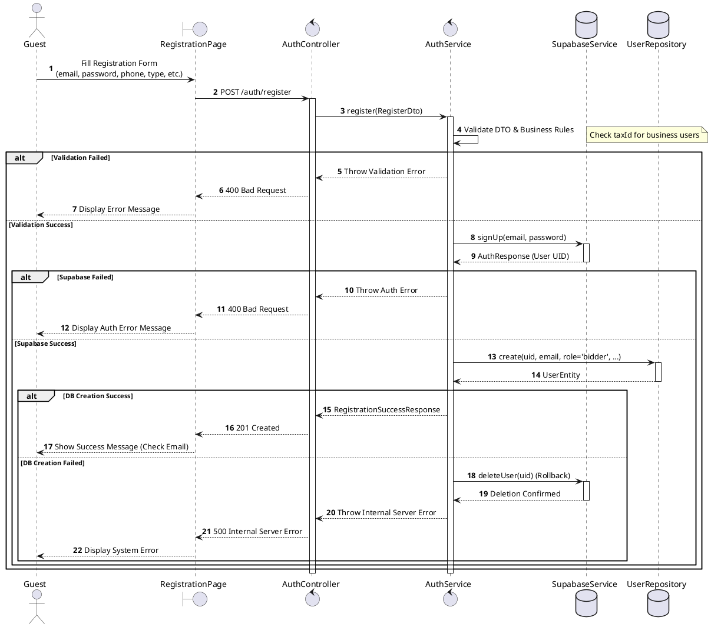
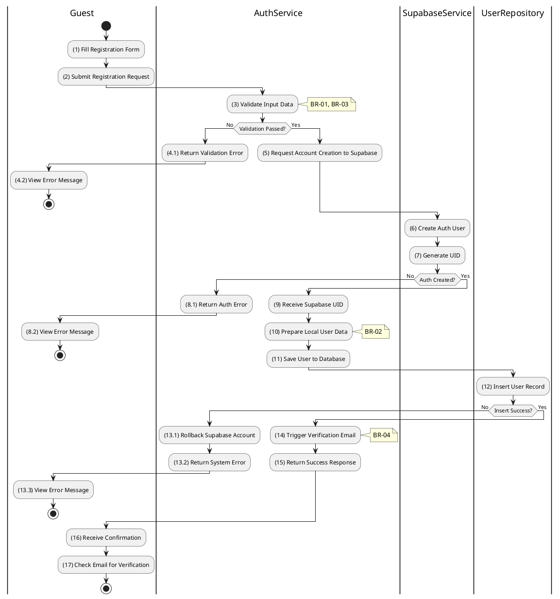

# 3.1.1 Register User in System

## 1. Use Case Description

| Field              | Description                                                                                           |
| ------------------ | ----------------------------------------------------------------------------------------------------- |
| **Name**           | Register User in System                                                                               |
| **Description**    | This use case allows the Guest to create a new User information in the system.                        |
| **Actor**          | Guest                                                                                                 |
| **Trigger**        | When the Guest clicks on the 'Register' button on the RegistrationPage.                               |
| **Pre-condition**  | • Guest's device must be connected to the internet. • Guest is on the RegistrationPage.            |
| **Post-condition** | The User information will be stored into the system and display verification email sent confirmation. |

## 2. Sequence Flow (MVC)

## 3. Activities Flow (Swimlanes)

## 4. Business Rules

| Activity | BR Code   | Description                                                                                                                                                                                                                                                                                                                                                                                                                                                                                                  |
| :------- | :-------- | :----------------------------------------------------------------------------------------------------------------------------------------------------------------------------------------------------------------------------------------------------------------------------------------------------------------------------------------------------------------------------------------------------------------------------------------------------------------------------------------------------------- |
| **(1)**  | **BR-01** | **Displaying Rule:** The system displays a 'RegistrationPage' screen. (Refer to 'RegistrationPage' view in 'View Description' file). The form contains input fields for: email, password, phone, userType, taxId (conditional), and other required registration data.                                                                                                                                                                                                                                  |
| **(1)**  | **BR-02** | **Validation Rule (Front-end):** When user enters information, system uses `Text_change()` method. Checks if input is valid (empty, wrong format). If `isEmpty()` on mandatory fields → display **MSG 1** (Mandatory field required). If wrong email format → display **MSG 4** (Invalid format). If `userType = 'business'` and `taxId` is empty → display **MSG 1**.                                                                                                                        |
| **(2)**  | **BR-03** | **Validation Rule (Back-end/Save):** When user clicks 'Register' button, send data to database via function `register(RegisterDto)`. Check table `USERS` for email uniqueness constraint. If email exists → show **MSG 2** (Conflict - Email already registered). Else, proceed to Supabase account creation.                                                                                                                                                                                    |
| **(12)** | **BR-04** | **Storing Rule:** The input data will be checked by table `USERS` in the database (Refer to 'USERS' table in 'DB Sheet' file) to check if there are any constraints. Else data of the User will be stored as a new record in table `USERS`. Set role = 'bidder', status = 'UNVERIFIED'. If insert fails → call rollback via `deleteUser(uid)` on Supabase, show **MSG 9** (System Error), close view. Else → show **MSG 7** (Success), trigger verification email, display confirmation message. |
| **(16)** | **BR-05** | **Displaying Rule (Confirmation):** The system displays a success confirmation screen instructing user to check their email for verification link. User is redirected or shown the 'Check Email' instruction view.                                                                                                                                                                                                                                                                                     |
