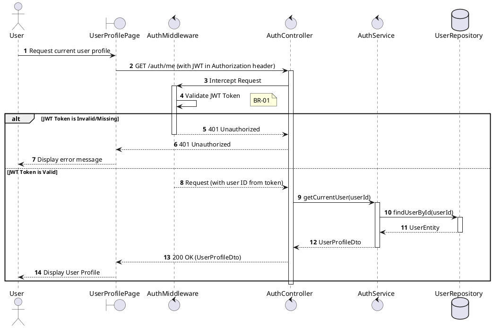
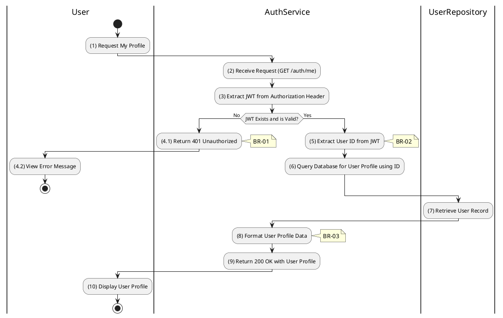

# 3.1.2 Get Current User Info

## 1. Use Case Description

| Field              | Description                                                                                             |
| ------------------ | ------------------------------------------------------------------------------------------------------- |
| **Name**           | Get Current User Info                                                                                   |
| **Description**    | This use case allows the User to search User Profile information in the system based on input keywords. |
| **Actor**          | User                                                                                                    |
| **Trigger**        | When User clicks on the 'Profile' button on the UserProfilePage screen.                                 |
| **Pre-condition**  | • User's device must be connected to the internet. • User is signed in with their account.           |
| **Post-condition** | The User Profile information will be displayed on the UserProfilePage screen.                           |

## 2. Sequence Flow (MVC)

## 3. Activities Flow (Swimlanes)

## 4. Business Rules

| Activity | BR Code   | Description                                                                                                                                                                                                                                                                         |
| :------- | :-------- | :---------------------------------------------------------------------------------------------------------------------------------------------------------------------------------------------------------------------------------------------------------------------------------- |
| **(1)**  | **BR-01** | **Searching Rule:** When user requests profile, system extracts JWT from Authorization header. System validates token via `validateJWT()` method. If token is missing or invalid → display **MSG 4** (Unauthorized), return 401.                                           |
| **(7)**  | **BR-02** | **Querying Rule:** System queries data in the table 'USERS' in the database (Refer to 'USERS' table in 'DB Sheet' file) based on the extracted user ID from JWT token. Call method `displayUserInformation(userData)` to populate profile view.                               |
| **(10)** | **BR-03** | **Displaying Rule:** The system displays a 'UserProfilePage' screen. (Refer to 'UserProfilePage' view in 'View Description' file). Profile data is populated with: email, role, userType, isVerified status. Sensitive fields (password hashes) are excluded from display. |
