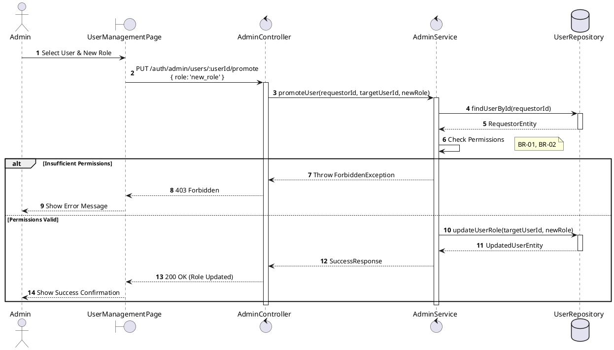
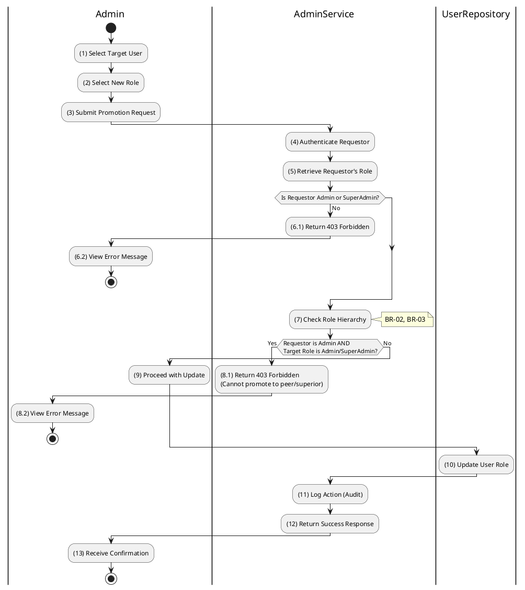

# 3.1.3 Promote User Role

## 1. Use Case Description

| Field              | Description                                                                                                    |
| ------------------ | -------------------------------------------------------------------------------------------------------------- |
| **Name**           | Promote User Role                                                                                              |
| **Description**    | This use case allows the Admin to update existing User Role information in the system.                         |
| **Actor**          | Admin                                                                                                          |
| **Trigger**        | When the Admin clicks on the [Icon Edit] button on the right of each item on the UserManagementPage datagrid.  |
| **Pre-condition**  | • Admin's device must be connected to the internet. • Admin is signed in with their account.                |
| **Post-condition** | The User Role information will be updated in the system and display new record on UserManagementPage datagrid. |

## 2. Sequence Flow (MVC)

## 3. Activities Flow (Swimlanes)

## 4. Business Rules

| Activity | BR Code   | Description                                                                                                                                                                                                                                                                                                                                                                                                                                                                                                                                                                                                                                                                                                                                                                                                                                                                                                                                                                                                 |
| :------- | :-------- | :---------------------------------------------------------------------------------------------------------------------------------------------------------------------------------------------------------------------------------------------------------------------------------------------------------------------------------------------------------------------------------------------------------------------------------------------------------- |
| **(1)**  | **BR-01** | **Displaying Rules:** ❖ The system displays a “UserManagementPage” screen in edit mode. (Refer to “UserManagementPage” view in “View Description” file). ❖ The system calls `Display_View()` to show the target user's details. ❖ The system populates the Role dropdown with available options: [Bidder], [Auctioneer], [Admin], and [Super Admin].                                                                                                                                                                                                                                                                                                                                                                                                                                                                                                                                                                                                                               |
| **(2)**  | **BR-02** | **Validation Rules (Input):** ❖ When the Admin selects a role, the system uses the `Selection_change()` method to validate the input. ❖ If the input is not valid: ⮚ If the [role] field is empty, the system displays **MSG 1** (Mandatory Field).                                                                                                                                                                                                                                                                                                                                                                                                                                                                                                                                                                                                                                                                                                                                  |
| **(7)**  | **BR-03** | **Authorization Rules (Back-end):** ❖ When the Admin submits the promotion, the system calls `AdminService.promoteUser(userId, promoteUserDto)`. ❖ The system checks the hierarchy constraints between the Requestor and the Target. ❖ If the input is not valid: ⮚ If an 'admin' tries to promote a user to 'admin' or higher, the system returns a 403 Forbidden status. ⮚ The system displays **MSG 6** (Insufficient Permissions).                                                                                                                                                                                                                                                                                                                                                                                                                                                                                                                                         |
| **(10)** | **BR-04** | **Storing Rules:** ❖ The system executes the promotion by updating the table “USERS” in the database. ❖ It sets the [role] field to the selected [NewRole]. ❖ The system logs the action in the audit trail. ❖ System moves to step (12) and displays successful notification (Refer to **MSG 7**).                                                                                                                                                                                                                                                                                                                                                                                                                                                                                                                                                                                                                                                                              |
