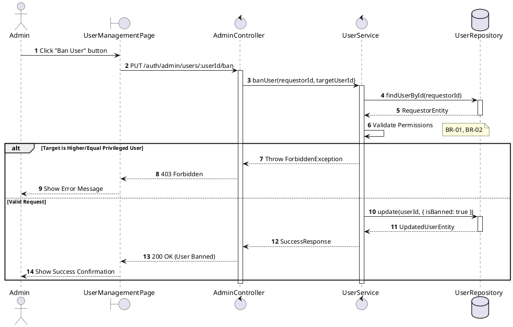
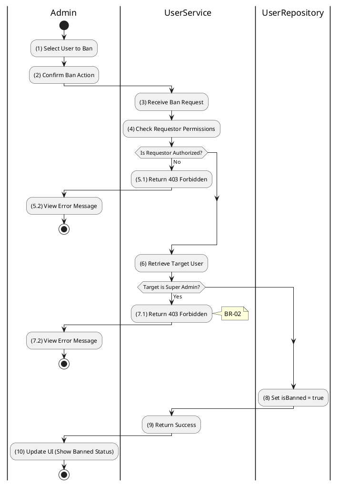

# 3.1.4 Ban User

## 1. Use Case Description

| Field              | Description                                                                                                      |
| ------------------ | ---------------------------------------------------------------------------------------------------------------- |
| **Name**           | Ban User                                                                                                         |
| **Description**    | This use case allows the Admin to update existing User Status information in the system.                         |
| **Actor**          | Admin                                                                                                            |
| **Trigger**        | When the Admin clicks on the 'Ban User' button on the UserManagementPage.                                        |
| **Pre-condition**  | • Admin's device must be connected to the internet. • Admin is signed in with their account.                  |
| **Post-condition** | The User Status information will be updated in the system and display new record on UserManagementPage datagrid. |

## 2. Sequence Flow (MVC)

## 3. Activities Flow (Swimlanes)

## 4. Business Rules

| Activity | BR Code   | Description                                                                                                                                                                                                                                                                                                                                                                                                                                                                                                                                                                                                                                                                                                                                                                                                                                                                     |
| :------- | :-------- | :------------------------------------------------------------------------------------------------------------------------------------------------------------------------------------------------------------------------------------------------------------------------------------------------------------------------------------------------------------------------------------------------------------------------------------------------------------------------------------------------------------------------------------------------------------------------------------------------------------------------------------------------------------------------------------------------------------------------------------------------------------------------------------------------------------------------------------------------------------------------------ |
| **(1)**  | **BR-01** | **Displaying Rules (Confirmation):** ❖ The system triggers a confirmation modal by calling `Display_Modal('ConfirmationBox')`. (Refer to “ConfirmationBox” view in “View Description” file). ❖ The system displays the message **MSG 11** ("Confirm ban action for user [Name]?"). ❖ The Admin must select [Confirm] or [Cancel].                                                                                                                                                                                                                                                                                                                                                                                                                                                                                                                      |
| **(2)**  | **BR-02** | **Validation Rules (Back-end):** ❖ When the Admin confirms the action, the system calls `UserService.banUser(userId)` to process the request. ❖ The system checks the role hierarchy in the table “USERS”. ❖ If the input is not valid: ⮚ If the [Requestor.role] is lower than or equal to the [Target.role], the system forbids the action. ⮚ The system returns a 403 Forbidden status and displays **MSG 6** (Cannot ban superior/peer).                                                                                                                                                                                                                                                                                                                                                                                                            |
| **(8)**  | **BR-03** | **Storing Rules:** ❖ If authorized, the system updates the record in the table “USERS” by setting the [isBanned] field to `true`. ❖ System moves to step (10) and displays successful notification (Refer to **MSG 7**). ❖ The system refreshes the User List to reflect the new status.                                                                                                                                                                                                                                                                                                                                                                                                                                                                                                                                                               |