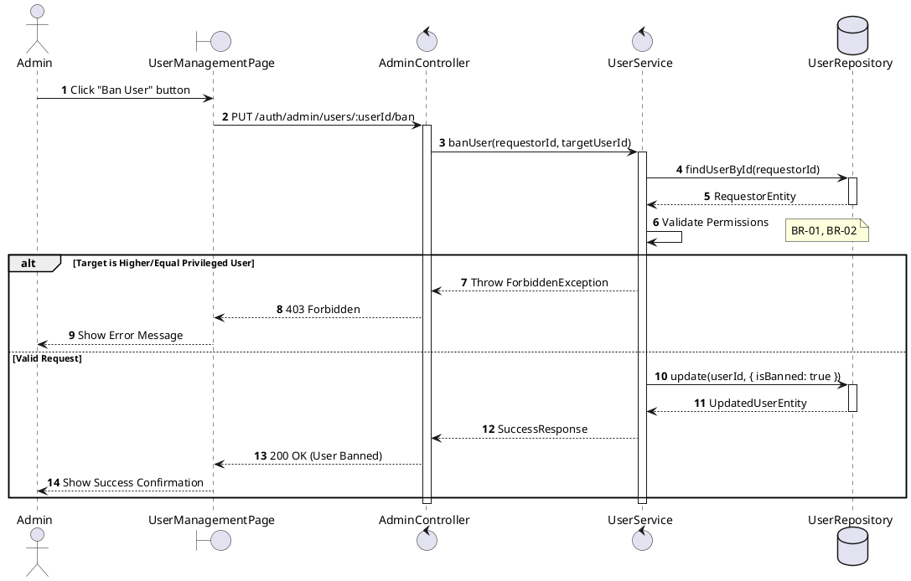
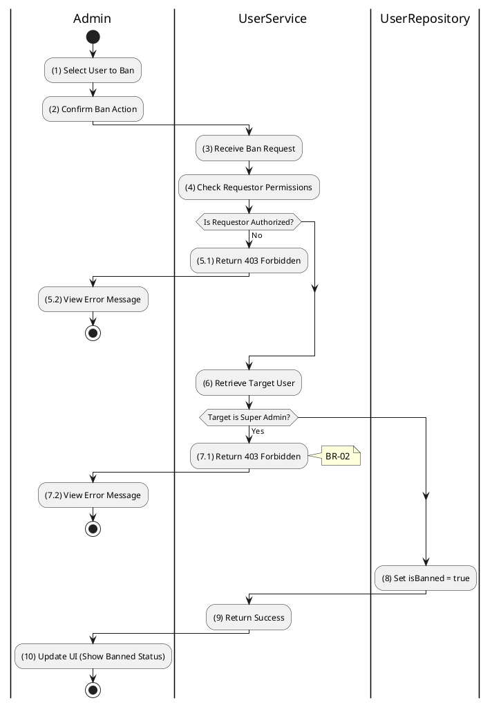

# 3.1.4 Ban User

## 1. Use Case Description

| Field              | Description                                                                                                      |
| ------------------ | ---------------------------------------------------------------------------------------------------------------- |
| **Name**           | Ban User                                                                                                         |
| **Description**    | This use case allows the Admin to update existing User Status information in the system.                         |
| **Actor**          | Admin                                                                                                            |
| **Trigger**        | When the Admin clicks on the 'Ban User' button on the UserManagementPage.                                        |
| **Pre-condition**  | • Admin's device must be connected to the internet. • Admin is signed in with their account.                  |
| **Post-condition** | The User Status information will be updated in the system and display new record on UserManagementPage datagrid. |

## 2. Sequence Flow (MVC)

## 3. Activities Flow (Swimlanes)

## 4. Business Rules

| Activity | BR Code   | Description                                                                                                                                                                                                                                                                                                                           |
| :------- | :-------- | :------------------------------------------------------------------------------------------------------------------------------------------------------------------------------------------------------------------------------------------------------------------------------------------------------------------------------------ |
| **(1)**  | **BR-01** | **Querying Rule:** System queries data in the table 'USERS' in the database (Refer to 'USERS' table in 'DB Sheet' file) based on the clicked user ID. Call method `displayUserInformation(targetUser)` to show user details with current status.                                                                                |
| **(2)**  | **BR-02** | **Displaying Rule:** The system displays a 'Confirmation message box' screen. (Refer to View Description) with **MSG 11** (Confirm ban action?). Shows target user name and confirmation buttons.                                                                                                                               |
| **(2)**  | **BR-03** | **Selecting Rule:** User selects button. If 'Cancel', use `Close()` to end. If 'Confirm', call method `banUser(targetUserId)`.                                                                                                                                                                                                  |
| **(8)**  | **BR-04** | **Validation Rule (Back-end/Save):** Check selection against table `USERS` for constraints (role hierarchy). If target is super_admin or higher role than requestor → display **MSG 6** (Cannot ban superior). Else, update `isBanned = true` in `USERS` table, display **MSG 7** (Success), use `Close()`, update datagrid. |
