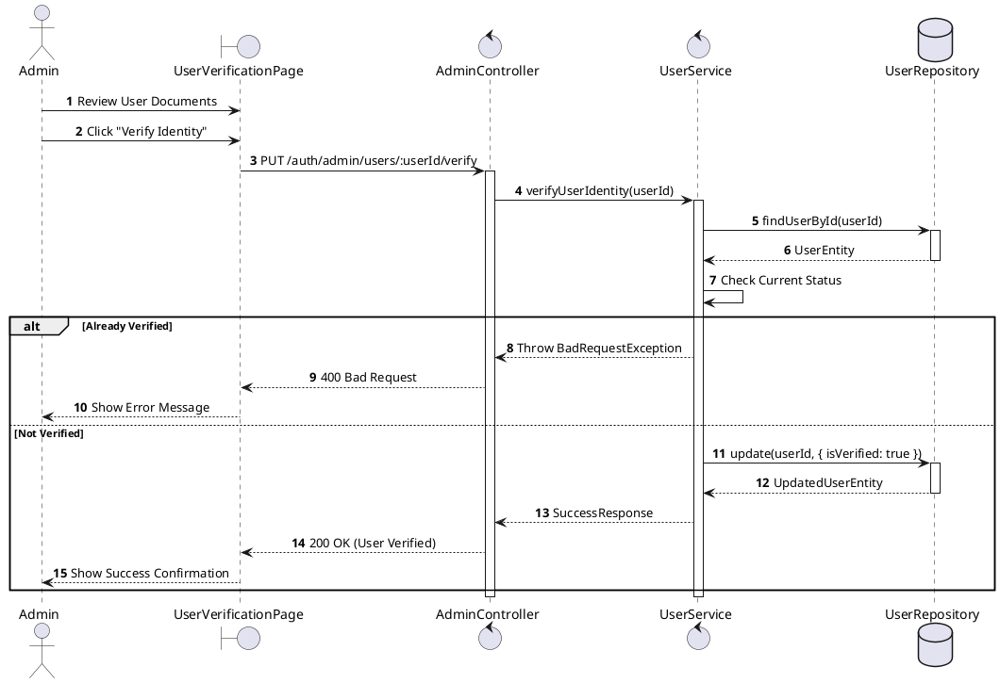
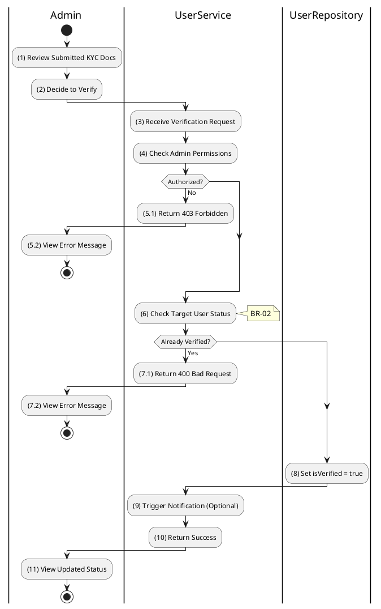

# 3.1.5 Verify User Identity (KYC)

## 1. Use Case Description

| Field              | Description                                                                                                              |
| ------------------ | ------------------------------------------------------------------------------------------------------------------------ |
| **Name**           | Verify User Identity (KYC)                                                                                               |
| **Description**    | This use case allows the Admin to update existing User Verification information in the system.                           |
| **Actor**          | Admin                                                                                                                    |
| **Trigger**        | When the Admin clicks on the 'Verify Identity' button on the UserVerificationPage.                                       |
| **Pre-condition**  | • Admin's device must be connected to the internet. • Admin is signed in with their account.                          |
| **Post-condition** | The User Verification information will be updated in the system and display new record on UserVerificationPage datagrid. |

## 2. Sequence Flow (MVC)

## 3. Activities Flow (Swimlanes)

## 4. Business Rules

| Activity | BR Code   | Description                                                                                                                                                                                                                                                                                                                                                                                                                                                                                                                                                                                                                                                                                                                                                                                                                                                                     |
| :------- | :-------- | :------------------------------------------------------------------------------------------------------------------------------------------------------------------------------------------------------------------------------------------------------------------------------------------------------------------------------------------------------------------------------------------------------------------------------------------------------------------------------------------------------------------------------------------------------------------------------------------------------------------------------------------------------------------------------------------------------------------------------------------------------------------------------------------------------------------------------------------------------------------------------ |
| **(1)**  | **BR-01** | **Displaying Rules:** ❖ The system renders the “UserVerificationPage” screen for the specified user via `Display_View(userId)`. ❖ It queries the “USERS” table by ID to retrieve the user's data. ❖ The system displays a preview area containing the [identityNumber] and [identityImages] submitted by the user, along with their current verification status.                                                                                                                                                                                                                                                                                                                                                                                                                                                                                               |
| **(6)**  | **BR-02** | **Validation Rules (Front-end):** ❖ The system performs a status check using `checkVerificationStatus()` before enabling actions. ❖ If the input is not valid: ⮚ If the user's [isVerified] status is already `true`, the system disables the “Verify Identity” button. ⮚ The system displays **MSG 9** (User already verified) to inform the admin.                                                                                                                                                                                                                                                                                                                                                                                                                                                                                                       |
| **(8)**  | **BR-03** | **Storing Rules (Back-end):** ❖ When the Admin confirms verification, the system invokes `AdminService.verifyUserIdentity(userId)`. ❖ The system checks the current status in the “USERS” table. ❖ If the input is not valid: ⮚ If the user is already verified, it returns a 400 Bad Request error. ❖ Otherwise, the system updates the record in the “USERS” table, setting [isVerified] to `true`. ❖ System moves to step (9) and triggers a notification to the user. ❖ The system displays **MSG 7** (Success) on the screen.                                                                                                                                                                                                                                                                                          |
