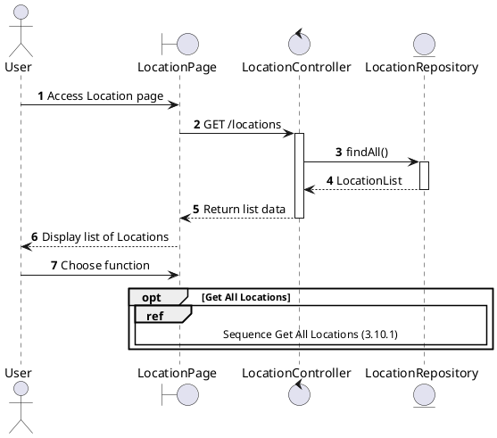
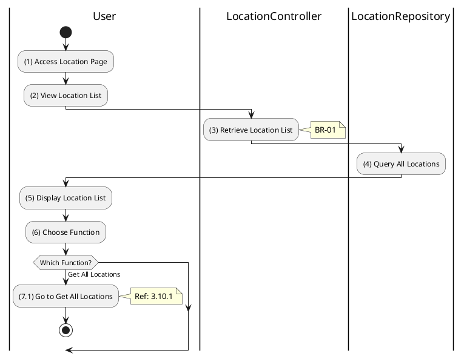

# Use Case 3.10.0: Manage Location

## 1. Use Case Description

| Field              | Content                                                                                                                                  |
| :----------------- | :--------------------------------------------------------------------------------------------------------------------------------------- |
| **Name**           | Manage Location                                                                                                                          |
| **Description**    | This use case allows the **User** to choose one of the corresponding functions of CRUD to adjust **Location** information in the system. |
| **Actor**          | **All (Public)**                                                                                                                         |
| **Trigger**        | When the **User** clicks on the "**Location**" button on the navigation sidebar or accesses location-related features.                   |
| **Pre-condition**  | 1. **User**'s device must be connected to the internet.                                                                                  |
| **Post-condition** | The **Location** information is updated to the corresponding function that the **User** executes.                                        |

---

## 2. Sequence Flow

---

## 3. Activities Flow (Swimlanes)

---

## 4. Business Rules

| Activity | BR Code   | Description                                                                                                                                                                                                                                                                                                                                                                                                                                                  |
| :------- | :-------- | :----------------------------------------------------------------------------------------------------------------------------------------------------------------------------------------------------------------------------------------------------------------------------------------------------------------------------------------------------------------------------------------------------------------------------------------------------------- |
| **(5)**  | **BR-01** | **Displaying Rules:** ❖ The system loads the “LocationPage” screen via `Display_View()`. (Refer to “LocationPage” view in “View Description” file). ❖ The system renders a hierarchical tree or list view of the available locations (Provinces, Districts, Wards).                                                                                                                                                                                    |
| **(6)**  | **BR-02** | **Choosing Rules:** ❖ The user selects a function from the available options. The system uses `Frontend_Navigation()` to direct the user. ❖ If the user selects "View All Locations", the system redirects to the full location listing workflow (Ref: `3.10.1`). ❖ The User can only choose one feature at a time.                                                                                                                                 |

---

## 5. Related Child Use Cases

| Use Case ID | Use Case Name     | Description                                             |
| :---------- | :---------------- | :------------------------------------------------------ |
| 3.10.1      | Get All Locations | Retrieve hierarchical list of provinces/districts/wards |
