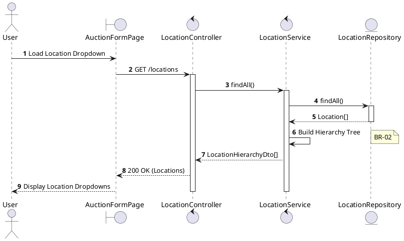
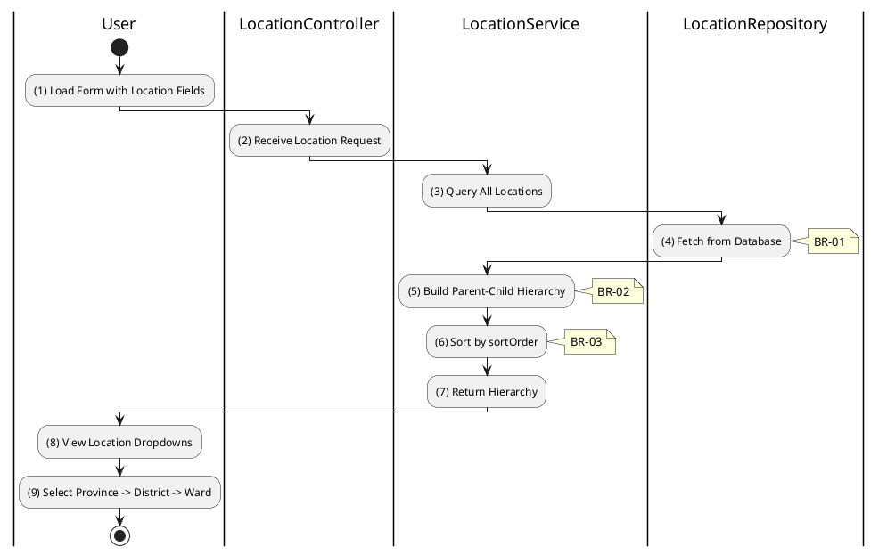

# 3.10.1 Get All Locations

## 1. Use Case Description

| Field              | Description                                                                                             |
| ------------------ | ------------------------------------------------------------------------------------------------------- |
| **Name**           | Get All Locations                                                                                       |
| **Description**    | This use case allows any user to retrieve the hierarchical location data (provinces, districts, wards). |
| **Actor**          | All (Public - Guest, Bidder, Auctioneer, Admin)                                                         |
| **Trigger**        | When the user requests `GET /locations` or when location dropdown is loaded on auction forms.           |
| **Pre-condition**  | • User's device must be connected to the internet.                                                      |
| **Post-condition** | The location hierarchy is retrieved and displayed for selection.                                        |

## 2. Sequence Flow (MVC)

## 3. Activities Flow (Swimlanes)

## 4. Business Rules

| Activity | BR Code   | Description                                                                                                                                                                                                                   |
| :------- | :-------- | :---------------------------------------------------------------------------------------------------------------------------------------------------------------------------------------------------------------------------- |
| **(1)**  | **BR-01** | **Displaying Rule (Location Dropdowns):** System displays cascading dropdowns for location selection. Fields: Province → District → Ward. Each level filters based on parent selection.                              |
| **(4)**  | **BR-02** | **Querying Rule:** System retrieves data from the 'LOCATION' table in the database. Includes: id, name, value, sortOrder, parentId. Returns all locations in single query for efficiency.                            |
| **(5)**  | **BR-03** | **Processing Rule (Hierarchy Building):** System builds parent-child relationships using `parentId`. Province level: parentId = null. District level: parentId = province.id. Ward level: parentId = district.id. |
| **(6)**  | **BR-04** | **Processing Rule (Sorting):** System sorts locations by `sortOrder` field within each level. Ensures consistent ordering across UI. Alphabetical fallback if sortOrder is equal.                                    |
| **(9)**  | **BR-05** | **Processing Rule (Cascading Selection):** When user selects province, system filters districts. When user selects district, system filters wards. Enables hierarchical address selection.                           |
