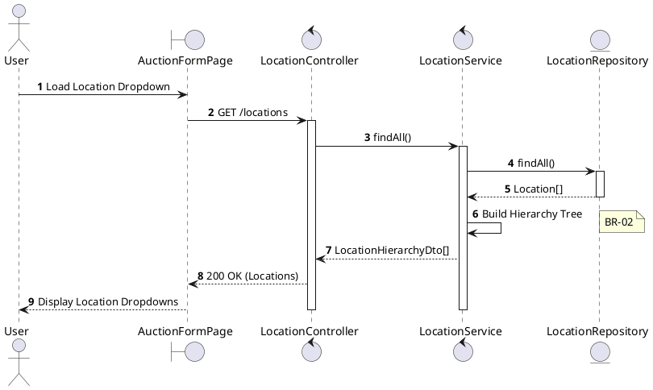
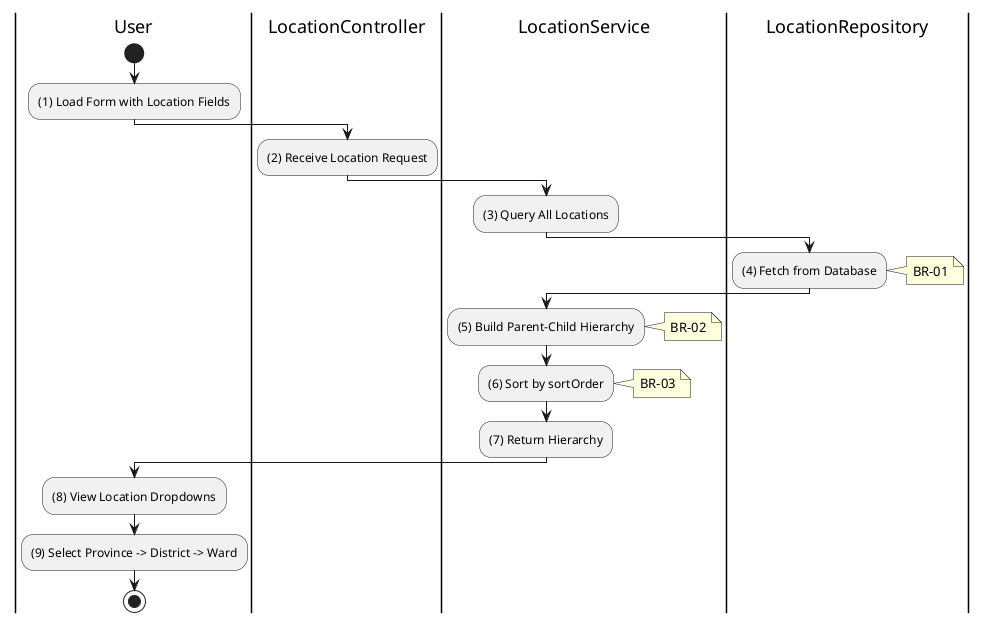

# 3.10.1 Get All Locations

## 1. Use Case Description

| Field              | Description                                                                                             |
| ------------------ | ------------------------------------------------------------------------------------------------------- |
| **Name**           | Get All Locations                                                                                       |
| **Description**    | This use case allows any user to retrieve the hierarchical location data (provinces, districts, wards). |
| **Actor**          | All (Public - Guest, Bidder, Auctioneer, Admin)                                                         |
| **Trigger**        | When the user requests `GET /locations` or when location dropdown is loaded on auction forms.           |
| **Pre-condition**  | • User's device must be connected to the internet.                                                      |
| **Post-condition** | The location hierarchy is retrieved and displayed for selection.                                        |

## 2. Sequence Flow (MVC)

## 3. Activities Flow (Swimlanes)

## 4. Business Rules

| Activity | BR Code   | Description                                                                                                                                                                                                                                                                                                                                                                                                                                                                                                                                                                                                                                                                                                                                                                                                                                                                     |
| :------- | :-------- | :------------------------------------------------------------------------------------------------------------------------------------------------------------------------------------------------------------------------------------------------------------------------------------------------------------------------------------------------------------------------------------------------------------------------------------------------------------------------------------------------------------------------------------------------------------------------------------------------------------------------------------------------------------------------------------------------------------------------------------------------------------------------------------------------------------------------------------------------------------------------------ |
| **(1)**  | **BR-01** | **Displaying Rules (UI):** ❖ The system calls `Display_Dropdowns(LocationHierarchyDto)` to render the selection interface. ❖ It displays three linked dropdown menus: [Province], [District], and [Ward]. ❖ Initially, only the [Province] dropdown is enabled, while [District] and [Ward] remain disabled until a parent selection is made.                                                                                                                                                                                                                                                                                                                                                                                                                                                                                                                  |
| **(4)**  | **BR-02** | **Querying Rules:** ❖ The system invokes `LocationService.findAll()` to retrieve location data. ❖ It calls `LocationRepository.findAll()` to fetch records from the “LOCATION” table. ❖ The query selects specific fields: [id], [name], [value], [sortOrder], and [parentId] to optimize the payload.                                                                                                                                                                                                                                                                                                                                                                                                                                                                                                                                                                 |
| **(5)**  | **BR-03** | **Processing Rules (Hierarchy):** ❖ The system constructs the location tree using `LocationService.buildHierarchy(locations)`. ❖ It identifies Root Nodes as records where [parentId] is NULL (representing Provinces). ❖ It maps Child Nodes (Districts and Wards) to their respective parents based on the [parentId] relationship.                                                                                                                                                                                                                                                                                                                                                                                                                                                                                                                                  |
| **(6)**  | **BR-04** | **Processing Rules (Sorting):** ❖ The system organizes the location data using `LocationService.sortLocations(locations)`. ❖ It sorts the list primarily by [sortOrder] in ascending order. ❖ If [sortOrder] values are equal, it applies a secondary sort by [name] in ascending alphabetical order.                                                                                                                                                                                                                                                                                                                                                                                                                                                                                                                                                                  |
| **(9)**  | **BR-05** | **Validation Rules (Front-end):** ❖ When the user changes a selection, the system triggers the `Selection_change()` event. ❖ If the input is not valid: ⮚ If the [Province] selection changes, the system filters the District list to show only those where [parentId] matches the selected [ProvinceID]. ⮚ The system then enables the District dropdown for user interaction.                                                                                                                                                                                                                                                                                                                                                                                                                                                                                    |
