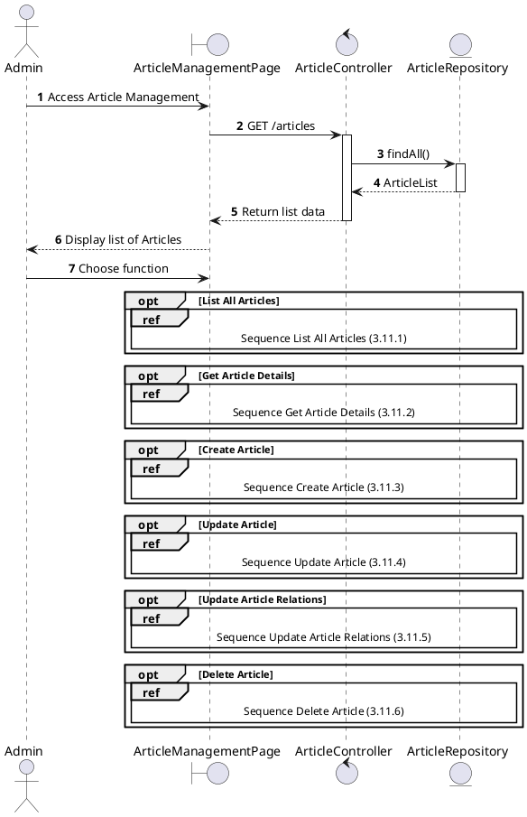
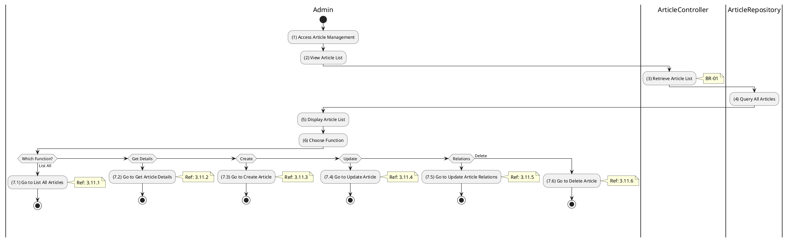

# Use Case 3.11.0: Manage Article

## 1. Use Case Description

| Field              | Content                                                                                                                                  |
| :----------------- | :--------------------------------------------------------------------------------------------------------------------------------------- |
| **Name**           | Manage Article                                                                                                                           |
| **Description**    | This use case allows the **Admin** to choose one of the corresponding functions of CRUD to adjust **Article** information in the system. |
| **Actor**          | **Admin**, **All (Public for viewing)**                                                                                                  |
| **Trigger**        | When the **Admin** clicks on the "**Article**" button on the navigation sidebar.                                                         |
| **Pre-condition**  | 1. **Admin**'s device must be connected to the internet. 2. **Admin** is signed in with their account.                                |
| **Post-condition** | The **Article** information is updated to the corresponding function that the **Admin** executes.                                        |

---

## 2. Sequence Flow

---

## 3. Activities Flow (Swimlanes)

---

## 4. Business Rules

| Activity | BR Code   | Description                                                                                                                                                                                                                                                                                                                                                                                                                                                                                                                                                                                                                                                                                                                                                                                                                                                                     |
| :------- | :-------- | :------------------------------------------------------------------------------------------------------------------------------------------------------------------------------------------------------------------------------------------------------------------------------------------------------------------------------------------------------------------------------------------------------------------------------------------------------------------------------------------------------------------------------------------------------------------------------------------------------------------------------------------------------------------------------------------------------------------------------------------------------------------------------------------------------------------------------------------------------------------------------ |
| **(5)**  | **BR-01** | **Displaying Rules:** ❖ The system renders the “ArticleManagementPage” screen by calling `ArticleController.listAll()`. (Refer to “Article Management” view in “View Description” file). ❖ It displays a datagrid containing columns for [ID], [Title], [Type], [Author], and [CreatedAt], populated with the list of articles.                                                                                                                                                                                                                                                                                                                                                                                                                                                                                                                                   |
| **(6)**  | **BR-02** | **Choosing Rules:** ❖ The Admin selects a function from the sidebar or action menu. The system handles navigation via `Frontend_Navigation()`. ❖ If “View List” is selected, the system redirects to `3.11.1`. ❖ If “View Details” is selected, it redirects to the detail view `3.11.2`. ❖ If “Create Article” is selected, the system opens the creation form `3.11.3`. ❖ If “Update Article” is selected, it redirects to the edit interface `3.11.4`. ❖ If “Relations” is selected, it opens the relationship manager `3.11.5`. ❖ If “Delete Article” is selected, the system initiates the deletion process `3.11.6`. ❖ The Admin can only choose one feature at a time.                                                                                                                                                                 |

---

## 5. Related Child Use Cases

| Use Case ID | Use Case Name            | Description                                     |
| :---------- | :----------------------- | :---------------------------------------------- |
| 3.11.1      | List All Articles        | Retrieve and display all articles               |
| 3.11.2      | Get Article Details      | View detailed information of a specific article |
| 3.11.3      | Create Article           | Create a new article                            |
| 3.11.4      | Update Article           | Modify existing article content                 |
| 3.11.5      | Update Article Relations | Manage related articles linkage                 |
| 3.11.6      | Delete Article           | Remove an article from the system               |
