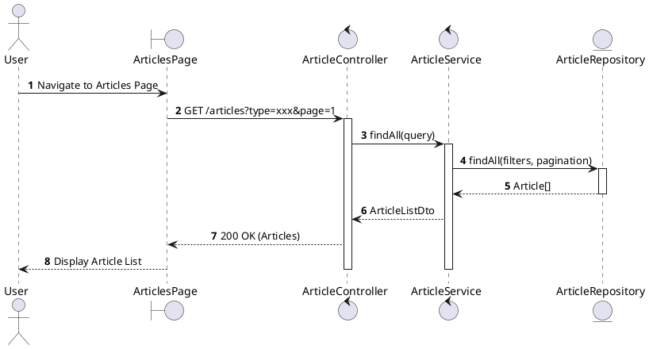
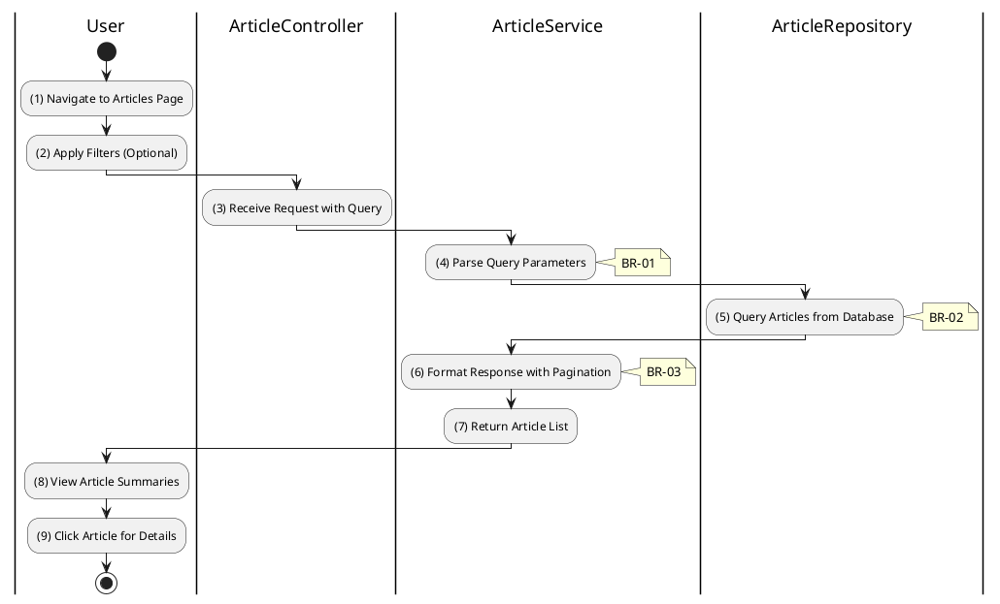

# 3.11.1 List All Articles

## 1. Use Case Description

| Field              | Description                                                                                            |
| ------------------ | ------------------------------------------------------------------------------------------------------ |
| **Name**           | List All Articles                                                                                      |
| **Description**    | This use case allows any user to view a list of articles including news, auction notices, and reports. |
| **Actor**          | All (Public - Guest, Bidder, Auctioneer, Admin)                                                        |
| **Trigger**        | When the user navigates to the articles/news page or requests `GET /articles`.                         |
| **Pre-condition**  | • User's device must be connected to the internet.                                                     |
| **Post-condition** | The list of articles is retrieved and displayed to the user.                                           |

## 2. Sequence Flow (MVC)

## 3. Activities Flow (Swimlanes)

## 4. Business Rules

| Activity | BR Code   | Description                                                                                                                                                                                                                                                                                                                                                                                                                                                                                                                                                                                                                                                                                                                                                                                                                                                                     |
| :------- | :-------- | :------------------------------------------------------------------------------------------------------------------------------------------------------------------------------------------------------------------------------------------------------------------------------------------------------------------------------------------------------------------------------------------------------------------------------------------------------------------------------------------------------------------------------------------------------------------------------------------------------------------------------------------------------------------------------------------------------------------------------------------------------------------------------------------------------------------------------------------------------------------------------ |
| **(1)**  | **BR-01** | **Displaying Rules:** ❖ The system renders the “ArticlesPage” screen using `Display_View()`. ❖ It displays a search/filter bar allowing filtering by Type and Keyword search. ❖ It renders a grid or list of Article Cards representing the content. ❖ The system shows a loading skeleton while the data is being fetched.                                                                                                                                                                                                                                                                                                                                                                                                                                                                                                                                 |
| **(2)**  | **BR-02** | **Filtering Rules:** ❖ The system uses `Frontend_Filter(query)` to handle user input. ❖ It supports filtering by the [type] field with values: `news`, `auction_notice`, `auction_report`, and `legal_document`.                                                                                                                                                                                                                                                                                                                                                                                                                                                                                                                                                                                                                                                  |
| **(5)**  | **BR-03** | **Querying Rules:** ❖ The system calls `ArticleService.findAll(query)` to retrieve the data. ❖ It invokes `ArticleRepository.findAll()`, applying a WHERE clause for `{ type: query.type }` and ordering by `{ createdAt: 'desc' }`. ❖ The query fetches specific fields: [id], [title], [description], [image], [author], and [createdAt].                                                                                                                                                                                                                                                                                                                                                                                                                                                                                                                    |
| **(6)**  | **BR-04** | **Processing Rules (Pagination):** ❖ The system implements `Pagination_Logic(page, limit)` to manage large datasets. ❖ It sets a default limit of 10 items per page. ❖ It calculates the skip value as `(page - 1) * limit`. ❖ It returns a response object containing: `{ data: Article[], meta: { total, page, lastPage } }`.                                                                                                                                                                                                                                                                                                                                                                                                                                                                                                                             |
| **(8)**  | **BR-05** | **Displaying Rules (Item):** ❖ The system renders each item using the `Display_Component('ArticleCard', article)` method. ❖ Each card displays the article's thumbnail image. ❖ It shows the title, truncating it if it exceeds 2 lines. ❖ It displays the description, truncating it to a maximum of 200 characters.                                                                                                                                                                                                                                                                                                                                                                                                                                                                                                                                       |
