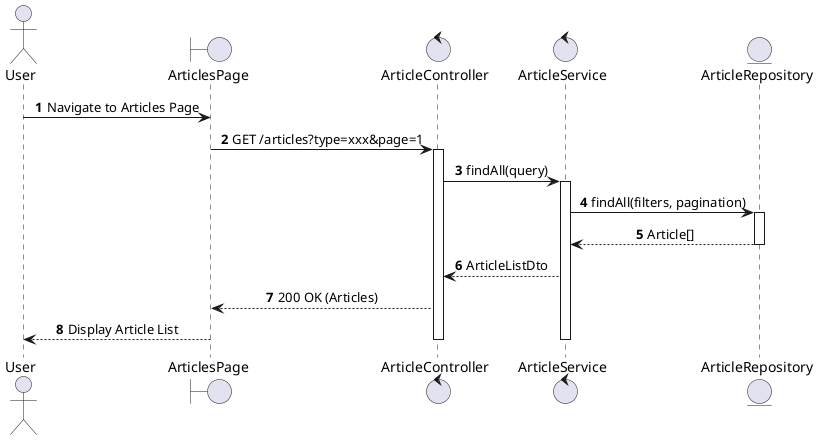
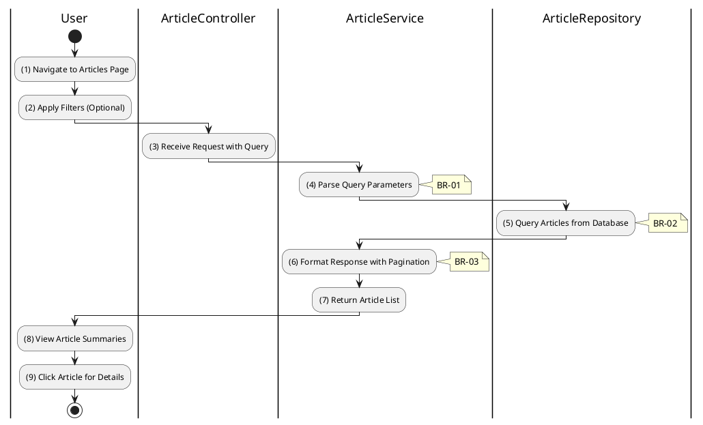

# 3.11.1 List All Articles

## 1. Use Case Description

| Field              | Description                                                                                            |
| ------------------ | ------------------------------------------------------------------------------------------------------ |
| **Name**           | List All Articles                                                                                      |
| **Description**    | This use case allows any user to view a list of articles including news, auction notices, and reports. |
| **Actor**          | All (Public - Guest, Bidder, Auctioneer, Admin)                                                        |
| **Trigger**        | When the user navigates to the articles/news page or requests `GET /articles`.                         |
| **Pre-condition**  | • User's device must be connected to the internet.                                                     |
| **Post-condition** | The list of articles is retrieved and displayed to the user.                                           |

## 2. Sequence Flow (MVC)

## 3. Activities Flow (Swimlanes)

## 4. Business Rules

| Activity | BR Code   | Description                                                                                                                                                                                                              |
| :------- | :-------- | :----------------------------------------------------------------------------------------------------------------------------------------------------------------------------------------------------------------------- |
| **(1)**  | **BR-01** | **Displaying Rule (Articles Page):** System displays `ArticlesPage` with article cards. Each card shows: title, description excerpt, author, date, type badge. System shows loading state while fetching.       |
| **(2)**  | **BR-02** | **Processing Rule (Filtering):** System supports filtering by `type`: - `news`: General news - `auction_notice`: Auction announcements - `auction_report`: Result reports - `legal_document`: Legal docs. |
| **(5)**  | **BR-03** | **Querying Rule:** System retrieves data from the 'ARTICLE' table in the database. Includes: id, type, title, description, image, author, createdAt. Orders by createdAt DESC (newest first).                   |
| **(6)**  | **BR-04** | **Processing Rule (Pagination):** System returns paginated results. Default page size: 10 articles. Includes: items, total count, page number, total pages.                                                     |
| **(8)**  | **BR-05** | **Displaying Rule (Article Cards):** System displays article summaries with: - Thumbnail image - Title (clickable) - Description excerpt (max 200 chars) - Author name and date.                          |
