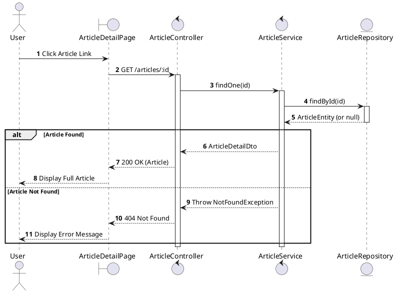
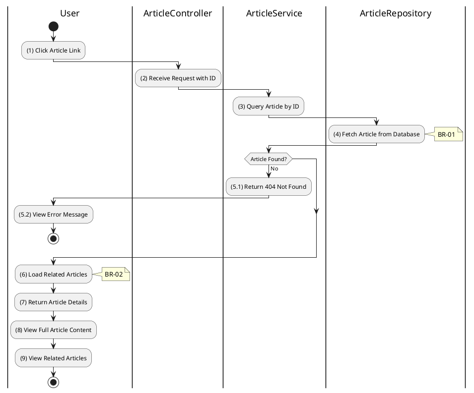

# 3.11.2 Get Article Details

## 1. Use Case Description

| Field              | Description                                                                   |
| ------------------ | ----------------------------------------------------------------------------- |
| **Name**           | Get Article Details                                                           |
| **Description**    | This use case allows any user to view the full details of a specific article. |
| **Actor**          | All (Public - Guest, Bidder, Auctioneer, Admin)                               |
| **Trigger**        | When the user clicks on an article or requests `GET /articles/:id`.           |
| **Pre-condition**  | • User's device must be connected to the internet.                            |
| **Post-condition** | The article details are retrieved and displayed to the user.                  |

## 2. Sequence Flow (MVC)

## 3. Activities Flow (Swimlanes)

## 4. Business Rules

| Activity | BR Code   | Description                                                                                                                                                                                                   |
| :------- | :-------- | :------------------------------------------------------------------------------------------------------------------------------------------------------------------------------------------------------------ |
| **(1)**  | **BR-01** | **Displaying Rule (Article Detail Page):** System displays `ArticleDetailPage` with full content. Shows: title, full content, author, date, type, image. Shows loading state while fetching.         |
| **(4)**  | **BR-02** | **Querying Rule:** System retrieves data from the 'ARTICLE' table by ID. Includes: all fields including full `content`. If not found: $\rightarrow$ System displays MSG 20 ("Article not found"). |
| **(6)**  | **BR-03** | **Processing Rule (Related Articles):** System loads related articles via `ARTICLE_RELATION` table. Returns up to 5 related articles. Allows user navigation to related content.                     |
| **(8)**  | **BR-04** | **Displaying Rule (Content Display):** System renders full article content. Supports rich text/HTML content. Displays header image if available.                                                     |
| **(9)**  | **BR-05** | **Displaying Rule (Related Articles):** System displays related articles sidebar/section. Shows thumbnail, title, date for each related article. Clickable links to navigate.                        |
