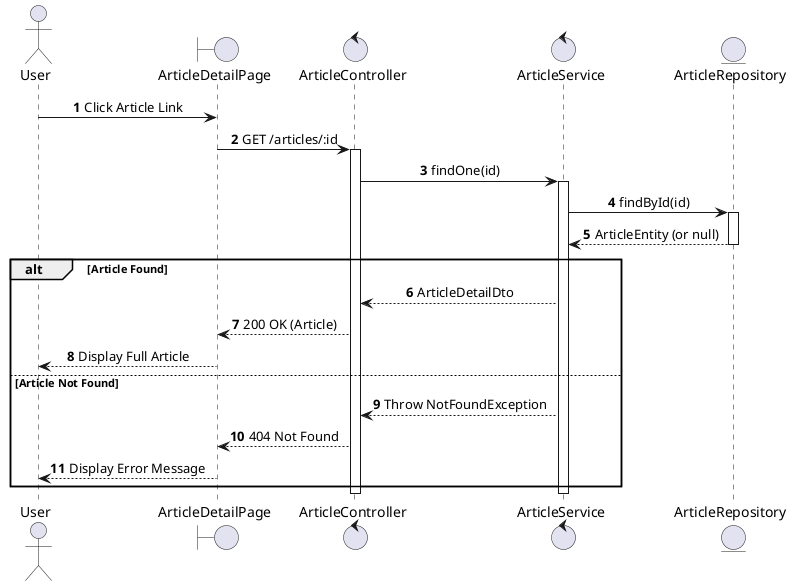
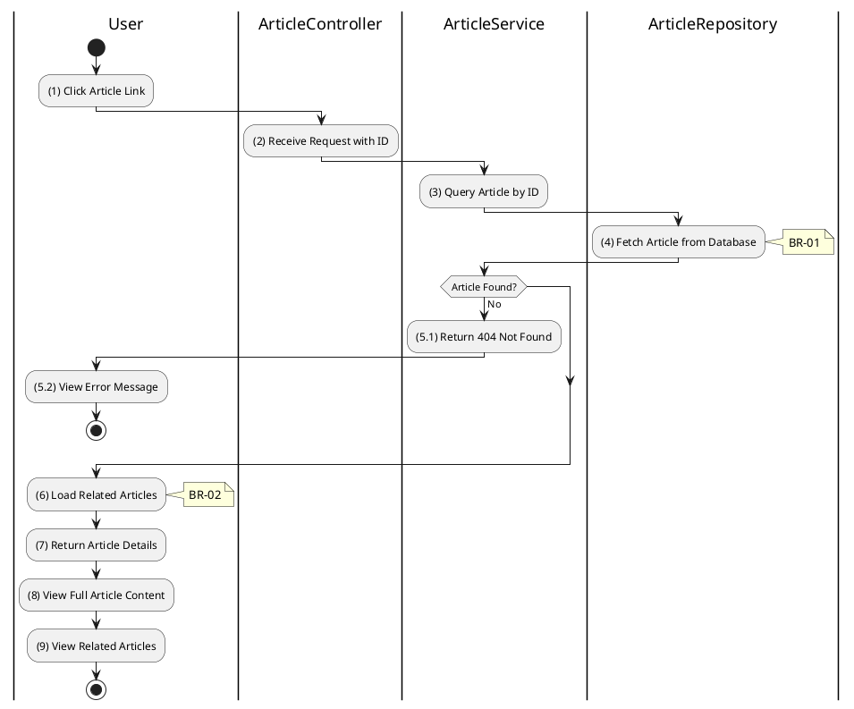

# 3.11.2 Get Article Details

## 1. Use Case Description

| Field              | Description                                                                   |
| ------------------ | ----------------------------------------------------------------------------- |
| **Name**           | Get Article Details                                                           |
| **Description**    | This use case allows any user to view the full details of a specific article. |
| **Actor**          | All (Public - Guest, Bidder, Auctioneer, Admin)                               |
| **Trigger**        | When the user clicks on an article or requests `GET /articles/:id`.           |
| **Pre-condition**  | • User's device must be connected to the internet.                            |
| **Post-condition** | The article details are retrieved and displayed to the user.                  |

## 2. Sequence Flow (MVC)

## 3. Activities Flow (Swimlanes)

## 4. Business Rules

| Activity | BR Code   | Description                                                                                                                                                                                                                                                                                                                                                                                                                                                                                                                                                                                                                                                                                                                                                                                                                                                                     |

| :------- | :-------- | :------------------------------------------------------------------------------------------------------------------------------------------------------------------------------------------------------------------------------------------------------------------------------------------------------------------------------------------------------------------------------------------------------------------------------------------------------------------------------------------------------------------------------------------------------------------------------------------------------------------------------------------------------------------------------------------------------------------------------------------------------------------------------------------------------------------------------------------------------------------------------ |

| **(1)**  | **BR-01** | **Displaying Rules (Article Detail Page):** ❖ The system displays the “ArticleDetailPage” via `Display_View(article)` for the selected article. ❖ The page presents the article's [Title], [Author], [Date], and [Type] as a badge. ❖ The system renders the full [Content] (which can be HTML/Markdown) and displays the header [Image].                                                                                                                                                                                                                                                                                                                                                                                                                                                                                                                        |

| **(4)**  | **BR-02** | **Querying Rules:** ❖ The system retrieves the article's details by calling `ArticleService.findOne(id)`. ❖ It queries the “ARTICLE” table by [ID], including any related articles. ❖ If the article is not found, the system returns a 404 Not Found error and displays **MSG 20** (Article not found).                                                                                                                                                                                                                                                                                                                                                                                                                                                                                                                                                           |

| **(6)**  | **BR-03** | **Processing Rules (Related Articles):** ❖ The system loads related articles by joining the “ARTICLE_RELATION” table with the main article. ❖ It limits the retrieval to a maximum of 5 related articles. ❖ The selection includes [id], [title], [image], and [createdAt] for each related article.                                                                                                                                                                                                                                                                                                                                                                                                                                                                                                                                                        |

| **(8)**  | **BR-04** | **Displaying Rules (Content Display):** ❖ The system renders the full article content by calling `Render_HTML_Content(content)`. ❖ It sanitizes any HTML content to prevent XSS vulnerabilities. ❖ It applies predefined styles for headers, paragraphs, lists, and images to ensure consistent formatting.                                                                                                                                                                                                                                                                                                                                                                                                                                                                                                                                           |

| **(9)**  | **BR-05** | **Displaying Rules (Related Articles):** ❖ The system displays a sidebar widget or section dedicated to related articles via `Display_List('RelatedArticles', articles)`. ❖ It lists each related article with a thumbnail, title, and date. ❖ These entries are clickable, allowing the user to navigate directly to the related content.                                                                                                                                                                                                                                                                                                                                                                                                                                                                                                             |

