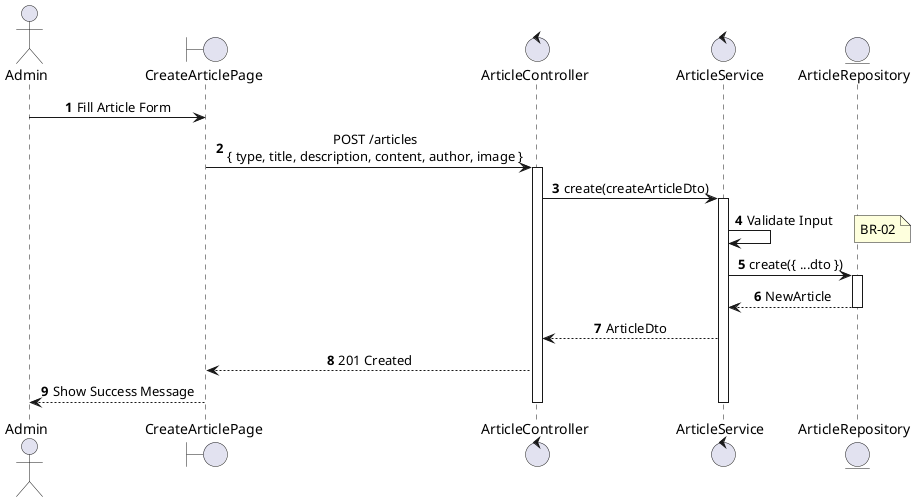
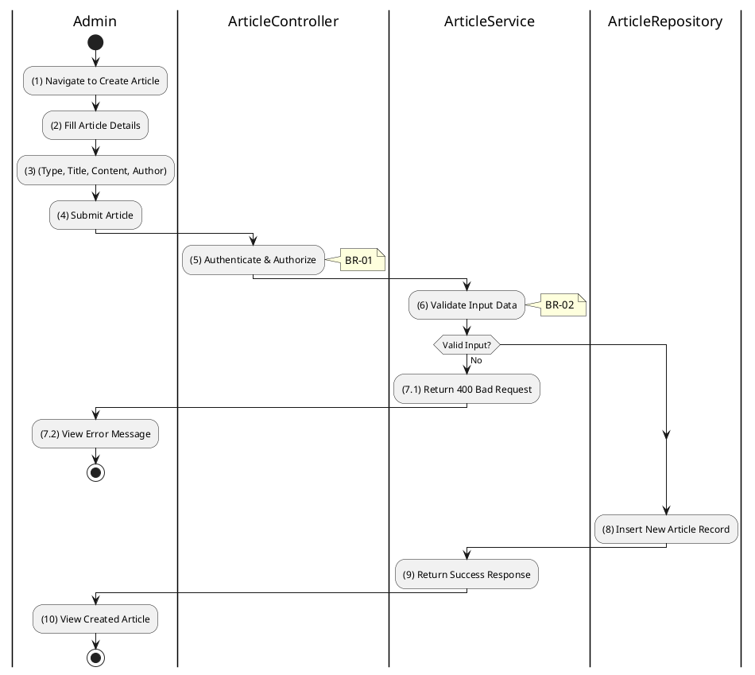

# 3.11.3 Create Article

## 1. Use Case Description

| Field              | Description                                                                                               |
| ------------------ | --------------------------------------------------------------------------------------------------------- |
| **Name**           | Create Article                                                                                            |
| **Description**    | This use case allows the Admin to create a new article (news, auction notice, report, or legal document). |
| **Actor**          | Admin, Super Admin                                                                                        |
| **Trigger**        | When the Admin clicks "Create Article" and submits `POST /articles`.                                      |
| **Pre-condition**  | • Admin's device must be connected to the internet. • Admin is signed in with admin privileges.        |
| **Post-condition** | The new article is created and stored in the database.                                                    |

## 2. Sequence Flow (MVC)

## 3. Activities Flow (Swimlanes)

## 4. Business Rules

| Activity | BR Code   | Description                                                                                                                                                                                                        |
| :------- | :-------- | :----------------------------------------------------------------------------------------------------------------------------------------------------------------------------------------------------------------- |
| **(1)**  | **BR-01** | **Displaying Rule (Create Article Form):** System displays form with: type dropdown, title, description, content (rich editor), author, image upload. All fields except image are mandatory.                 |
| **(2)**  | **BR-02** | **Validation Rule (Input - Front-end):** Type must be: `news`, `auction_notice`, `auction_report`, or `legal_document`. Title: max 255 chars. If `isEmpty()`: $\rightarrow$ Display MSG 1 (Mandatory). |
| **(5)**  | **BR-03** | **Validation Rule (Authorization - Back-end):** System checks if requestor role is `admin` or `super_admin`. If unauthorized: $\rightarrow$ System displays MSG 5 ("Forbidden") on the View.              |
| **(8)**  | **BR-04** | **Storing Rule:** System saves to `ARTICLE` table: - `type`, `title`, `description`, `content`, `author` - `image` (JSON with url, publicId if uploaded) - `createdAt = now()`                         |
| **(10)** | **BR-05** | **Displaying Rule (Success Confirmation):** System displays MSG 7 ("Article created successfully") on the View. System redirects to article detail page or list.                                             |
