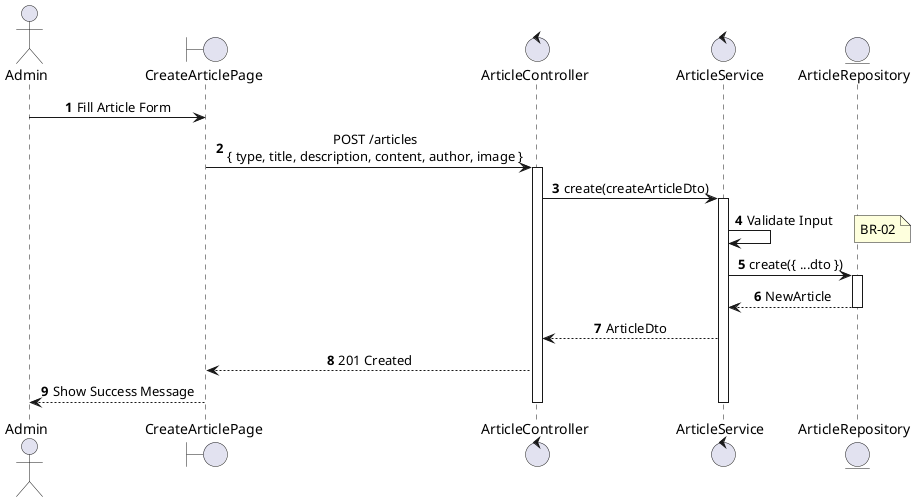
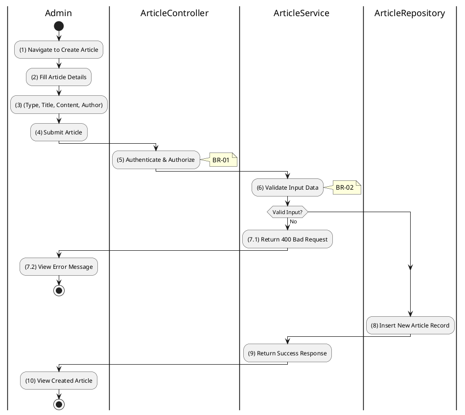

# 3.11.3 Create Article

## 1. Use Case Description

| Field              | Description                                                                                               |
| ------------------ | --------------------------------------------------------------------------------------------------------- |
| **Name**           | Create Article                                                                                            |
| **Description**    | This use case allows the Admin to create a new article (news, auction notice, report, or legal document). |
| **Actor**          | Admin, Super Admin                                                                                        |
| **Trigger**        | When the Admin clicks "Create Article" and submits `POST /articles`.                                      |
| **Pre-condition**  | • Admin's device must be connected to the internet. • Admin is signed in with admin privileges.        |
| **Post-condition** | The new article is created and stored in the database.                                                    |

## 2. Sequence Flow (MVC)

## 3. Activities Flow (Swimlanes)

## 4. Business Rules

| Activity | BR Code   | Description                                                                                                                                                                                                                                                                                                                                                                                                                                                                                                                                                                                                                                                                                                                                                                                                                                                                     |
| :------- | :-------- | :------------------------------------------------------------------------------------------------------------------------------------------------------------------------------------------------------------------------------------------------------------------------------------------------------------------------------------------------------------------------------------------------------------------------------------------------------------------------------------------------------------------------------------------------------------------------------------------------------------------------------------------------------------------------------------------------------------------------------------------------------------------------------------------------------------------------------------------------------------------------------ |
| **(1)**  | **BR-01** | **Displaying Rules (Create Article Form):** ❖ The system renders a “CreateArticlePage” via `Display_View()` to allow for new article creation. ❖ The form includes fields for [Type] (dropdown), [Title] (text input), [Description] (textarea), [Content] (rich editor), and [Image] (upload functionality).                                                                                                                                                                                                                                                                                                                                                                                                                                                                                                                                                           |
| **(2)**  | **BR-02** | **Validation Rules (Front-end):** ❖ When the Admin submits the form, the system validates the input data using `ValidateInput(CreateArticleDto)`. ❖ If the input is not valid: ⮚ If [Title], [Content], or [Type] is empty, the system displays **MSG 1** (Mandatory Field). ⮚ If the [Title] exceeds 255 characters, the system displays **MSG 4** (Too Long).                                                                                                                                                                                                                                                                                                                                                                                                                                                                                       |
| **(4)**  | **BR-03** | **Authorization Rules (Back-end):** ❖ The system checks the authenticated user's role via `ArticleService.create()` to ensure they have the necessary permissions. ❖ If the input is not valid: ⮚ If the user's role is not 'admin' or 'super_admin', the system returns a 403 Forbidden status. ⮚ The system displays **MSG 5** (Forbidden) on the View.                                                                                                                                                                                                                                                                                                                                                                                                                                                                                              |
| **(8)**  | **BR-04** | **Storing Rules (Back-end):** ❖ The system calls `ArticleRepository.create()` to insert the new article. ❖ It saves the [type], [title], [description], [content], and [author] fields. ❖ The [image] is stored as JSON containing its URL and public ID after being uploaded. ❖ The `createdAt` timestamp is set to the current time. ❖ System moves to step (10) and displays successful notification (Refer to **MSG 7**).                                                                                                                                                                                                                                                                                                                                                                                                                      |
| **(10)** | **BR-05** | **Displaying Rules (Success Confirmation):** ❖ The system redirects the admin to the Article List Page by calling `Redirect('ArticleListPage')`. ❖ A success toast notification confirms that the article has been created.                                                                                                                                                                                                                                                                                                                                                                                                                                                                                                                                                                                                                                        |
