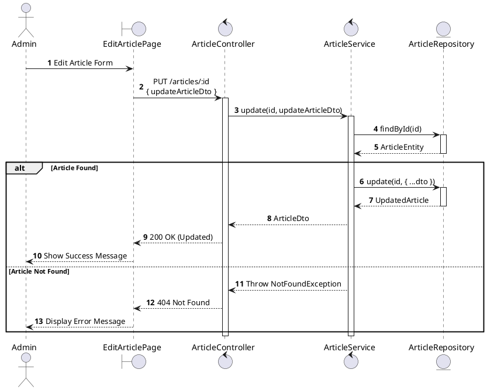
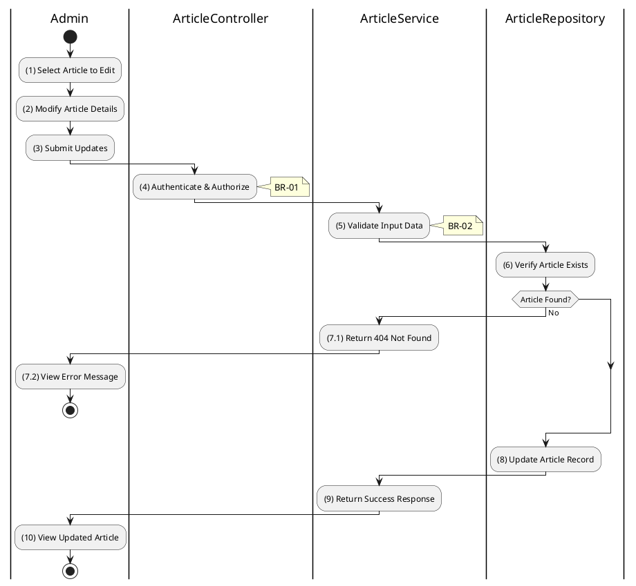

# 3.11.4 Update Article

## 1. Use Case Description

| Field              | Description                                                                                                             |
| ------------------ | ----------------------------------------------------------------------------------------------------------------------- |
| **Name**           | Update Article                                                                                                          |
| **Description**    | This use case allows the Admin to update an existing article's content and metadata.                                    |
| **Actor**          | Admin, Super Admin                                                                                                      |
| **Trigger**        | When the Admin submits updates via `PUT /articles/:id`.                                                                 |
| **Pre-condition**  | • Admin's device must be connected to the internet. • Admin is signed in with admin privileges. • Article exists. |
| **Post-condition** | The article is updated in the database.                                                                                 |

## 2. Sequence Flow (MVC)

## 3. Activities Flow (Swimlanes)

## 4. Business Rules

| Activity | BR Code   | Description                                                                                                                                                                                           |
| :------- | :-------- | :---------------------------------------------------------------------------------------------------------------------------------------------------------------------------------------------------- |
| **(1)**  | **BR-01** | **Displaying Rule (Edit Article Page):** System pre-fills form with existing article data. All fields are editable: type, title, description, content, author, image.                           |
| **(4)**  | **BR-02** | **Validation Rule (Authorization - Back-end):** System checks if requestor role is `admin` or `super_admin`. If unauthorized: $\rightarrow$ System displays MSG 5 ("Forbidden") on the View. |
| **(5)**  | **BR-03** | **Validation Rule (Input):** Same validation rules as create apply. Type must be valid enum value. Title: max 255 chars.                                                                     |
| **(8)**  | **BR-04** | **Storing Rule:** System updates `ARTICLE` table: - All provided fields updated - `updatedAt = now()` - Unprovided fields remain unchanged.                                               |
| **(10)** | **BR-05** | **Displaying Rule (Success Confirmation):** System displays MSG 7 ("Article updated successfully") on the View. System refreshes article display with new content.                              |
