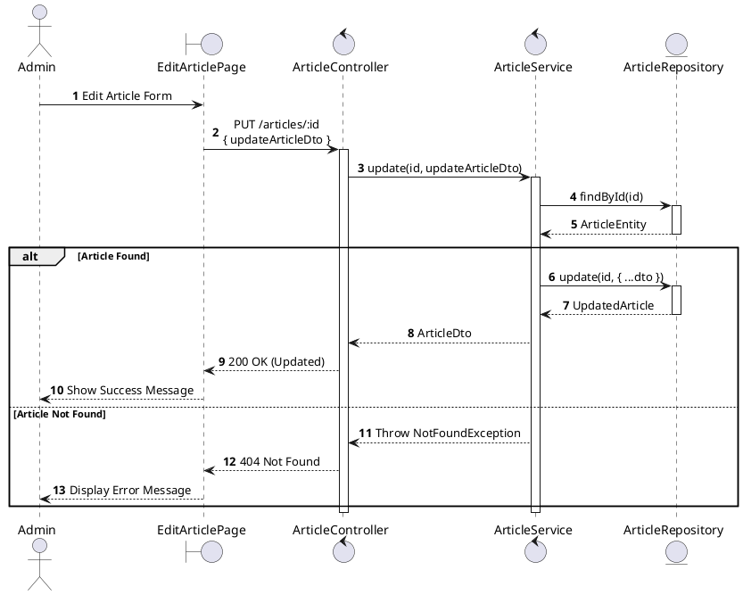
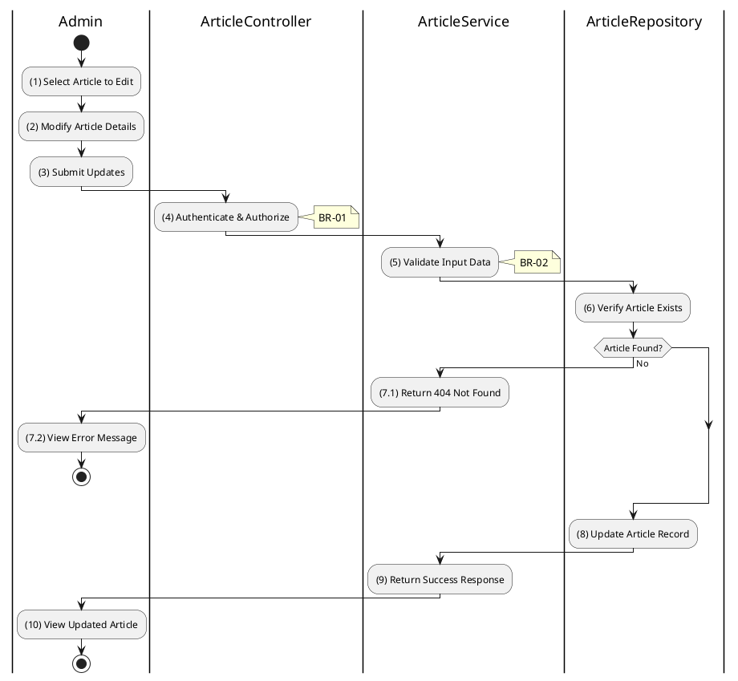

# 3.11.4 Update Article

## 1. Use Case Description

| Field              | Description                                                                                                             |
| ------------------ | ----------------------------------------------------------------------------------------------------------------------- |
| **Name**           | Update Article                                                                                                          |
| **Description**    | This use case allows the Admin to update an existing article's content and metadata.                                    |
| **Actor**          | Admin, Super Admin                                                                                                      |
| **Trigger**        | When the Admin submits updates via `PUT /articles/:id`.                                                                 |
| **Pre-condition**  | • Admin's device must be connected to the internet. • Admin is signed in with admin privileges. • Article exists. |
| **Post-condition** | The article is updated in the database.                                                                                 |

## 2. Sequence Flow (MVC)

## 3. Activities Flow (Swimlanes)

## 4. Business Rules

| Activity | BR Code   | Description                                                                                                                                                                                                                                                                                                                                                                                                                                                                                                                                                                                                                                                                                                                                                                                                                                                                     |
| :------- | :-------- | :------------------------------------------------------------------------------------------------------------------------------------------------------------------------------------------------------------------------------------------------------------------------------------------------------------------------------------------------------------------------------------------------------------------------------------------------------------------------------------------------------------------------------------------------------------------------------------------------------------------------------------------------------------------------------------------------------------------------------------------------------------------------------------------------------------------------------------------------------------------------------ |
| **(1)**  | **BR-01** | **Displaying Rules (Edit Article Page):** ❖ The system renders the “EditArticlePage” via `Display_View(article)` for the selected article. ❖ All form fields are pre-filled with the existing article data. ❖ All fields including [type], [title], [description], [content], [author], and [image] are editable.                                                                                                                                                                                                                                                                                                                                                                                                                                                                                                                                               |
| **(4)**  | **BR-02** | **Authorization Rules (Back-end):** ❖ The system checks the authenticated user's role via `ArticleService.update()` to ensure they have the necessary permissions. ❖ If the input is not valid: ⮚ If the user's role is not 'admin' or 'super_admin', the system returns a 403 Forbidden status. ⮚ The system displays **MSG 5** (Forbidden) on the View.                                                                                                                                                                                                                                                                                                                                                                                                                                                                                              |
| **(5)**  | **BR-03** | **Validation Rules (Input):** ❖ The system validates the updated data using `ValidateInput(UpdateArticleDto)`, applying rules similar to article creation. ❖ It ensures the [Type] is a valid enum value. ❖ The [Title] length is restricted to a maximum of 255 characters.                                                                                                                                                                                                                                                                                                                                                                                                                                                                                                                                                                               |
| **(8)**  | **BR-04** | **Storing Rules (Back-end):** ❖ The system updates the record in the “ARTICLE” table by calling `ArticleRepository.update()`. ❖ It updates all provided fields and sets the `updatedAt` timestamp to the current time. ❖ Fields not provided in the update request remain unchanged. ❖ System moves to step (10) and displays successful notification (Refer to **MSG 7**).                                                                                                                                                                                                                                                                                                                                                                                                                                                                                    |
| **(10)** | **BR-05** | **Displaying Rules (Success Confirmation):** ❖ The system redirects the admin to the Article List Page by calling `Redirect('ArticleListPage')`. ❖ A success toast notification confirms that the article has been updated.                                                                                                                                                                                                                                                                                                                                                                                                                                                                                                                                                                                                                                        |
