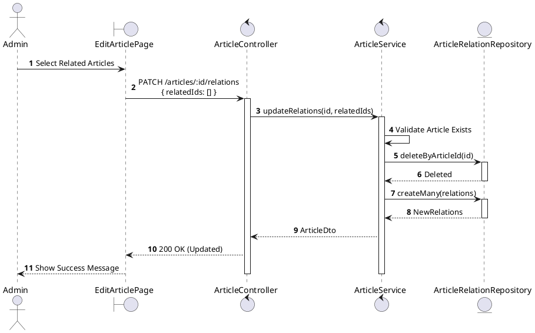
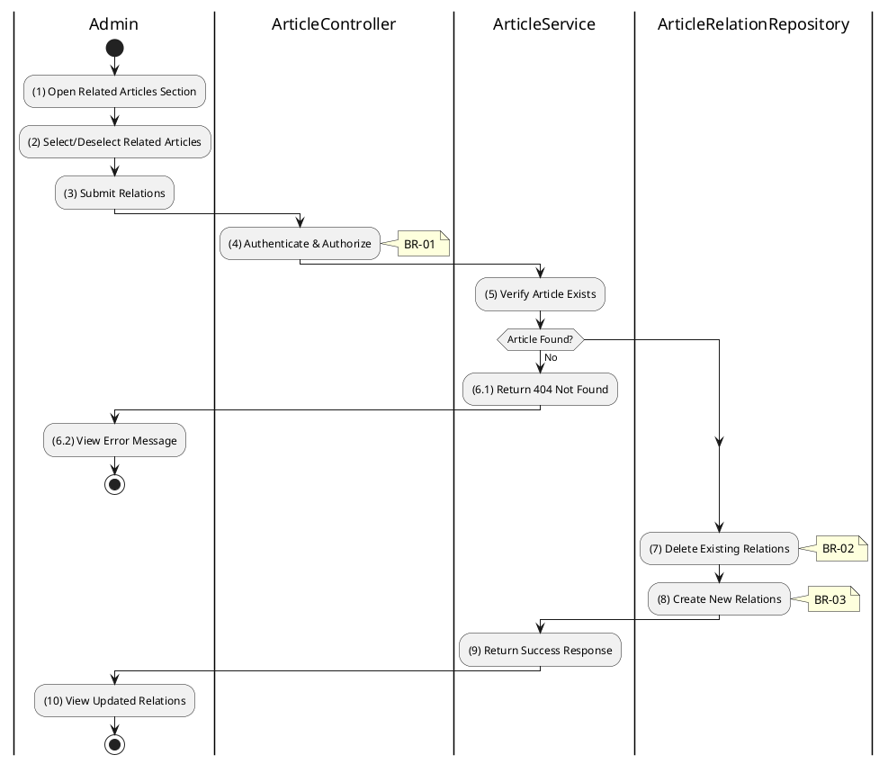

# 3.11.5 Update Article Relations

## 1. Use Case Description

| Field              | Description                                                                                                             |
| ------------------ | ----------------------------------------------------------------------------------------------------------------------- |
| **Name**           | Update Article Relations                                                                                                |
| **Description**    | This use case allows the Admin to update the related articles for a specific article.                                   |
| **Actor**          | Admin, Super Admin                                                                                                      |
| **Trigger**        | When the Admin submits related article updates via `PATCH /articles/:id/relations`.                                     |
| **Pre-condition**  | • Admin's device must be connected to the internet. • Admin is signed in with admin privileges. • Article exists. |
| **Post-condition** | The article's relations are updated in the database.                                                                    |

## 2. Sequence Flow (MVC)

## 3. Activities Flow (Swimlanes)

## 4. Business Rules

| Activity | BR Code   | Description                                                                                                                                                                                                                                                                                                                                                                                                                                                                                                                                                                                                                                                                                                                                                                                                                                                                     |
| :------- | :-------- | :------------------------------------------------------------------------------------------------------------------------------------------------------------------------------------------------------------------------------------------------------------------------------------------------------------------------------------------------------------------------------------------------------------------------------------------------------------------------------------------------------------------------------------------------------------------------------------------------------------------------------------------------------------------------------------------------------------------------------------------------------------------------------------------------------------------------------------------------------------------------------ |
| **(1)**  | **BR-01** | **Displaying Rules (Relations Section):** ❖ The system renders a “UpdateRelationsModal” via `Display_Modal()` to allow editing of related articles. ❖ It displays a multi-select list of all articles (excluding the current one). ❖ Any currently related articles are pre-selected in the list.                                                                                                                                                                                                                                                                                                                                                                                                                                                                                                                                                                |
| **(4)**  | **BR-02** | **Authorization Rules (Back-end):** ❖ The system checks the authenticated user's role via `ArticleService.updateRelations()` to ensure they have the necessary permissions. ❖ If the input is not valid: ⮚ If the user's role is not 'admin' or 'super_admin', the system returns a 403 Forbidden status. ⮚ The system displays **MSG 5** (Forbidden) on the View.                                                                                                                                                                                                                                                                                                                                                                                                                                                                                              |
| **(7)**  | **BR-03** | **Processing Rules (Replace Strategy):** ❖ The system utilizes a “replace strategy” for managing relations, calling `ArticleRelationRepository.deleteByAuctionId(id)`. ❖ It first deletes all existing records from the “ARTICLE_RELATION” table associated with the current article. ❖ Then, it proceeds to create new relation entries based on the provided list of related article IDs.                                                                                                                                                                                                                                                                                                                                                                                                                                                                                 |
| **(8)**  | **BR-04** | **Storing Rules (Back-end):** ❖ For each [relatedId] in the submitted list, the system inserts a new record into the “ARTICLE_RELATION” table, specifying the `articleId` (current article) and `relatedArticleId`. ❖ The system establishes bidirectional links as needed.                                                                                                                                                                                                                                                                                                                                                                                                                                                                                                                                                                                      |
| **(10)** | **BR-05** | **Displaying Rules (Success Confirmation):** ❖ The system refreshes the related articles section on the page by calling `Refresh_Component('RelatedArticles')`. ❖ A success toast notification confirms that the relations have been updated.                                                                                                                                                                                                                                                                                                                                                                                                                                                                                                                                                                                                        |
