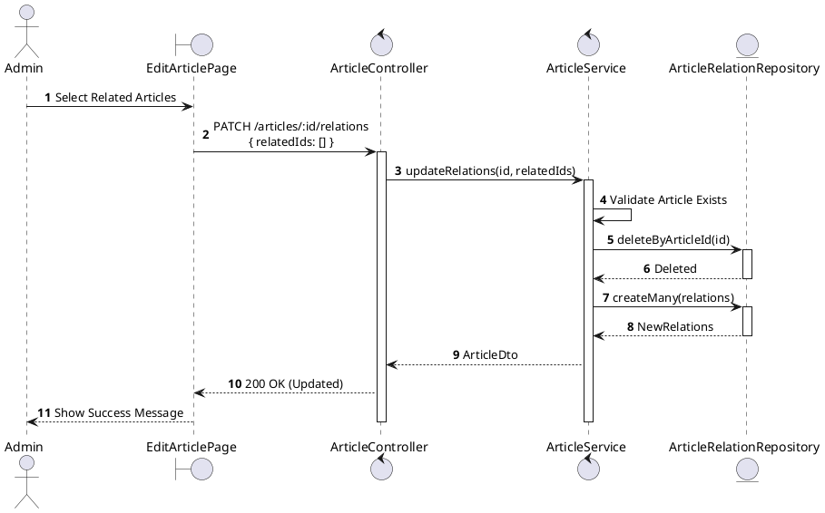
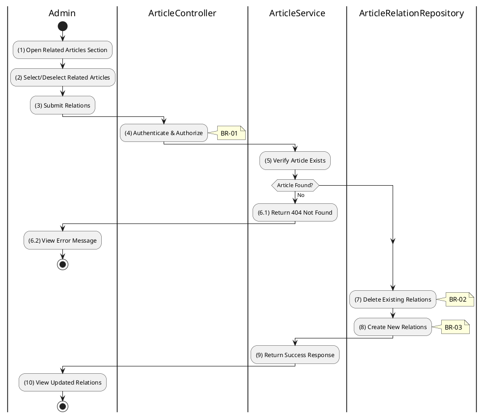

# 3.11.5 Update Article Relations

## 1. Use Case Description

| Field              | Description                                                                                                             |
| ------------------ | ----------------------------------------------------------------------------------------------------------------------- |
| **Name**           | Update Article Relations                                                                                                |
| **Description**    | This use case allows the Admin to update the related articles for a specific article.                                   |
| **Actor**          | Admin, Super Admin                                                                                                      |
| **Trigger**        | When the Admin submits related article updates via `PATCH /articles/:id/relations`.                                     |
| **Pre-condition**  | • Admin's device must be connected to the internet. • Admin is signed in with admin privileges. • Article exists. |
| **Post-condition** | The article's relations are updated in the database.                                                                    |

## 2. Sequence Flow (MVC)

## 3. Activities Flow (Swimlanes)

## 4. Business Rules

| Activity | BR Code   | Description                                                                                                                                                                                           |
| :------- | :-------- | :---------------------------------------------------------------------------------------------------------------------------------------------------------------------------------------------------- |
| **(1)**  | **BR-01** | **Displaying Rule (Relations Section):** System displays searchable/selectable list of other articles. Currently related articles are pre-selected. Admin can select/deselect articles.      |
| **(4)**  | **BR-02** | **Validation Rule (Authorization - Back-end):** System checks if requestor role is `admin` or `super_admin`. If unauthorized: $\rightarrow$ System displays MSG 5 ("Forbidden") on the View. |
| **(7)**  | **BR-03** | **Processing Rule (Replace Strategy):** System uses replace strategy for relations. Deletes all existing relations for the article. Creates new relations from provided IDs.                 |
| **(8)**  | **BR-04** | **Storing Rule:** System saves to `ARTICLE_RELATION` table: - `articleId = [current article]` - `relatedArticleId = [each selected article]` Creates bidirectional links if needed.       |
| **(10)** | **BR-05** | **Displaying Rule (Success Confirmation):** System displays MSG 7 ("Relations updated successfully") on the View. System refreshes related articles section.                                    |
