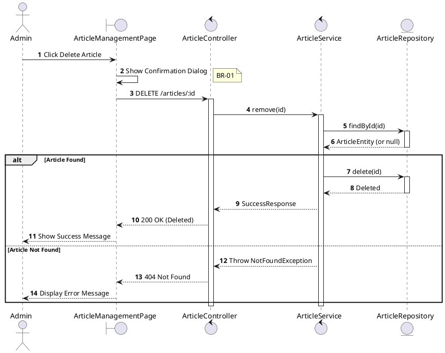
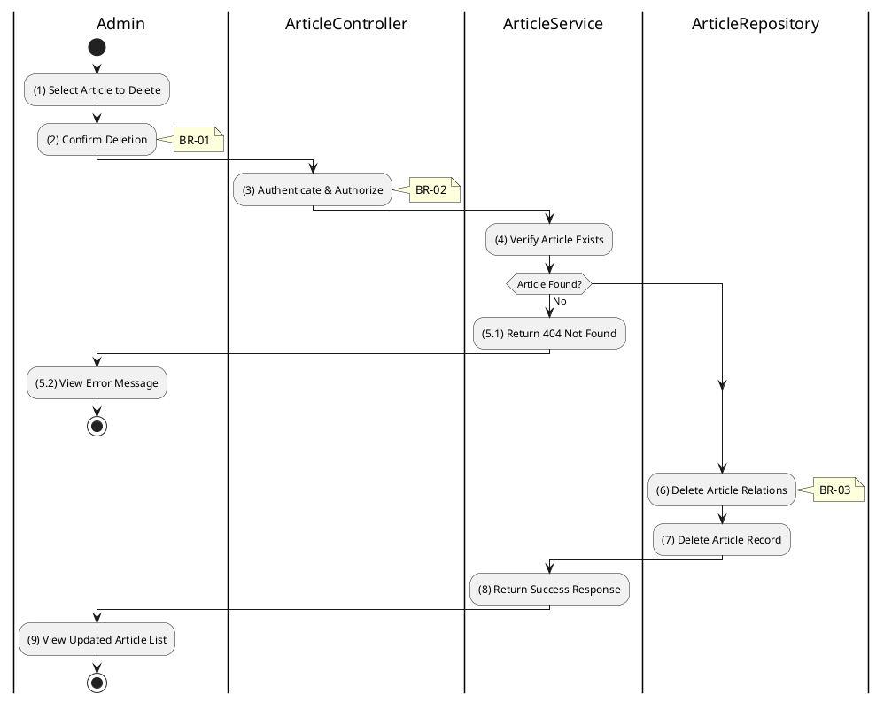

# 3.11.6 Delete Article

## 1. Use Case Description

| Field              | Description                                                                                                             |
| ------------------ | ----------------------------------------------------------------------------------------------------------------------- |
| **Name**           | Delete Article                                                                                                          |
| **Description**    | This use case allows the Admin to delete an existing article from the system.                                           |
| **Actor**          | Admin, Super Admin                                                                                                      |
| **Trigger**        | When the Admin confirms deletion via `DELETE /articles/:id`.                                                            |
| **Pre-condition**  | • Admin's device must be connected to the internet. • Admin is signed in with admin privileges. • Article exists. |
| **Post-condition** | The article and its relations are removed from the database.                                                            |

## 2. Sequence Flow (MVC)

## 3. Activities Flow (Swimlanes)

## 4. Business Rules

| Activity | BR Code   | Description                                                                                                                                                                                                                                                                                                                                                                                                                                                                                                                                                                                                                                                                                                                                                                                                                                      | 
| :------- | :-------- | :------------------------------------------------------------------------------------------------------------------------------------------------------------------------------------------------------------------------------------------------------------------------------------------------------------------------------------------------------------------------------------------------------------------------------------------------------------------------------------------------------------------------------------------------------------------------------------------------------------------------------------------------------------------------------------------------------------------------------------------------------------------------------------------------------------------------------------------------------------------------------ | 
| **(1)**  | **BR-01** | **Displaying Rules (Confirmation):** ❖ The system displays a confirmation modal, `Display_Modal('ConfirmationBox')`. (Refer to “ConfirmationBox” view in “View Description” file). ❖ It presents **MSG 11** ("Delete article [Title]? Action cannot be undone.") to the Admin. ❖ The system awaits Admin confirmation before proceeding with the irreversible deletion.                                                                                                                                                                                                                                                                                                                                                                                                                                                                     |
| **(3)**  | **BR-02** | **Authorization Rules (Back-end):** ❖ The system checks the authenticated user's role via `ArticleService.remove()` to ensure they have the necessary permissions. ❖ If the input is not valid: ⮚ If the user's role is not 'admin' or 'super_admin', the system returns a 403 Forbidden status. ⮚ The system displays **MSG 5** (Forbidden) on the View.                                                                                                                                                                                                                                                                                                                                                                                                                                                                                              |
| **(6)**  | **BR-03** | **Processing Rules (Cascade Delete):** ❖ The system leverages a database cascade delete mechanism. ❖ Upon deletion of the main article, related entries in the “ARTICLE_RELATION” table are automatically removed via a Foreign Key constraint (ON DELETE CASCADE). ❖ This ensures referential integrity and prevents orphaned records.                                                                                                                                                                                                                                                                                                                                                                                                                                                                                                                         |
| **(7)**  | **BR-04** | **Storing Rules (Back-end):** ❖ The system removes the record from the “ARTICLE” table by calling `ArticleService.remove(id)`. ❖ This is a hard delete, meaning the record is permanently removed from the database. ❖ System moves to step (9) and displays successful notification (Refer to **MSG 7**).                                                                                                                                                                                                                                                                                                                                                                                                                                                                                                                                                |
| **(9)**  | **BR-05** | **Displaying Rules (Success Confirmation):** ❖ The system redirects the admin to the Article List Page by calling `Redirect('ArticleListPage')`. ❖ A success toast notification confirms that the article has been deleted. ❖ The system refreshes the article list to remove the deleted entry.                                                                                                                                                                                                                                                                                                                                                                                                                                                                                                                                                          |
