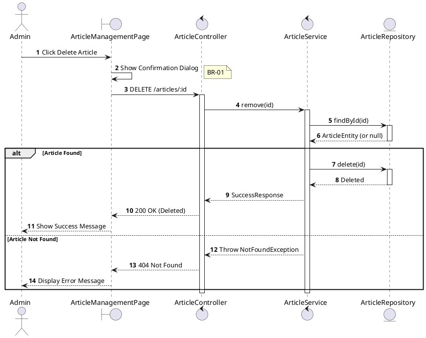
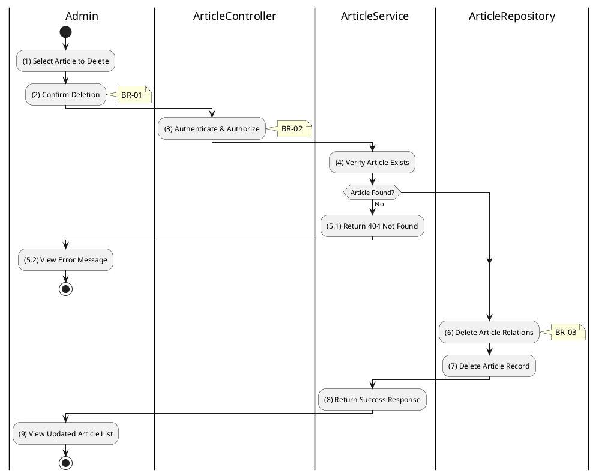

# 3.11.6 Delete Article

## 1. Use Case Description

| Field              | Description                                                                                                             |
| ------------------ | ----------------------------------------------------------------------------------------------------------------------- |
| **Name**           | Delete Article                                                                                                          |
| **Description**    | This use case allows the Admin to delete an existing article from the system.                                           |
| **Actor**          | Admin, Super Admin                                                                                                      |
| **Trigger**        | When the Admin confirms deletion via `DELETE /articles/:id`.                                                            |
| **Pre-condition**  | • Admin's device must be connected to the internet. • Admin is signed in with admin privileges. • Article exists. |
| **Post-condition** | The article and its relations are removed from the database.                                                            |

## 2. Sequence Flow (MVC)

## 3. Activities Flow (Swimlanes)

## 4. Business Rules

| Activity | BR Code   | Description                                                                                                                                                                                                    |
| :------- | :-------- | :------------------------------------------------------------------------------------------------------------------------------------------------------------------------------------------------------------- |
| **(1)**  | **BR-01** | **Validation Rule (Confirmation - Front-end):** System displays MSG 11 ("Are you sure you want to delete this article? This action cannot be undone."). System waits for confirmation before proceeding. |
| **(3)**  | **BR-02** | **Validation Rule (Authorization - Back-end):** System checks if requestor role is `admin` or `super_admin`. If unauthorized: $\rightarrow$ System displays MSG 5 ("Forbidden") on the View.          |
| **(6)**  | **BR-03** | **Processing Rule (Cascade Delete):** System deletes related entries in `ARTICLE_RELATION` table. Uses ON DELETE CASCADE constraint. Ensures referential integrity.                                   |
| **(7)**  | **BR-04** | **Storing Rule:** System removes record from `ARTICLE` table. Hard delete (permanent removal). Article is no longer accessible.                                                                       |
| **(9)**  | **BR-05** | **Displaying Rule (Success Confirmation):** System displays MSG 7 ("Article deleted successfully") on the View. System refreshes article list to remove deleted entry.                                   |
