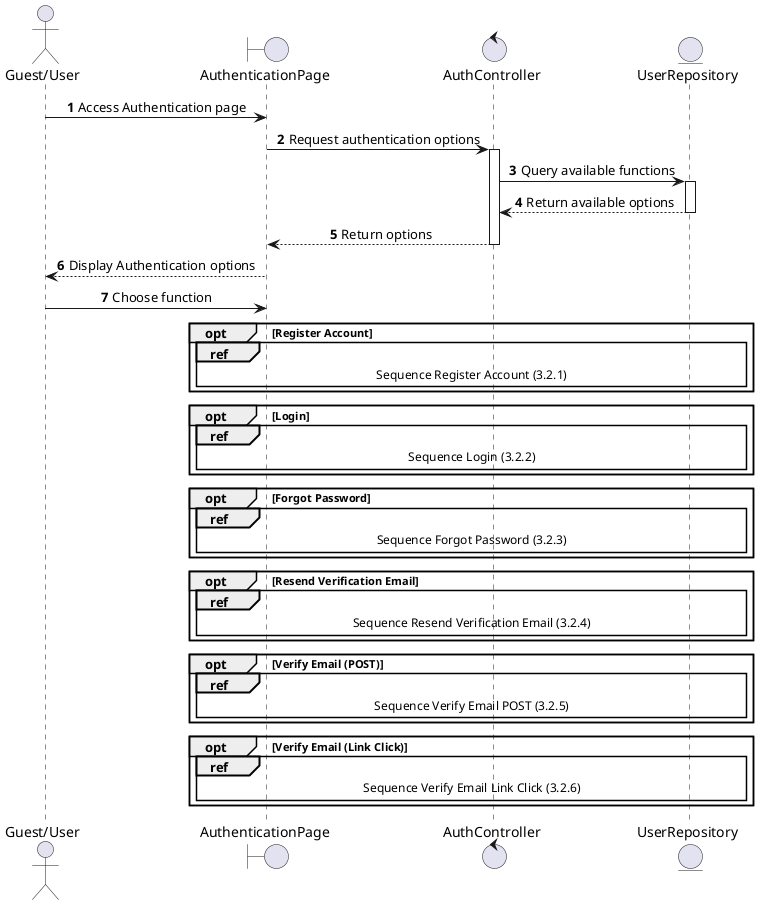
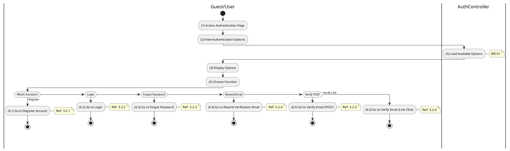

# Use Case 3.2.0: Manage Authentication

## 1. Use Case Description

| Field              | Content                                                                                                                                              |
| :----------------- | :--------------------------------------------------------------------------------------------------------------------------------------------------- |
| **Name**           | Manage Authentication                                                                                                                                |
| **Description**    | This use case allows the **Guest/User** to choose one of the corresponding functions of CRUD to adjust **Authentication** information in the system. |
| **Actor**          | **Guest**, **All Users**                                                                                                                             |
| **Trigger**        | When the **Guest/User** clicks on the "**Authentication**" button on the navigation sidebar or accesses authentication-related pages.                |
| **Pre-condition**  | 1. **Guest/User**'s device must be connected to the internet. 2. For certain functions, the **User** may need to be signed in with their account. |
| **Post-condition** | The **Authentication** information is updated to the corresponding function that the **Guest/User** executes.                                        |

---

## 2. Sequence Flow

---

## 3. Activities Flow (Swimlanes)

---

## 4. Business Rules

| Activity | BR Code   | Description                                                                                                                                  |
| :------- | :-------- | :------------------------------------------------------------------------------------------------------------------------------------------- |
| **(4)**  | **BR-01** | **Displaying Rule:** The system displays an "**Authentication**" screen. (Refer to "**Authentication**" view in "View Description" file). |
| **(5)**  | **BR-02** | **Choosing Rule:** **Guest/User** can only choose one feature at a time to use.                                                           |

---

## 5. Related Child Use Cases

| Use Case ID | Use Case Name             | Description                                |
| :---------- | :------------------------ | :----------------------------------------- |
| 3.2.1       | Register Account          | Create a new user account                  |
| 3.2.2       | Login                     | Authenticate user credentials              |
| 3.2.3       | Forgot Password           | Request password reset                     |
| 3.2.4       | Resend Verification Email | Resend email verification link             |
| 3.2.5       | Verify Email (POST)       | Verify email using POST request with token |
| 3.2.6       | Verify Email (Link Click) | Verify email by clicking verification link |
