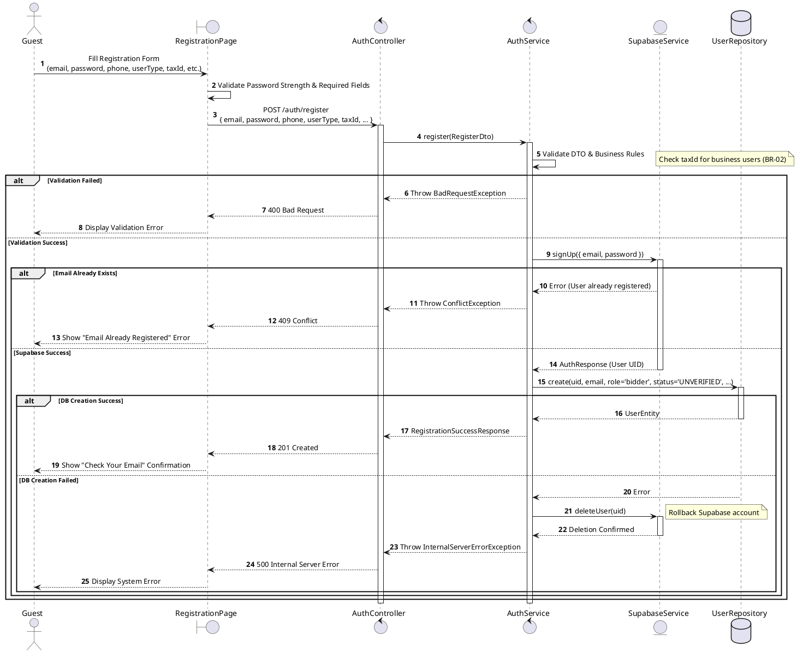
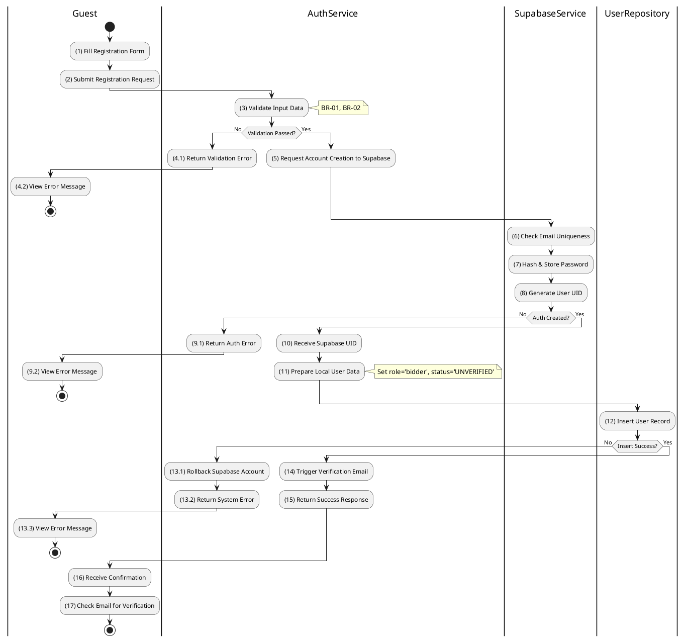

# 3.2.1 Register Account

## 1. Use Case Description

| Field              | Description                                                                                                                                |
| ------------------ | ------------------------------------------------------------------------------------------------------------------------------------------ |
| **Name**           | Register Account                                                                                                                           |
| **Description**    | This use case allows the Guest to create a new Account in the authentication provider and corresponding User record in the local database. |
| **Actor**          | Guest                                                                                                                                      |
| **Trigger**        | When the Guest clicks on the 'Sign Up' button on the RegistrationPage.                                                                     |
| **Pre-condition**  | • Guest's device must be connected to the internet. • Guest is on the RegistrationPage.                                                 |
| **Post-condition** | The Account is stored in Supabase Auth, the User record is stored in the local database, and a verification email is sent to the Guest.    |

## 2. Sequence Flow (MVC)

## 3. Activities Flow (Swimlanes)

## 4. Business Rules

| Activity | BR Code   | Description                                                                                                                                                                                                                                                                                                                                                                                                                                                     |
| :------- | :-------- | :-------------------------------------------------------------------------------------------------------------------------------------------------------------------------------------------------------------------------------------------------------------------------------------------------------------------------------------------------------------------------------------------------------------------------------------------------------------- |
| **(1)**  | **BR-01** | **Displaying Rule:** The system displays a 'RegistrationPage' screen. (Refer to 'RegistrationPage' view in 'View Description' file). The form contains input fields for: email, password, confirm password, phone, userType, and taxId (conditional).                                                                                                                                                                                                     |
| **(1)**  | **BR-02** | **Validation Rule (Front-end):** When user enters information, system uses `Text_change()` method. Checks if input is valid (empty, wrong format). If `isEmpty()` on mandatory fields → display **MSG 1** (Mandatory field required). If password does not meet complexity requirements → display **MSG 4** (Invalid format). If `userType = 'business'` and `taxId` is empty → display **MSG 1**.                                               |
| **(2)**  | **BR-03** | **Validation Rule (Back-end/Save):** When user clicks 'Sign Up' button, send data to auth provider via function `signUp({ email, password })`. Check `Supabase Auth` for email uniqueness constraint. If email exists → show **MSG 2** (Conflict - Email already registered), return 409 Conflict. Else, hash & store password, generate User UID.                                                                                                  |
| **(12)** | **BR-04** | **Storing Rule:** The input data will be checked by table `USERS` in the database (Refer to 'USERS' table in 'DB Sheet' file) to check if there are any constraints. Else data of the Account will be stored as a new record in table `USERS`. Set role = 'bidder', status = 'UNVERIFIED'. If insert fails → call rollback via `deleteUser(uid)` on Supabase, show **MSG 9** (System Error), return 500. Else → proceed to send verification email. |
| **(14)** | **BR-05** | **Notification Rule:** System triggers verification email via Supabase `sendVerificationEmail()` method. Email contains a unique verification link valid for 24 hours.                                                                                                                                                                                                                                                                                    |
| **(16)** | **BR-06** | **Displaying Rule (Confirmation):** The system displays a 'Check Email' instruction screen. User receives confirmation that account is created but NOT active until email verification is completed. No active session token is issued at this stage.                                                                                                                                                                                                  |
