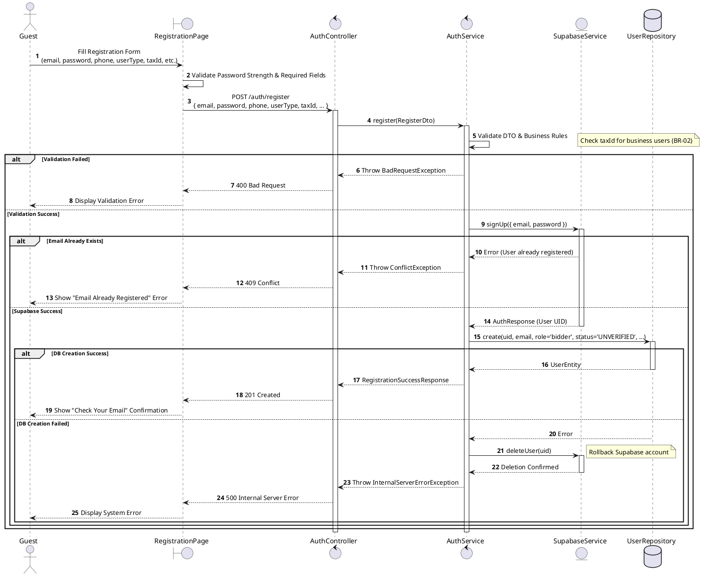
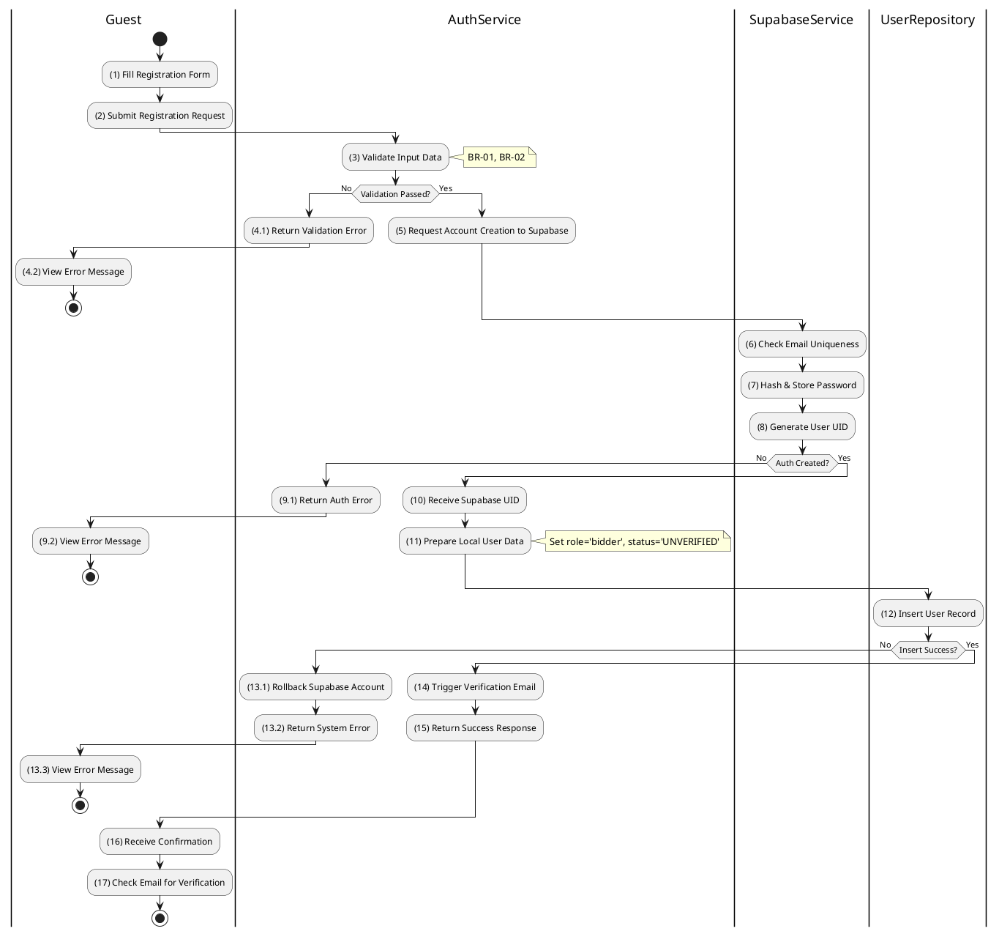

# 3.2.1 Register Account

## 1. Use Case Description

| Field              | Description                                                                                                                                |
| ------------------ | ------------------------------------------------------------------------------------------------------------------------------------------ |
| **Name**           | Register Account                                                                                                                           |
| **Description**    | This use case allows the Guest to create a new Account in the authentication provider and corresponding User record in the local database. |
| **Actor**          | Guest                                                                                                                                      |
| **Trigger**        | When the Guest clicks on the 'Sign Up' button on the RegistrationPage.                                                                     |
| **Pre-condition**  | • Guest's device must be connected to the internet. • Guest is on the RegistrationPage.                                                 |
| **Post-condition** | The Account is stored in Supabase Auth, the User record is stored in the local database, and a verification email is sent to the Guest.    |

## 2. Sequence Flow (MVC)

## 3. Activities Flow (Swimlanes)

## 4. Business Rules

| Activity | BR Code   | Description                                                                                                                                                                                                                                                                                                                                                                                                                                                                                                                                                                                                                                                                                                                                                                                                                                                                                                                                                                                                                                                                                                                                                                                                                                                                                                                                                                                                  |
| :------- | :-------- | :------------------------------------------------------------------------------------------------------------------------------------------------------------------------------------------------------------------------------------------------------------------------------------------------------------------------------------------------------------------------------------------------------------------------------------------------------------------------------------------------------------------------------------------------------------------------------------------------------------------------------------------------------------------------------------------------------------------------------------------------------------------------------------------------------------------------------------------------------------------------------------------------------------------------------------------------------------------------------------------------------------------------------------------------------------------------------------------------------------------------------------------------------------------------------------------------------------------------------------------------------------------------------------------------------------------------------------------------------------------------------------------------------- |
| **(1)**  | **BR-01** | **Displaying Rules:** ❖ The system displays a “RegistrationPage” screen. (Refer to “RegistrationPage” view in “View Description” file). ❖ The screen renders input fields for: [email], [password], [confirmPassword], [phone], [userType], and [taxId].                                                                                                                                                                                                                                                                                                                                                                                                                                                                                                                                                                                                                                                                                                                                                                                                                                                                                                                                                                                                                                                                                                                             |
| **(1)**  | **BR-02** | **Validation Rules (Front-end):** ❖ When the user enters information, the system uses the `ValidateInput(RegisterDto)` method to check validity. ❖ If the input is not valid: ⮚ If [email] or [password] is empty, the system displays **MSG 1** (Mandatory Field). ⮚ If the [password] does not meet complexity requirements, the system displays **MSG 4** (Weak Password). ⮚ If [userType] is “business” and [taxId] is empty, the system displays **MSG 1**.                                                                                                                                                                                                                                                                                                                                                                                                                                                                                                                                                                                                                                                                                                                                                                                                                                                                                                                                         |
| **(2)**  | **BR-03** | **Validation Rules (Back-end):** ❖ When the user clicks the “Sign Up” button, the system calls `AuthService.register()` to submit the data. ❖ The system attempts to create the account in `Supabase.signUp(email, password)`. ❖ If the input is not valid: ⮚ If the [email] already exists in Supabase, the system returns a 409 Conflict and displays **MSG 2** (Email already registered).                                                                                                                                                                                                                                                                                                                                                                                                                                                                                                                                                                                                                                                                                                                                                                                                                                                                                                                                                                                                      |
| **(12)** | **BR-04** | **Storing Rules (Back-end):** ❖ If Supabase account creation is successful, the system inserts a new record into the “USERS” table. ❖ It sets the [role] field to 'bidder' and [status] to 'UNVERIFIED'. ❖ If the database insertion fails, the system initiates a rollback by calling `deleteUser()` on Supabase to remove the partially created account. ❖ The system then returns a 500 Internal Error and displays **MSG 9** (System Error) to the user.                                                                                                                                                                                                                                                                                                                                                                                                                                                                                                                                                                                                                                                                                                                                                                                                                                                                                                                                |
| **(14)** | **BR-05** | **Notification Rules:** ❖ Upon successful user registration, the system triggers the sending of a verification email via `Supabase.sendVerificationEmail()` method. ❖ This email contains a unique verification link that is valid for 24 hours.                                                                                                                                                                                                                                                                                                                                                                                                                                                                                                                                                                                                                                                                                                                                                                                                                                                                                                                                                                                                                                                                                                                                            |
| **(16)** | **BR-06** | **Displaying Rules (Success Confirmation):** ❖ The system displays a “RegistrationSuccessPage” screen to the user. (Refer to “RegistrationSuccessPage” view in “View Description” file). ❖ The screen shows a confirmation message: "Account created. Please check your email to activate." ❖ The system does not automatically log in the user at this stage.                                                                                                                                                                                                                                                                                                                                                                                                                                                                                                                                                                                                                                                                                                                                                                                                                                                                                                                                                                                                                                      |
