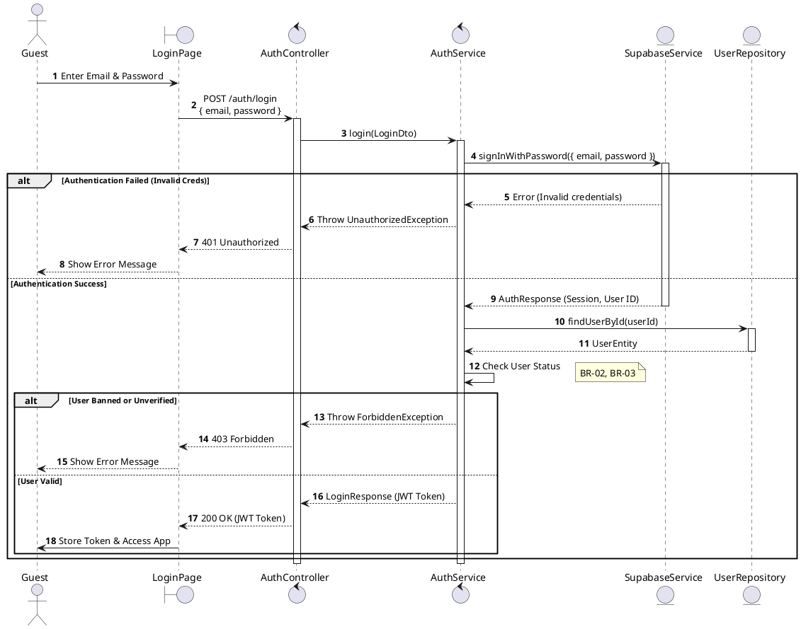
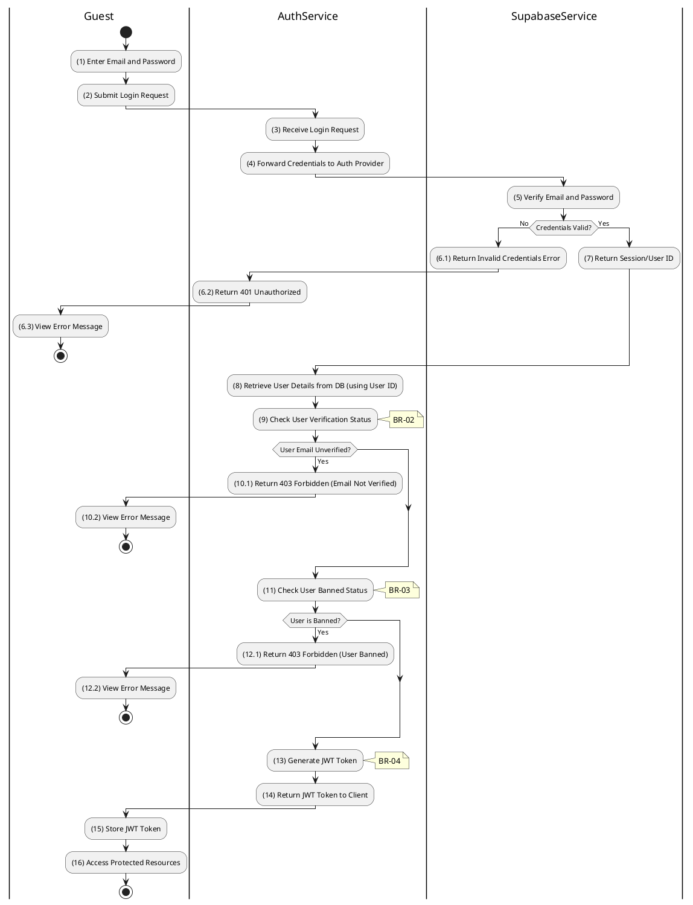

# 3.2.2 Login

## 1. Use Case Description

| Field              | Description                                                                         |
| ------------------ | ----------------------------------------------------------------------------------- |
| **Name**           | Login                                                                               |
| **Description**    | This use case allows the Guest to authenticate and access the system.               |
| **Actor**          | Guest                                                                               |
| **Trigger**        | When the Guest clicks on the 'Login' button on the LoginPage.                       |
| **Pre-condition**  | • Guest's device must be connected to the internet. • Guest is on the LoginPage. |
| **Post-condition** | The Guest will be authenticated and granted access to the system dashboard.         |

## 2. Sequence Flow (MVC)

## 3. Activities Flow (Swimlanes)

## 4. Business Rules

| Activity | BR Code   | Description                                                                                                                                                                                                                                                                                                                                                                                                        |
| :------- | :-------- | :----------------------------------------------------------------------------------------------------------------------------------------------------------------------------------------------------------------------------------------------------------------------------------------------------------------------------------------------------------------------------------------------------------------- |
| **(1)**  | **BR-01** | **Displaying Rules:** ❖ The system displays a “LoginPage” screen. (Refer to “LoginPage” view in “View Description” file). ❖ The screen renders input fields for: [email] and [password].                                                                                                                                                                                                                     |
| **(1)**  | **BR-02** | **Validation Rules (Front-end):** ❖ When the user enters credentials, the system uses the `ValidateInput(LoginDto)` method to check validity. ❖ If the input is not valid: ⮚ If [email] or [password] is empty, the system displays **MSG 1** (Mandatory Field). ⮚ If the [email] format is invalid, the system displays **MSG 4** (Invalid Format).                                                   |
| **(2)**  | **BR-03** | **Authentication Rules (Back-end):** ❖ When the user clicks the “Login” button, the system calls `AuthService.login(LoginDto)` to process the request. ❖ It attempts authentication by calling `Supabase.signInWithPassword({ email, password })`. ❖ If the authentication fails due to invalid credentials, the system returns a 401 Unauthorized error and displays **MSG 3** (Invalid Email/Password). |
| **(9)**  | **BR-04** | **Verification Rules (Back-end):** ❖ After successful authentication with Supabase, the system queries the “USERS” table via `UserRepository.findUserById(userId)` to retrieve user details. ❖ It checks the [isVerified] status. If the user’s email is not verified, the system returns a 403 Forbidden error and displays **MSG 7** (Email not verified).                                                 |
| **(11)** | **BR-05** | **Access Rules (Back-end):** ❖ The system further checks the [isBanned] status from the retrieved user data. ❖ If the user is banned, the system returns a 403 Forbidden error and displays **MSG 8** (User banned), preventing login.                                                                                                                                                                       |
| **(15)** | **BR-06** | **Displaying Rules (Success):** ❖ Upon successful login and authorization, the system generates and returns a JWT Token to the client. ❖ The system calls `Store_JWT(token)` to store the access token locally (e.g., in LocalStorage/Cookie). ❖ The user is then redirected to the protected Dashboard.                                                                                                  |
