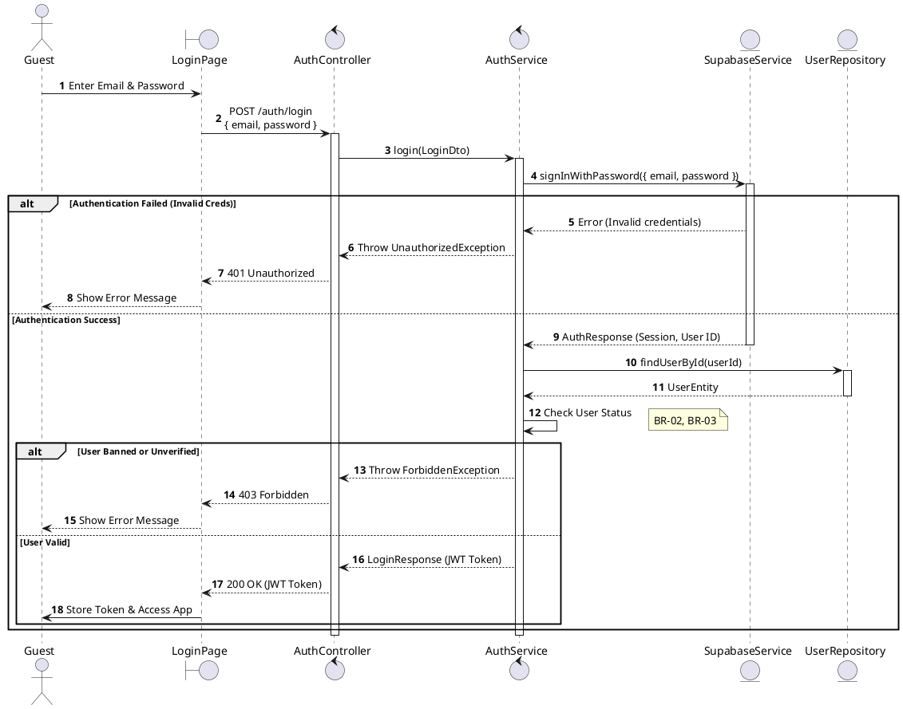
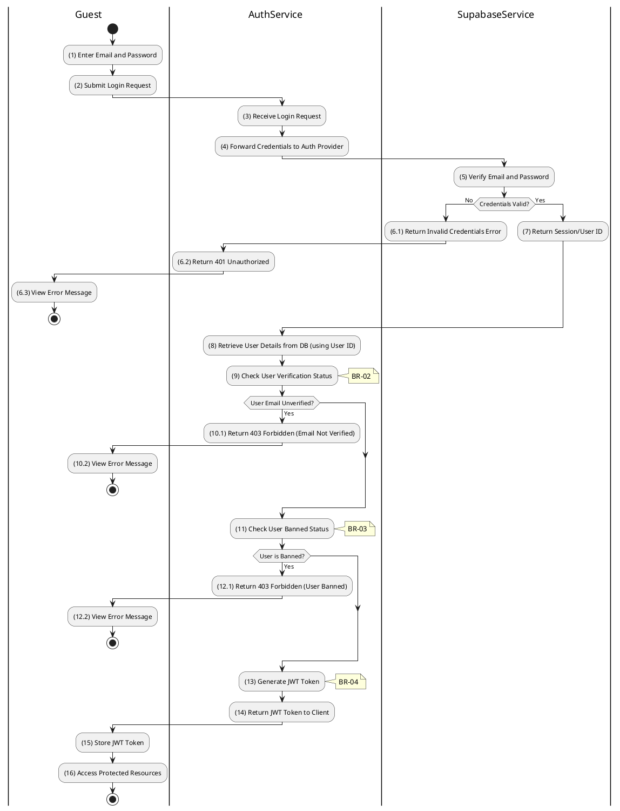

# 3.2.2 Login

## 1. Use Case Description

| Field              | Description                                                                         |
| ------------------ | ----------------------------------------------------------------------------------- |
| **Name**           | Login                                                                               |
| **Description**    | This use case allows the Guest to authenticate and access the system.               |
| **Actor**          | Guest                                                                               |
| **Trigger**        | When the Guest clicks on the 'Login' button on the LoginPage.                       |
| **Pre-condition**  | • Guest's device must be connected to the internet. • Guest is on the LoginPage. |
| **Post-condition** | The Guest will be authenticated and granted access to the system dashboard.         |

## 2. Sequence Flow (MVC)

## 3. Activities Flow (Swimlanes)

## 4. Business Rules

| Activity | BR Code   | Description                                                                                                                                                                                                                                                                                                |
| :------- | :-------- | :--------------------------------------------------------------------------------------------------------------------------------------------------------------------------------------------------------------------------------------------------------------------------------------------------------- |
| **(1)**  | **BR-01** | **Displaying Rule:** The system displays a 'LoginPage' screen. (Refer to 'LoginPage' view in 'View Description' file). The form contains input fields for: email, password.                                                                                                                          |
| **(1)**  | **BR-02** | **Validation Rule (Front-end):** When user enters information, system uses `Text_change()` method. Checks if input is valid (empty, wrong format). If `isEmpty()` on email/password → display **MSG 1** (Mandatory). If wrong email format → display **MSG 4** (Invalid format).               |
| **(2)**  | **BR-03** | **Validation Rule (Back-end/Save):** When user clicks 'Login' button, send data to auth provider via function `signInWithPassword({ email, password })`. Check credentials against `Supabase Auth` store. If invalid credentials → show **MSG 3** (Invalid credentials), return 401 Unauthorized. |
| **(9)**  | **BR-04** | **Validation Rule (Status Check):** System queries data in the table 'USERS' in the database (Refer to 'USERS' table in 'DB Sheet' file) based on the User ID. Check `isVerified` status. If email not verified → show **MSG 7** (Email not verified), return 403 Forbidden.                         |
| **(11)** | **BR-05** | **Validation Rule (Access Check):** Check `isBanned` status from retrieved user data. If user is banned → show **MSG 8** (User banned), return 403 Forbidden.                                                                                                                                        |
| **(15)** | **BR-06** | **Displaying Rule (Success):** The system generates JWT Token and returns to client. System displays successful login, stores JWT Token locally, and redirects user to access protected resources/dashboard.                                                                                         |
