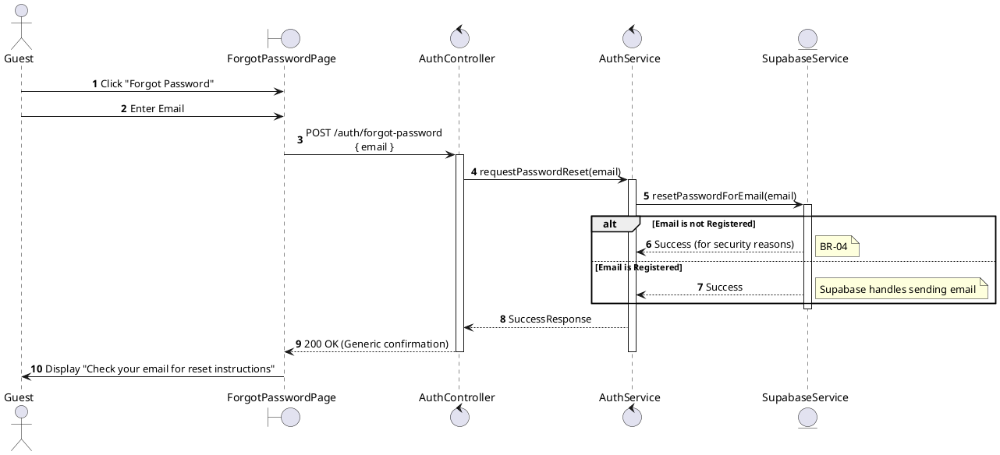
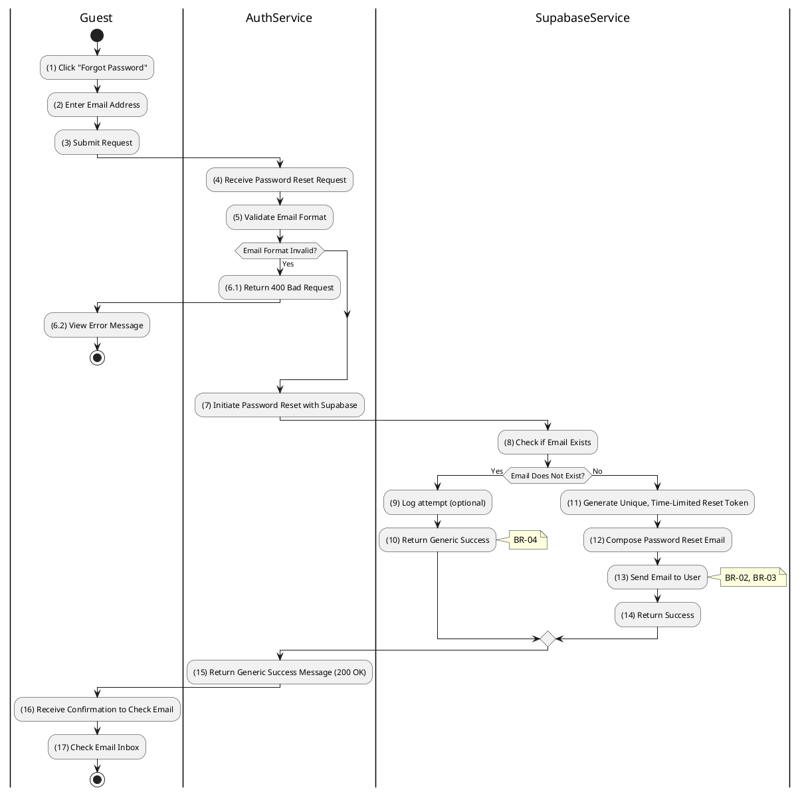

# 3.2.3 Forgot Password

## 1. Use Case Description

| Field              | Description                                                                                                        |
| ------------------ | ------------------------------------------------------------------------------------------------------------------ |
| **Name**           | Forgot Password                                                                                                    |
| **Description**    | This use case allows the Guest to create a new Password Reset Request information in the system.                   |
| **Actor**          | Guest                                                                                                              |
| **Trigger**        | When the Guest clicks on the 'Forgot Password' button on the ForgotPasswordPage.                                   |
| **Pre-condition**  | • Guest's device must be connected to the internet. • Guest is on the ForgotPasswordPage.                       |
| **Post-condition** | The Password Reset Request information will be stored into the system and a reset email will be sent to the Guest. |

## 2. Sequence Flow (MVC)

## 3. Activities Flow (Swimlanes)

## 4. Business Rules

| Activity | BR Code   | Description                                                                                                                                                                                                                                                                                                                                                                                                                                                                                                                                                                                                                                                                                                                                                                                                                                                                     |
| :------- | :-------- | :------------------------------------------------------------------------------------------------------------------------------------------------------------------------------------------------------------------------------------------------------------------------------------------------------------------------------------------------------------------------------------------------------------------------------------------------------------------------------------------------------------------------------------------------------------------------------------------------------------------------------------------------------------------------------------------------------------------------------------------------------------------------------------------------------------------------------------------------------------------------------ |
| **(1)**  | **BR-01** | **Displaying Rules:** ❖ The system displays a “ForgotPasswordPage” screen. (Refer to “ForgotPasswordPage” view in “View Description” file). ❖ The screen renders an input field for the user's [email] address.                                                                                                                                                                                                                                                                                                                                                                                                                                                                                                                                                                                                                                                        |
| **(2)**  | **BR-02** | **Validation Rules (Front-end):** ❖ When the user enters their email, the system uses the `ValidateInput(email)` method for validation. ❖ If the input is not valid: ⮚ If the [email] field is empty, the system displays **MSG 1** (Mandatory Field). ⮚ If the [email] format is invalid, the system displays **MSG 4** (Invalid Format).                                                                                                                                                                                                                                                                                                                                                                                                                                                                                                                     |
| **(3)**  | **BR-03** | **Processing Rules (Back-end):** ❖ When the user clicks the “Reset Password” button, the system calls `AuthService.requestPasswordReset(email)` to initiate the process. ❖ It invokes `Supabase.resetPasswordForEmail(email)` to send the reset email. ❖ The system internally checks if the email exists in the database but, for security reasons, does NOT reveal this information to the user.                                                                                                                                                                                                                                                                                                                                                                                                                                                      |
| **(16)** | **BR-04** | **Displaying Rules (Security/Confirmation):** ❖ Regardless of whether the email is registered or not, the system displays a generic success message: "If your email is registered, you will receive reset instructions." ❖ This approach prevents user enumeration attacks, enhancing security. ❖ If the email exists, a password reset link is sent to the user via the email service.                                                                                                                                                                                                                                                                                                                                                                                                                                                                                  |