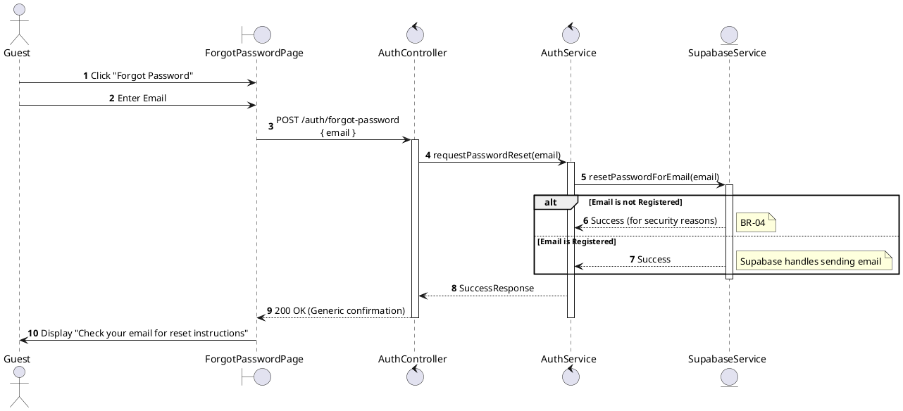
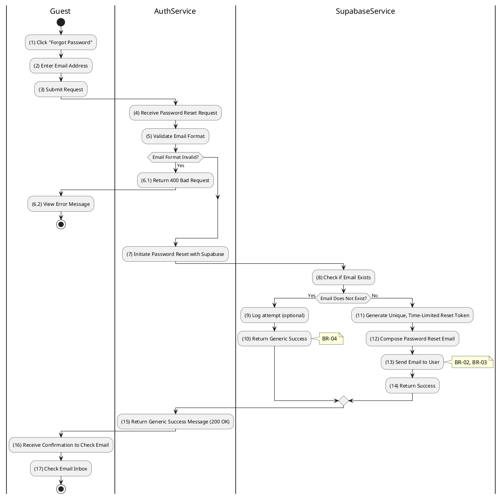

# 3.2.3 Forgot Password

## 1. Use Case Description

| Field              | Description                                                                                                        |
| ------------------ | ------------------------------------------------------------------------------------------------------------------ |
| **Name**           | Forgot Password                                                                                                    |
| **Description**    | This use case allows the Guest to create a new Password Reset Request information in the system.                   |
| **Actor**          | Guest                                                                                                              |
| **Trigger**        | When the Guest clicks on the 'Forgot Password' button on the ForgotPasswordPage.                                   |
| **Pre-condition**  | • Guest's device must be connected to the internet. • Guest is on the ForgotPasswordPage.                       |
| **Post-condition** | The Password Reset Request information will be stored into the system and a reset email will be sent to the Guest. |

## 2. Sequence Flow (MVC)

## 3. Activities Flow (Swimlanes)

## 4. Business Rules

| Activity | BR Code   | Description                                                                                                                                                                                                                                                                                   |
| :------- | :-------- | :-------------------------------------------------------------------------------------------------------------------------------------------------------------------------------------------------------------------------------------------------------------------------------------------- |
| **(1)**  | **BR-01** | **Displaying Rule:** The system displays a 'ForgotPasswordPage' screen. (Refer to 'ForgotPasswordPage' view in 'View Description' file). The form contains input field for: email address.                                                                                              |
| **(2)**  | **BR-02** | **Validation Rule (Front-end):** When user enters email, system uses `Text_change()` method. Checks if input is valid (empty, wrong format). If `isEmpty()` on email → display **MSG 1** (Mandatory). If wrong email format → display **MSG 4** (Invalid format).                 |
| **(3)**  | **BR-03** | **Validation Rule (Back-end/Save):** When user clicks 'Reset Password' button, send data to auth provider via function `resetPasswordForEmail(email)`. System internally checks if email exists in database but does NOT reveal result to user (security).                              |
| **(16)** | **BR-04** | **Displaying Rule (Security/Confirmation):** Regardless of whether email exists or not, system displays generic success message: "Check your email for reset instructions". This prevents User Enumeration attacks. If email exists → password reset link is sent via email service. |
