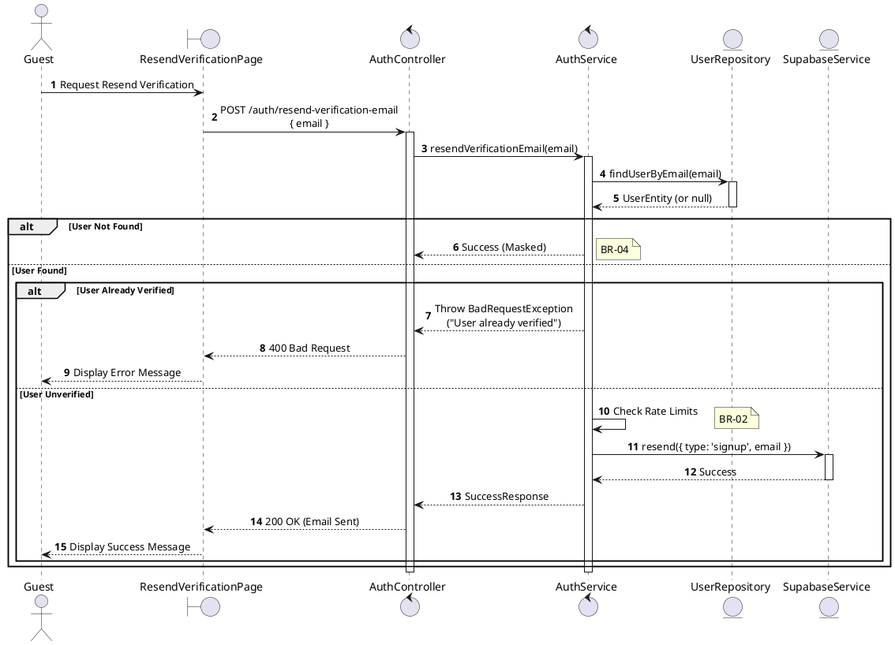
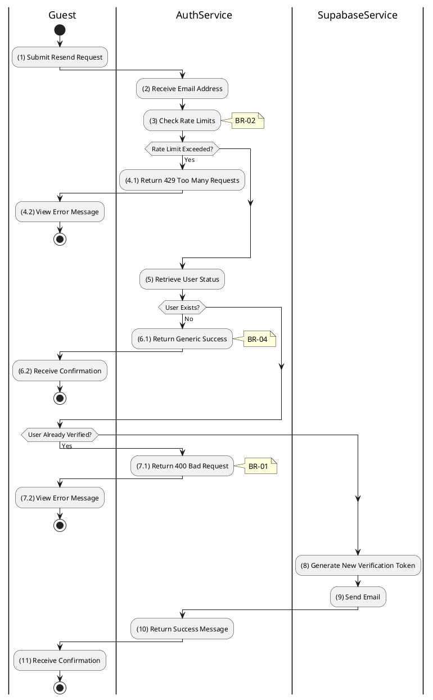

# 3.2.4 Resend Verification Email

## 1. Use Case Description

| Field              | Description                                                                                                                   |
| ------------------ | ----------------------------------------------------------------------------------------------------------------------------- |
| **Name**           | Resend Verification Email                                                                                                     |
| **Description**    | This use case allows the Guest to create a new Verification Email Request information in the system.                          |
| **Actor**          | Guest                                                                                                                         |
| **Trigger**        | When the Guest clicks on the 'Resend Verification Email' button on the ResendVerificationPage.                                |
| **Pre-condition**  | • Guest's device must be connected to the internet. • Guest is on the ResendVerificationPage.                              |
| **Post-condition** | The Verification Email Request information will be stored into the system and a verification email will be sent to the Guest. |

## 2. Sequence Flow (MVC)

## 3. Activities Flow (Swimlanes)

## 4. Business Rules

| Activity | BR Code   | Description                                                                                                                                                                                                                                                                                                                                                                                                    |
| :------- | :-------- | :------------------------------------------------------------------------------------------------------------------------------------------------------------------------------------------------------------------------------------------------------------------------------------------------------------------------------------------------------------------------------------------------------------- |
| **(1)**  | **BR-01** | **Displaying Rule:** The system displays a 'ResendVerificationPage' screen. (Refer to 'ResendVerificationPage' view in 'View Description' file). The form contains input field for: email address.                                                                                                                                                                                                       |
| **(1)**  | **BR-02** | **Validation Rule (Front-end):** When user enters email, system uses `Text_change()` method. Checks if input is valid (empty, wrong format). If `isEmpty()` on email → display **MSG 1** (Mandatory). If wrong email format → display **MSG 4** (Invalid format).                                                                                                                                  |
| **(3)**  | **BR-03** | **Validation Rule (Rate Limiting):** System checks rate limit for requesting IP or email via `checkRateLimit()` method. If rate limit exceeded → display **MSG 9** (Too many requests), return 429.                                                                                                                                                                                                      |
| **(1)**  | **BR-04** | **Validation Rule (Back-end/Save):** When user clicks 'Resend' button, send request via function `resendVerificationEmail(email)`. Check table `USERS` for user existence and verification status. If user not found → show generic success (security). If already verified → show **MSG 9** (Already verified), return 400. Else, generate new token, send email, show **MSG 7** (Email sent). |
