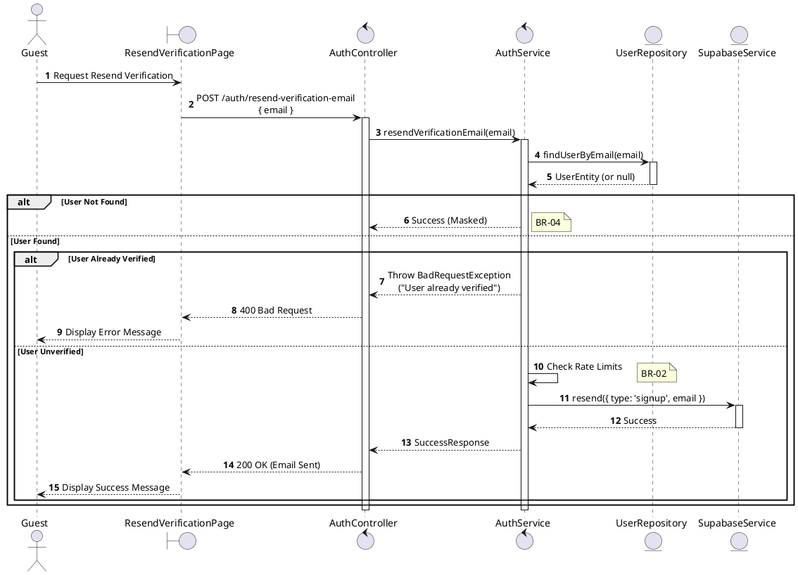
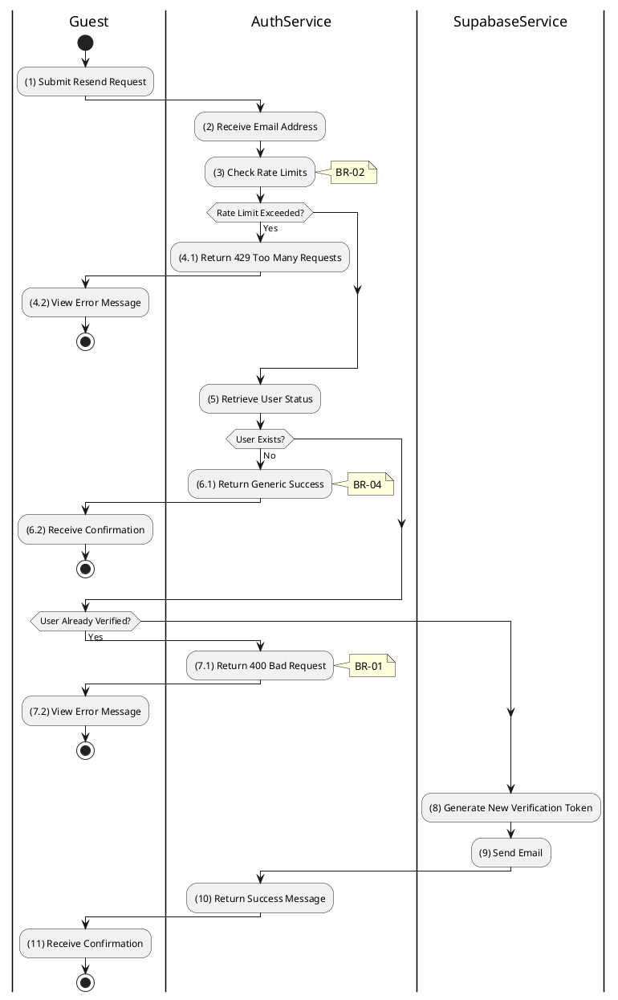

# 3.2.4 Resend Verification Email

## 1. Use Case Description

| Field              | Description                                                                                                                   |
| ------------------ | ----------------------------------------------------------------------------------------------------------------------------- |
| **Name**           | Resend Verification Email                                                                                                     |
| **Description**    | This use case allows the Guest to create a new Verification Email Request information in the system.                          |
| **Actor**          | Guest                                                                                                                         |
| **Trigger**        | When the Guest clicks on the 'Resend Verification Email' button on the ResendVerificationPage.                                |
| **Pre-condition**  | • Guest's device must be connected to the internet. • Guest is on the ResendVerificationPage.                              |
| **Post-condition** | The Verification Email Request information will be stored into the system and a verification email will be sent to the Guest. |

## 2. Sequence Flow (MVC)

## 3. Activities Flow (Swimlanes)

## 4. Business Rules

| Activity | BR Code   | Description                                                                                                                                                                                                                                                                                                                                                                                                                   | 
| :------- | :-------- | :-------------------------------------------------------------------------------------------------------------------------------------------------------------------------------------------------------------------------------------------------------------------------------------------------------------------------------------------------------------------------------------------------------------- | 
| **(1)**  | **BR-01** | **Displaying Rules:** ❖ The system displays a “ResendVerificationPage” screen. (Refer to “ResendVerificationPage” view in “View Description” file). ❖ The screen renders an input field for the user's [email] address.                                                                                                                                                                                                                            | 
| **(1)**  | **BR-02** | **Validation Rules (Front-end):** ❖ When the user enters their email, the system uses the `ValidateInput(email)` method for validation. ❖ If the input is not valid: ⮚ If the [email] field is empty, the system displays **MSG 1** (Mandatory Field). ⮚ If the [email] format is invalid, the system displays **MSG 4** (Invalid Format).                                                                                                                                                                                                                                                                                            | 
| **(3)**  | **BR-03** | **Rate Limiting Rules (Back-end):** ❖ The system calls `AuthService.checkRateLimit(ip, email)` to prevent abuse. ❖ It checks the request count for the originating IP address or email within a defined period. ❖ If the rate limit is exceeded, the system returns a 429 Too Many Requests error and displays **MSG 9** (Too many requests).                                                                                                                                                                                                                                                                                                   | 
| **(1)**  | **BR-04** | **Processing Rules (Back-end):** ❖ When the user clicks “Resend”, the system calls `AuthService.resendVerificationEmail(email)` to process the request. ❖ The system checks the “USERS” table for user existence and [isVerified] status. ❖ If the user is not found, a generic success message is returned for security reasons. ❖ If the user is already verified, a 400 Bad Request is returned. ❖ Otherwise, a new verification token is generated, the email is sent via `Supabase.resend()`, and a success message is displayed.                                                                                                                                                                                                                                                         |
