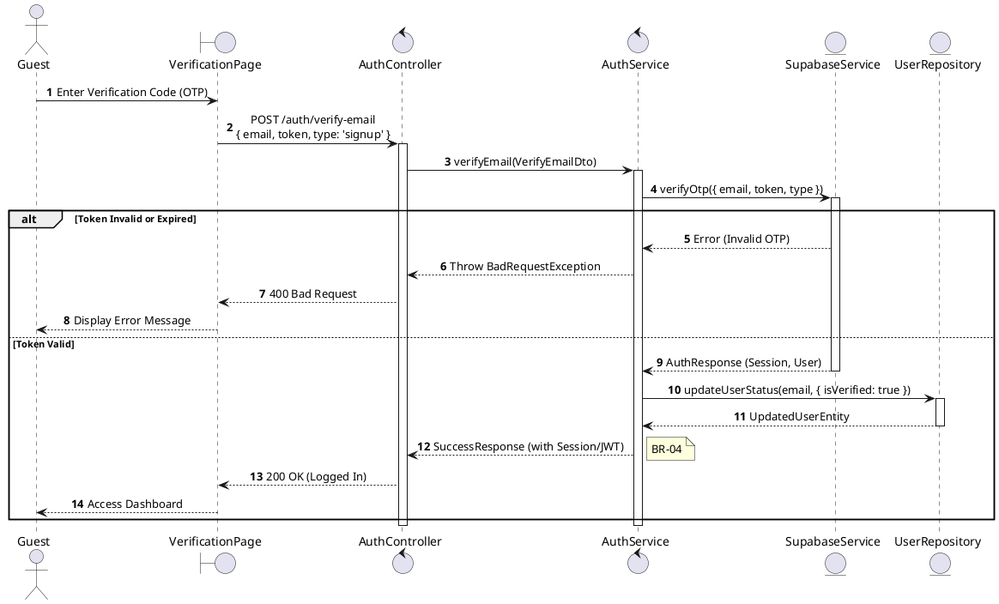
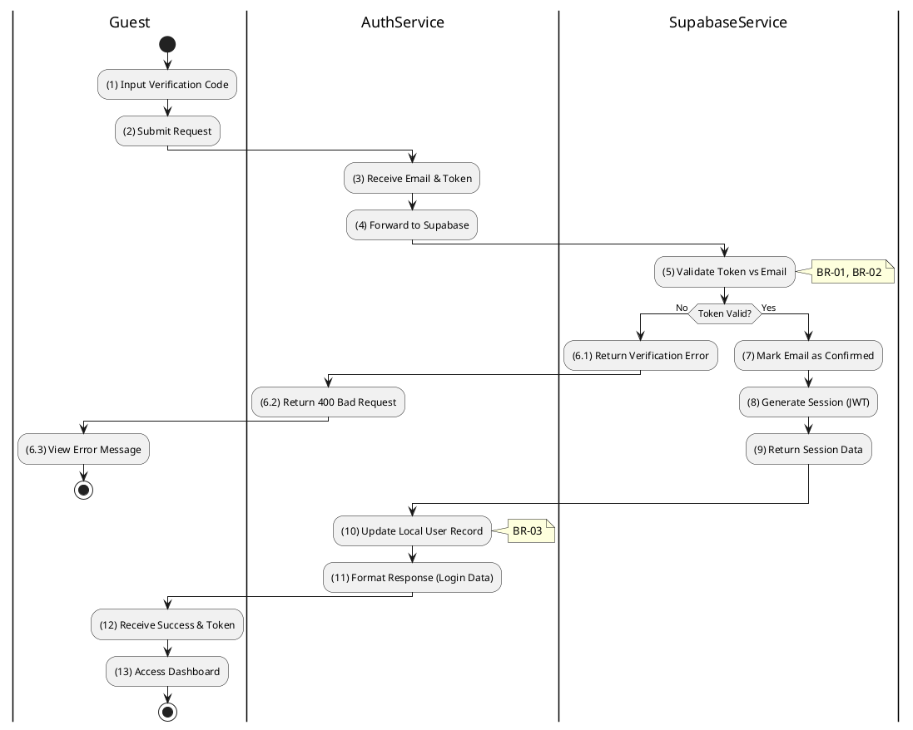

# 3.2.5 Verify Email (POST)

## 1. Use Case Description

| Field              | Description                                                                                     |
| ------------------ | ----------------------------------------------------------------------------------------------- |
| **Name**           | Verify Email (POST)                                                                             |
| **Description**    | This use case allows the Guest to update existing Email Verification information in the system. |
| **Actor**          | Guest                                                                                           |
| **Trigger**        | When the Guest clicks on the 'Verify' button on the VerificationPage.                           |
| **Pre-condition**  | • Guest's device must be connected to the internet. • Guest is on the VerificationPage.      |
| **Post-condition** | The Email Verification information will be updated in the system and Guest will be logged in.   |

## 2. Sequence Flow (MVC)

## 3. Activities Flow (Swimlanes)

## 4. Business Rules

| Activity | BR Code   | Description                                                                                                                                                                                                                                                                                                                                |
| :------- | :-------- | :----------------------------------------------------------------------------------------------------------------------------------------------------------------------------------------------------------------------------------------------------------------------------------------------------------------------------------------- |
| **(1)**  | **BR-01** | **Displaying Rule:** The system displays a 'VerificationPage' screen. (Refer to 'VerificationPage' view in 'View Description' file). The form contains input fields for: email (pre-filled), verification code (OTP).                                                                                                                |
| **(1)**  | **BR-02** | **Validation Rule (Front-end):** When user enters OTP code, system uses `Text_change()` method. Checks if input is valid (empty, wrong format). If `isEmpty()` on code → display **MSG 1** (Mandatory). If code format invalid (wrong length) → display **MSG 4** (Invalid format).                                            |
| **(2)**  | **BR-03** | **Validation Rule (Back-end/Save):** When user clicks 'Verify' button, send data to auth provider via function `verifyOtp({ email, token, type })`. Check token validity against Supabase records. If token invalid or expired → show **MSG 10** (Verification failed), return 400. Else, mark email as confirmed in Supabase. |
| **(10)** | **BR-04** | **Storing Rule:** The User information will be updated in table 'USERS' in the database (Refer to 'USERS' table in 'DB Sheet' file) to set the verification status. Generate session/JWT token for immediate login.                                                                                                                  |
| **(13)** | **BR-05** | **Displaying Rule (Success):** The system displays success and automatically logs user in. User is redirected to Dashboard with JWT token stored locally. Show **MSG 7** (Verification successful).                                                                                                                               |
