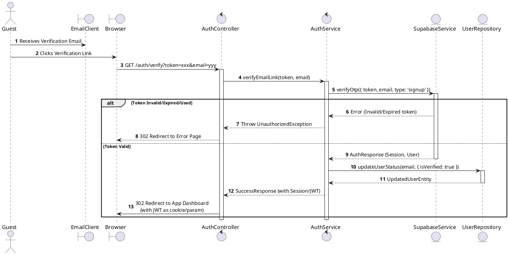
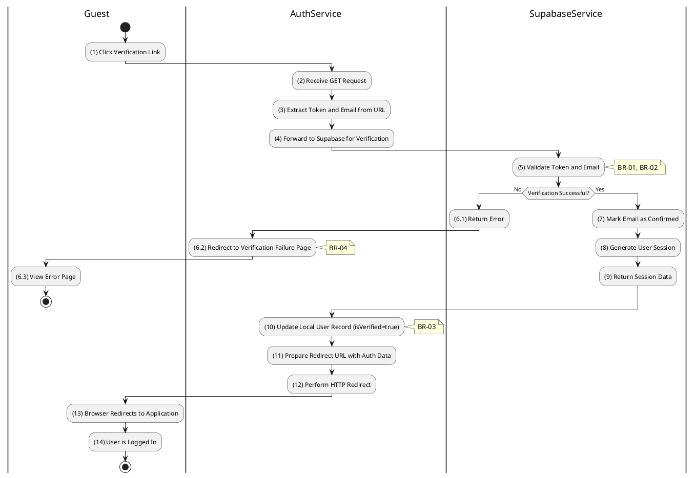

# 3.2.6 Verify Email (Link Click)

## 1. Use Case Description

| Field              | Description                                                                                       |
| ------------------ | ------------------------------------------------------------------------------------------------- |
| **Name**           | Verify Email (Link Click)                                                                         |
| **Description**    | This use case allows the Guest to update existing Email Verification information in the system.   |
| **Actor**          | Guest                                                                                             |
| **Trigger**        | When the Guest clicks on the verification link in the EmailClient.                                |
| **Pre-condition**  | • Guest's device must be connected to the internet. • Guest has received a verification email. |
| **Post-condition** | The Email Verification information will be updated in the system and Guest will be logged in.     |

## 2. Sequence Flow (MVC)

## 3. Activities Flow (Swimlanes)

## 4. Business Rules

| Activity  | BR Code   | Description                                                                                                                                                                                                                                                                                                                                                                                                                                                                                                                                                                                                                                                                                                                                                                                                                                                                                                                                                                                                 |
| :-------- | :-------- | :---------------------------------------------------------------------------------------------------------------------------------------------------------------------------------------------------------------------------------------------------------------------------------------------------------------------------------------------------------------------------------------------------------------------------------------------------------------------------------------------------------------------------------------------------------------------------------------------------------------------------------------------------------------------------------------------------------------------------------------------------------------------------------------------------------------------------------------------------------------------------------------------------------------------------------------------------------------------------------------------------------- |
| **(1)**   | **BR-01** | **Querying Rules:** ❖ When the user clicks the verification link, the system calls `AuthController.verifyEmailLink(query)`. ❖ It extracts the [token] and [email] from the URL parameters.                                                                                                                                                                                                                                                                                                                                                                                                                                                                                                                                                                                                                                                                                                                                                                                                                  |
| **(5)**   | **BR-02** | **Verification Rules (Back-end):** ❖ The system invokes `AuthService.verifyEmailLink()` to process the verification. ❖ It calls `Supabase.verifyOtp({ token, email, type: 'signup' })` to validate the token. ❖ If the input is not valid: ⮚ If the token is invalid, expired, or has been used, the system redirects to a 'VerificationFailedPage'. ⮚ The system displays **MSG 10** (Verification failed) on the error page.                                                                                                                                                                                                                                                                                                                                                                                                                                                                                                                                     |
| **(10)**  | **BR-03** | **Storing Rules (Back-end):** ❖ Upon successful verification, the system updates the user’s record by calling `UserRepository.updateUserStatus()`. ❖ It sets the [isVerified] field to `true` in the “USERS” table. ❖ The system also ensures local database status is synchronized with Supabase.                                                                                                                                                                                                                                                                                                                                                                                                                                                                                                                                                                                                                                                                                    |
| **(6.2)** | **BR-04** | **Displaying Rules (Error):** ❖ If the verification fails for any reason, the system redirects the browser to a user-friendly 'Verification Failed' page by calling `Redirect('ErrorPage')`. ❖ The user is shown clear instructions, such as options to resend the verification email, rather than raw JSON error messages.                                                                                                                                                                                                                                                                                                                                                                                                                                                                                                                                                                                                                                                                   |
| **(14)**  | **BR-05** | **Displaying Rules (Success):** ❖ If the verification succeeds, the system performs an HTTP 302 redirect to the Application Dashboard by calling `Redirect('Dashboard')`. ❖ The JWT token is passed either via a cookie or as a URL parameter. ❖ The user is automatically logged in without needing a separate login action.                                                                                                                                                                                                                                                                                                                                                                                                                                                                                                                                                                                                                                                                   |
