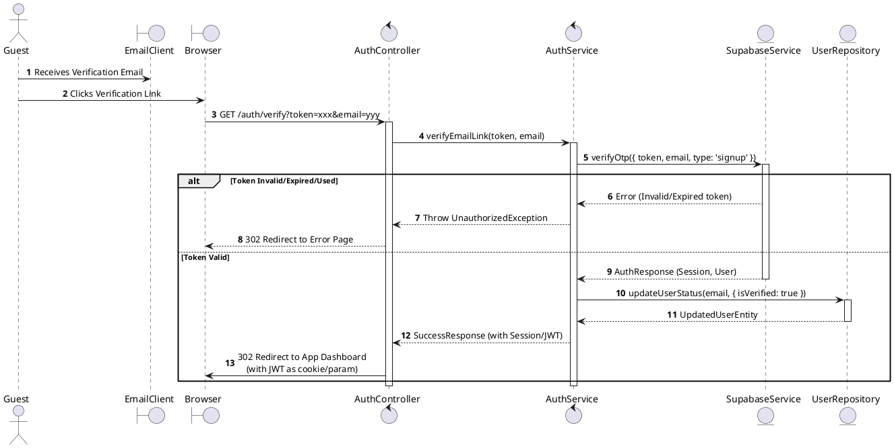
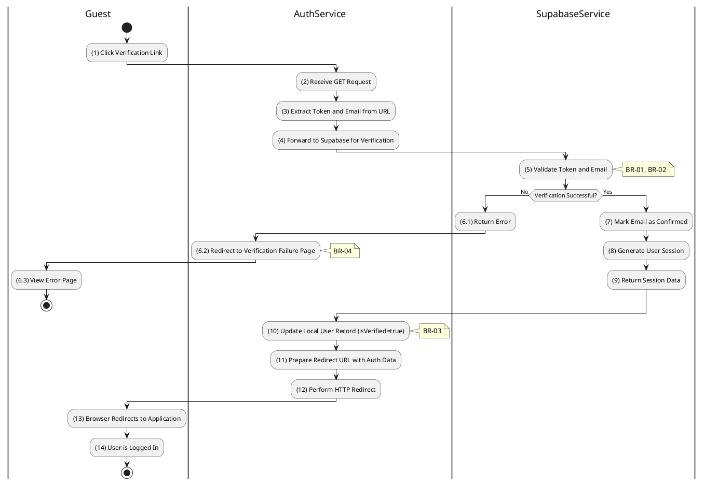

# 3.2.6 Verify Email (Link Click)

## 1. Use Case Description

| Field              | Description                                                                                       |
| ------------------ | ------------------------------------------------------------------------------------------------- |
| **Name**           | Verify Email (Link Click)                                                                         |
| **Description**    | This use case allows the Guest to update existing Email Verification information in the system.   |
| **Actor**          | Guest                                                                                             |
| **Trigger**        | When the Guest clicks on the verification link in the EmailClient.                                |
| **Pre-condition**  | • Guest's device must be connected to the internet. • Guest has received a verification email. |
| **Post-condition** | The Email Verification information will be updated in the system and Guest will be logged in.     |

## 2. Sequence Flow (MVC)

## 3. Activities Flow (Swimlanes)

## 4. Business Rules

| Activity  | BR Code   | Description                                                                                                                                                                                                                                                                                      |
| :-------- | :-------- | :----------------------------------------------------------------------------------------------------------------------------------------------------------------------------------------------------------------------------------------------------------------------------------------------- |
| **(1)**   | **BR-01** | **Querying Rule:** When user clicks verification link, system extracts token and email from URL parameters. System queries the authentication provider to verify the OTP token against the email.                                                                                          |
| **(5)**   | **BR-02** | **Validation Rule (Token Integrity):** System validates token signature and expiration against Supabase records. If token invalid, expired, or tampered → redirect to error page with **MSG 10** (Verification failed). If token already used (replay attack) → redirect to error page. |
| **(10)**  | **BR-03** | **Storing Rule:** The User information will be updated in table 'USERS' in the database (Refer to 'USERS' table in 'DB Sheet' file) to set the verification status. Sync local database status with Supabase.                                                                              |
| **(6.2)** | **BR-04** | **Displaying Rule (Error):** If verification fails, system redirects browser to 'Verification Failed' page. User sees friendly error message, not raw JSON error.                                                                                                                          |
| **(14)**  | **BR-05** | **Displaying Rule (Success):** If verification succeeds, system performs HTTP 302 redirect to Application Dashboard. JWT token is passed via cookie or URL parameter. User is automatically logged in without separate login action.                                                    |
