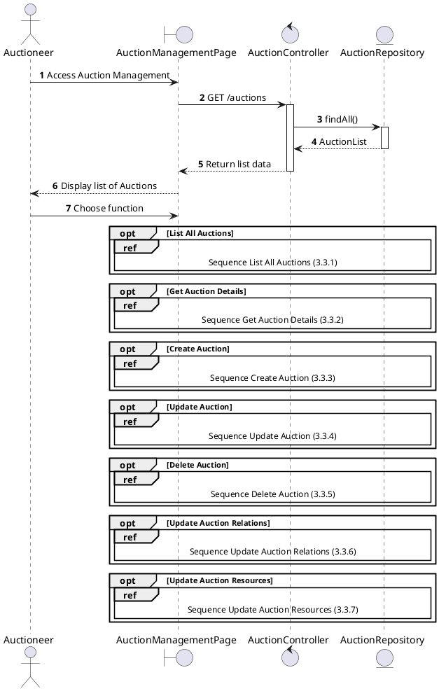
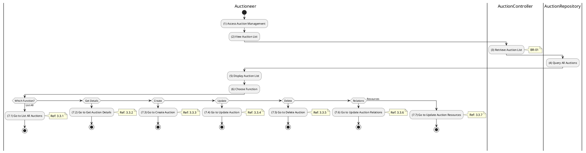

# Use Case 3.3.0: Manage Auction

## 1. Use Case Description

| Field              | Content                                                                                                                                       |
| :----------------- | :-------------------------------------------------------------------------------------------------------------------------------------------- |
| **Name**           | Manage Auction                                                                                                                                |
| **Description**    | This use case allows the **Auctioneer** to choose one of the corresponding functions of CRUD to adjust **Auction** information in the system. |
| **Actor**          | **Auctioneer**, **Admin**, **Super Admin**                                                                                                    |
| **Trigger**        | When the **Auctioneer** clicks on the "**Auction**" button on the navigation sidebar.                                                         |
| **Pre-condition**  | 1. **Auctioneer**'s device must be connected to the internet. 2. **Auctioneer** is signed in with their account.                           |
| **Post-condition** | The **Auction** information is updated to the corresponding function that the **Auctioneer** executes.                                        |

---

## 2. Sequence Flow

---

## 3. Activities Flow (Swimlanes)

---

## 4. Business Rules

| Activity | BR Code   | Description                                                                                                                                          |
| :------- | :-------- | :--------------------------------------------------------------------------------------------------------------------------------------------------- |
| **(5)**  | **BR-01** | **Displaying Rule:** The system displays an "**Auction Management**" screen. (Refer to "**Auction Management**" view in "View Description" file). |
| **(6)**  | **BR-02** | **Choosing Rule:** **Auctioneer** can only choose one feature at a time to use.                                                                   |

---

## 5. Related Child Use Cases

| Use Case ID | Use Case Name            | Description                                     |
| :---------- | :----------------------- | :---------------------------------------------- |
| 3.3.1       | List All Auctions        | Retrieve and display all auction listings       |
| 3.3.2       | Get Auction Details      | View detailed information of a specific auction |
| 3.3.3       | Create Auction           | Create a new auction listing                    |
| 3.3.4       | Update Auction           | Modify existing auction details                 |
| 3.3.5       | Delete Auction           | Remove an auction from the system               |
| 3.3.6       | Update Auction Relations | Manage related auctions linkage                 |
| 3.3.7       | Update Auction Resources | Manage auction images and attachments           |
