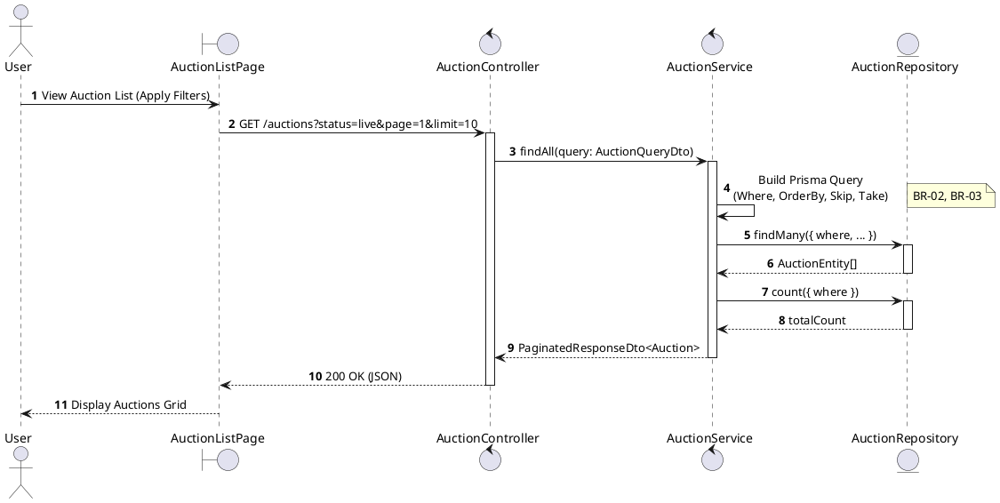
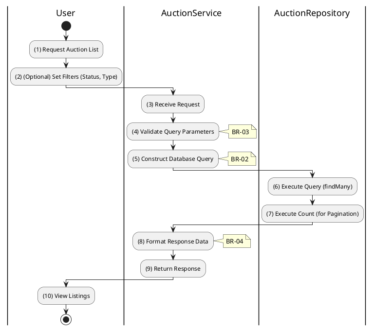

# 3.3.1 List All Auctions

## 1. Use Case Description

| Field              | Description                                                                                                   |
| ------------------ | ------------------------------------------------------------------------------------------------------------- |
| **Name**           | List All Auctions                                                                                             |
| **Description**    | This use case allows the User to search Auction information in the system based on input keywords.            |
| **Actor**          | User                                                                                                          |
| **Trigger**        | When User enters searching keywords in the SearchBox on the top left of the AuctionListPage screen.           |
| **Pre-condition**  | • User's device must be connected to the internet. • User is on the AuctionListPage.                       |
| **Post-condition** | The datagrid of Auction information will be filtered by keywords and displayed on the AuctionListPage screen. |

## 2. Sequence Flow (MVC)

## 3. Activities Flow (Swimlanes)

## 4. Business Rules

| Activity | BR Code   | Description                                                                                                                                                                                                                                                                                                                                                                                                                                                                                                                                                                                                                                                                                                                                                                                                                                                                     |
| :------- | :-------- | :------------------------------------------------------------------------------------------------------------------------------------------------------------------------------------------------------------------------------------------------------------------------------------------------------------------------------------------------------------------------------------------------------------------------------------------------------------------------------------------------------------------------------------------------------------------------------------------------------------------------------------------------------------------------------------------------------------------------------------------------------------------------------------------------------------------------------------------------------------------------------ |
| **(1)**  | **BR-01** | **Displaying Rules:** ❖ The system displays an “AuctionListPage” screen. (Refer to “AuctionListPage” view in “View Description” file). ❖ The screen renders a filter sidebar, allowing users to filter by [Status], [AssetType], and [PriceRange]. ❖ It also includes a search bar for [Keyword] input and dedicated controls for pagination.                                                                                                                                                                                                                                                                                                                                                                                                                                                                                           |
| **(2)**  | **BR-02** | **Searching Rules:** ❖ When the user enters keywords or applies filters, the system dynamically constructs a Prisma WHERE clause for `AuctionService.findAll(query)`. ❖ This clause includes conditions such as: [name] containing the [keyword], [status] being within [selectedStatuses], [assetType] matching [selectedTypes], and [startingPrice] falling between [min] and [max] values.                                                                                                                                                                                                                                                                                                                                                                                                                                                                    |
| **(4)**  | **BR-03** | **Validation Rules (Pagination):** ❖ The system validates `page` and `limit` parameters received in the query by calling `Pagination_Logic(page, limit)`. ❖ To prevent performance degradation, it enforces a maximum [limit] of 50 records per page. ❖ If [page] is less than 1, it defaults to 1. The [skip] value is calculated as `(page - 1) * limit`.                                                                                                                                                                                                                                                                                                                                                                                                                                                                                                     |
| **(10)** | **BR-04** | **Displaying Rules (Results):** ❖ The system displays the “AuctionListPage” screen with an updated datagrid via `Display_Grid('AuctionGrid', auctions)`. ❖ Simplified auction cards are rendered, showing: [Image], [Code], [Name], a [Status] badge, and [StartingPrice]. ❖ To optimize response times for the list view, heavy fields such as full descriptions and bid histories are excluded.                                                                                                                                                                                                                                                                                                                                                                                                                                                  |
