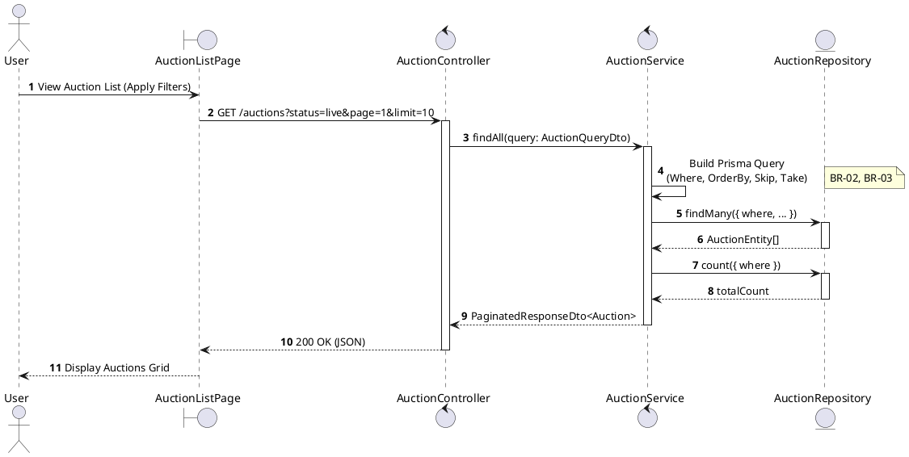
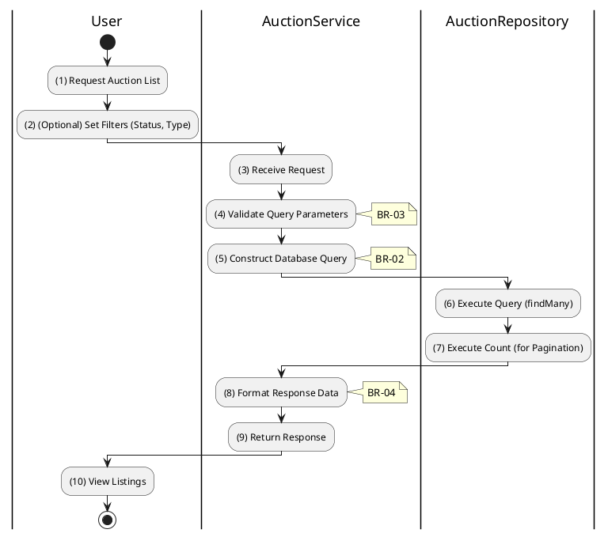

# 3.3.1 List All Auctions

## 1. Use Case Description

| Field              | Description                                                                                                   |
| ------------------ | ------------------------------------------------------------------------------------------------------------- |
| **Name**           | List All Auctions                                                                                             |
| **Description**    | This use case allows the User to search Auction information in the system based on input keywords.            |
| **Actor**          | User                                                                                                          |
| **Trigger**        | When User enters searching keywords in the SearchBox on the top left of the AuctionListPage screen.           |
| **Pre-condition**  | • User's device must be connected to the internet. • User is on the AuctionListPage.                       |
| **Post-condition** | The datagrid of Auction information will be filtered by keywords and displayed on the AuctionListPage screen. |

## 2. Sequence Flow (MVC)

## 3. Activities Flow (Swimlanes)

## 4. Business Rules

| Activity | BR Code   | Description                                                                                                                                                                                                                                                                                       |
| :------- | :-------- | :------------------------------------------------------------------------------------------------------------------------------------------------------------------------------------------------------------------------------------------------------------------------------------------------ |
| **(1)**  | **BR-01** | **Displaying Rule:** The system displays a 'AuctionListPage' screen. (Refer to 'AuctionListPage' view in 'View Description' file). The screen contains filter options (status, type, price range) and pagination controls.                                                                  |
| **(2)**  | **BR-02** | **Searching Rule:** When user enters keywords or selects filters, system uses `Text_change(Event e)` or `Selection_change()` method. System queries data in the table 'AUCTION' in the database (Refer to 'AUCTION' table in 'DB Sheet' file) based on input keywords and selected filters. |
| **(4)**  | **BR-03** | **Validation Rule (Pagination):** System validates `page` and `limit` parameters. Enforces maximum `limit` (e.g., 50) to prevent performance degradation. If invalid, defaults to standard values (page = 1, limit = 10).                                                                |
| **(10)** | **BR-04** | **Displaying Rule (Results):** The system displays 'AuctionListPage' screen with data on the datagrid updated according to entered filters/keywords. Heavy fields (full descriptions, bid histories) are excluded to optimize list view response.                                           |
