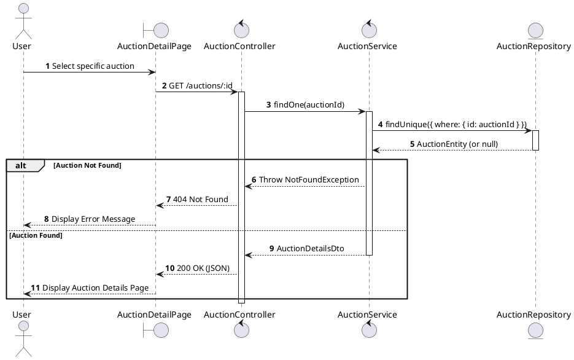
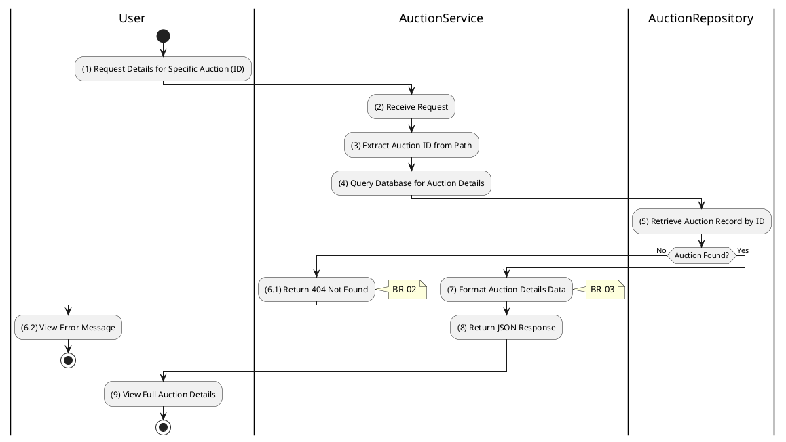

# 3.3.2 Get Auction Details

## 1. Use Case Description

| Field              | Description                                                                                        |
| ------------------ | -------------------------------------------------------------------------------------------------- |
| **Name**           | Get Auction Details                                                                                |
| **Description**    | This use case allows the User to search Auction information in the system based on input keywords. |
| **Actor**          | User                                                                                               |
| **Trigger**        | When User clicks on an Auction item in the AuctionListPage datagrid.                               |
| **Pre-condition**  | • User's device must be connected to the internet. • User is on the AuctionListPage.            |
| **Post-condition** | The Auction details will be displayed on the AuctionDetailPage screen.                             |

## 2. Sequence Flow (MVC)

## 3. Activities Flow (Swimlanes)

## 4. Business Rules

| Activity  | BR Code   | Description                                                                                                                                                                                                                                                                                                                                                                                                                                                  |
| :-------- | :-------- | :----------------------------------------------------------------------------------------------------------------------------------------------------------------------------------------------------------------------------------------------------------------------------------------------------------------------------------------------------------------------------------------------------------------------------------------------------------- |
| **(1)**   | **BR-01** | **Querying Rules:** ❖ The system calls `AuctionService.findOne(id)` to retrieve detailed auction information. ❖ It invokes `AuctionRepository.findUnique({ where: { id } })` to query the “AUCTION” table. ❖ The query includes relations such as [propertyOwner] and [auctionCosts] to fetch comprehensive data.                                                                                                                                 |
| **(6.1)** | **BR-02** | **Validation Rules (Back-end):** ❖ The system performs a backend check for the auction’s existence. ❖ If the input is not valid: ⮚ If the auction ID is not found, the system returns a 404 Not Found error. ⮚ The system displays **MSG 11** (Auction Not Found) on the View.                                                                                                                                                                  |
| **(9)**   | **BR-03** | **Displaying Rules:** ❖ The system displays an “AuctionDetailPage” screen. (Refer to “AuctionDetailPage” view in “View Description” file). ❖ The screen renders content organized into tabs such as [Overview], [Timeline], [Documents], and [Location]. ❖ The auction’s [Status] is displayed with color coding for quick visual identification. ❖ An [ImageGallery] component is used to showcase associated media.                                                                                                                                                                                           |
