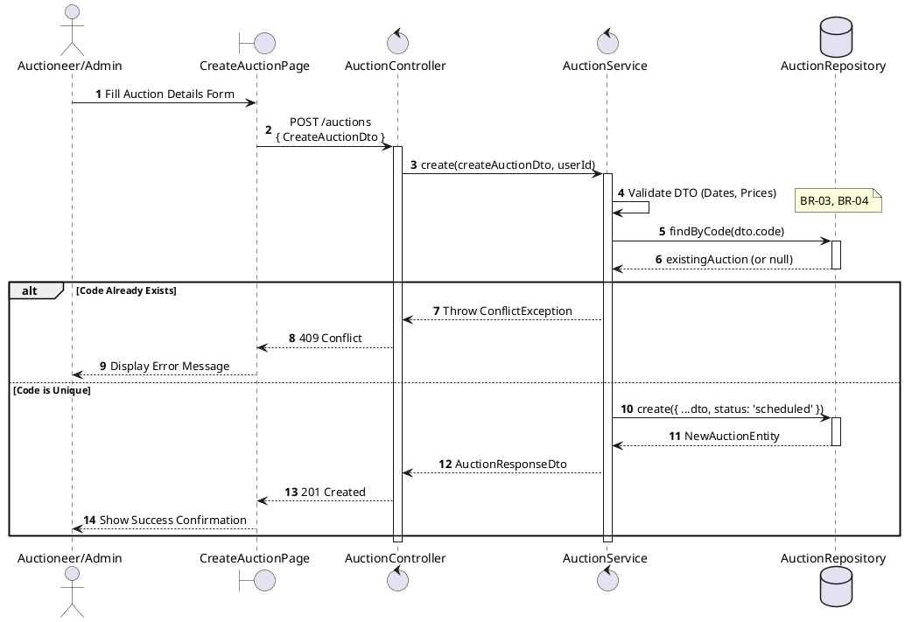
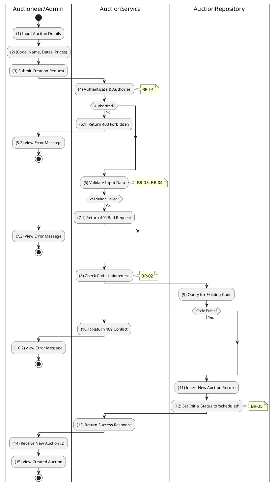

# 3.3.3 Create Auction

## 1. Use Case Description

| Field              | Description                                                                                                           |
| ------------------ | --------------------------------------------------------------------------------------------------------------------- |
| **Name**           | Create Auction                                                                                                        |
| **Description**    | This use case allows the Auctioneer/Admin to create a new Auction information in the system.                          |
| **Actor**          | Auctioneer/Admin                                                                                                      |
| **Trigger**        | When the Auctioneer/Admin clicks on the 'Create Auction' button on the CreateAuctionPage.                             |
| **Pre-condition**  | • Auctioneer/Admin's device must be connected to the internet. • Auctioneer/Admin is signed in with their account. |
| **Post-condition** | The Auction information will be stored into the system and display new record on AuctionListPage datagrid.            |

## 2. Sequence Flow (MVC)

## 3. Activities Flow (Swimlanes)

## 4. Business Rules

| Activity | BR Code   | Description                                                                                                                                                                                                                                                                                                                                                                       |
| :------- | :-------- | :-------------------------------------------------------------------------------------------------------------------------------------------------------------------------------------------------------------------------------------------------------------------------------------------------------------------------------------------------------------------------------- |
| **(1)**  | **BR-01** | **Displaying Rule:** The system displays a 'CreateAuctionPage' screen. (Refer to 'CreateAuctionPage' view in 'View Description' file). The form contains input fields for: code, name, description, dates (saleStart, saleEnd, auctionStart, auctionEnd), pricing (startingPrice, bidIncrement, depositAmount).                                                             |
| **(2)**  | **BR-02** | **Validation Rule (Front-end):** When user enters information, system uses `Text_change()` method. Checks if input is valid (empty, wrong format). If `isEmpty()` on mandatory fields → display **MSG 1** (Mandatory). If dates invalid (saleStartAt >= saleEndAt) → display **MSG 4** (Invalid timeline). If prices negative → display **MSG 4** (Invalid price). |
| **(3)**  | **BR-03** | **Validation Rule (Back-end/Save):** When user clicks 'Create Auction' button, send data to database via function `create(createAuctionDto)`. Check table `AUCTION` for code uniqueness constraint. If code exists → show **MSG 12** (Duplicate code), return 409 Conflict.                                                                                              |
| **(12)** | **BR-04** | **Storing Rule:** The input data will be checked by table `AUCTION` in the database (Refer to 'AUCTION' table in 'DB Sheet' file) to check if there are any constraints. Else data of the Auction will be stored as a new record in table `AUCTION`. Set status = 'scheduled' (or 'draft'). Show **MSG 7** (Success), close view, update auction list with new entry.    |
