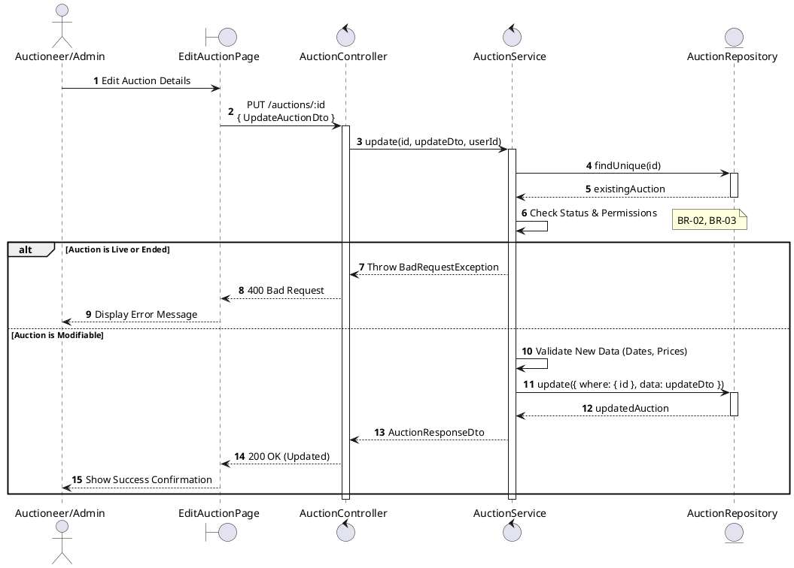
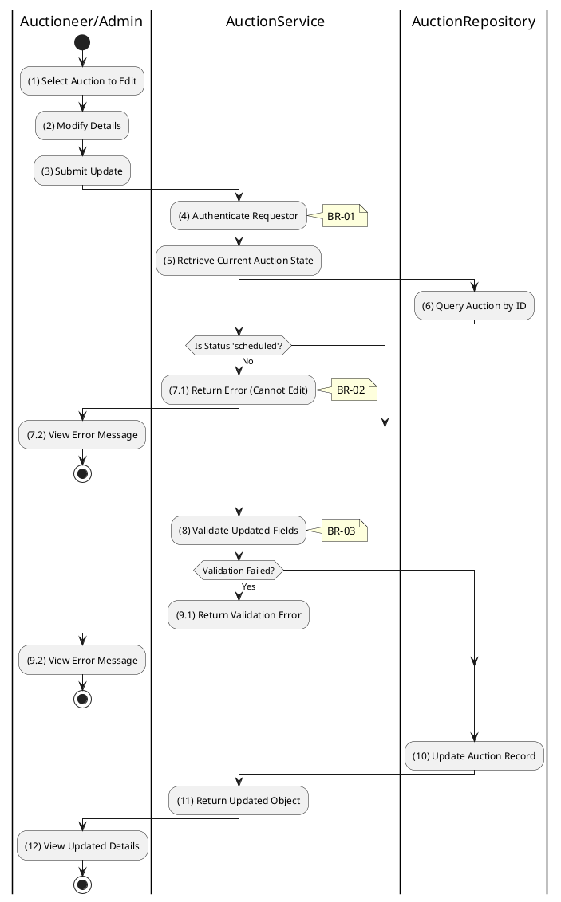

# 3.3.4 Update Auction

## 1. Use Case Description

| Field              | Description                                                                                                           |
| ------------------ | --------------------------------------------------------------------------------------------------------------------- |
| **Name**           | Update Auction                                                                                                        |
| **Description**    | This use case allows the Auctioneer/Admin to update existing Auction information in the system.                       |
| **Actor**          | Auctioneer/Admin                                                                                                      |
| **Trigger**        | When the Auctioneer/Admin clicks on the [Icon Edit] button on the right of each item on the AuctionListPage datagrid. |
| **Pre-condition**  | • Auctioneer/Admin's device must be connected to the internet.<br>• Auctioneer/Admin is signed in with their account. |
| **Post-condition** | The Auction information will be updated in the system and display new record on AuctionListPage datagrid.             |

## 2. Sequence Flow (MVC)



## 3. Activities Flow (Swimlanes)



## 4. Business Rules

| Activity  | BR Code   | Description                                                                                                                                                                                                                                                                                                                                                                                                                                                                                                                                                                                                                                                                                                                                                                                                                                      | 
| :-------- | :-------- | :------------------------------------------------------------------------------------------------------------------------------------------------------------------------------------------------------------------------------------------------------------------------------------------------------------------------------------------------------------------------------------------------------------------------------------------------------------------------------------------------------------------------------------------------------------------------------------------------------------------------------------------------------------------------------------------------------------------------------------------------------------------------------------------------------------------------------------------------------------------------------ |
| **(1)**   | **BR-01** | **Displaying Rules:**<br>❖ The system displays an “EditAuctionPage” screen. (Refer to “EditAuctionPage” view in “View Description” file).<br>❖ The screen is populated with the current auction data.                                                                                                                                                                                                                                                                                                                                                                                                                                                                                                                                                                                                                                                                   |
| **(2)**   | **BR-02** | **Validation Rules (Front-end):**<br>❖ When the user modifies information, the system performs `ValidateInput(UpdateAuctionDto)` validation, similar to the creation rules.<br>❖ If the input is not valid:<br>⮚ If mandatory fields are empty, the system displays **MSG 1** (Mandatory Field).<br>⮚ If dates are invalid (e.g., [saleStartAt] >= [saleEndAt]), the system displays **MSG 4** (Invalid Timeline).<br>⮚ If prices are negative, the system displays **MSG 4** (Negative Price).                                                                                                                                                                                                                                                                                                                                                                                                                        |
| **(7.1)** | **BR-03** | **State Locking Rules (Back-end):**<br>❖ The system calls `AuctionService.update()` and checks the auction’s [status] in the “AUCTION” table.<br>❖ If the input is not valid:<br>⮚ If the [status] is not 'scheduled' or 'draft' (e.g., 'live', 'ended'), the system returns a 400 Bad Request.<br>⮚ The system displays **MSG 13** (Cannot edit active auction) to the user.                                                                                                                                                                                                                                                                                                                                                                                                                                                                                    |
| **(3)**   | **BR-04** | **Storing Rules (Back-end):**<br>❖ When the user clicks “Save Changes”, the system calls `AuctionService.update(id, updateAuctionDto)` to update the record in the “AUCTION” table where the [id] matches.<br>❖ The `updatedAt` timestamp is set to the current time.<br>❖ System moves to step (12) and displays successful notification (Refer to **MSG 7**).                                                                                                                                                                                                                                                                                                                                                                                                                                                                                                              |

```

```
