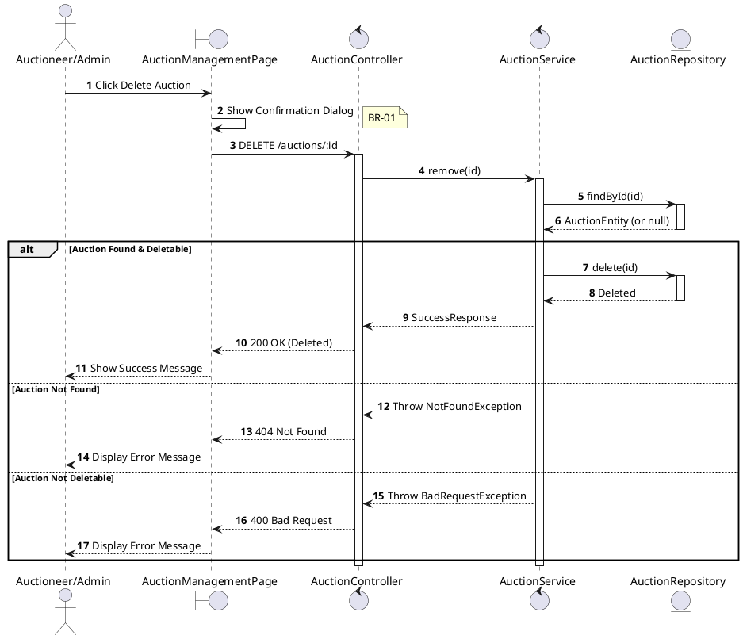
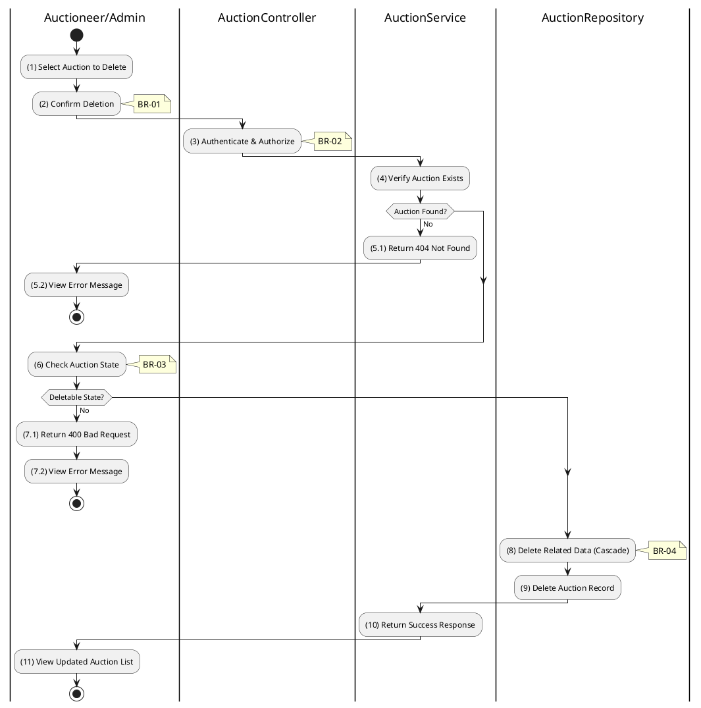

# 3.3.5 Delete Auction

## 1. Use Case Description

| Field              | Description                                                                                                                                                                         |
| ------------------ | ----------------------------------------------------------------------------------------------------------------------------------------------------------------------------------- |
| **Name**           | Delete Auction                                                                                                                                                                      |
| **Description**    | This use case allows the Auctioneer/Admin to delete an existing Auction from the system.                                                                                            |
| **Actor**          | Auctioneer, Admin                                                                                                                                                                   |
| **Trigger**        | When the Auctioneer/Admin clicks on the 'Delete Auction' button and confirms deletion.                                                                                              |
| **Pre-condition**  | • Auctioneer/Admin's device must be connected to the internet. • Auctioneer/Admin is signed in with their account. • Auction exists and is in appropriate state for deletion. |
| **Post-condition** | The Auction and its related data are removed from the system.                                                                                                                       |

## 2. Sequence Flow (MVC)

## 3. Activities Flow (Swimlanes)

## 4. Business Rules

| Activity | BR Code   | Description                                                                                                                                                                                                    |
| :------- | :-------- | :------------------------------------------------------------------------------------------------------------------------------------------------------------------------------------------------------------- |
| **(1)**  | **BR-01** | **Validation Rule (Confirmation - Front-end):** System displays MSG 11 ("Are you sure you want to delete this auction? This action cannot be undone."). System waits for confirmation before proceeding. |
| **(3)**  | **BR-02** | **Validation Rule (Authorization - Back-end):** System checks if requestor role is `auctioneer`, `admin`, or `super_admin`. If unauthorized: $\rightarrow$ System displays MSG 5 ("Forbidden").       |
| **(6)**  | **BR-03** | **Validation Rule (State Check):** System checks auction status: - `scheduled`: Can be deleted - `live`, `awaiting_result`, `success`, `failed`: Cannot be deleted (has active/completed bids).       |
| **(8)**  | **BR-04** | **Processing Rule (Cascade Delete):** System deletes related data via CASCADE: - `AUCTION_PARTICIPANT` records - `AUCTION_BID` records - `AUCTION_COST` records - `AUCTION_AUDIT_LOG` records.  |
| **(11)** | **BR-05** | **Displaying Rule (Success Confirmation):** System displays MSG 7 ("Auction deleted successfully") on the View. System refreshes auction list to remove deleted entry.                                   |
