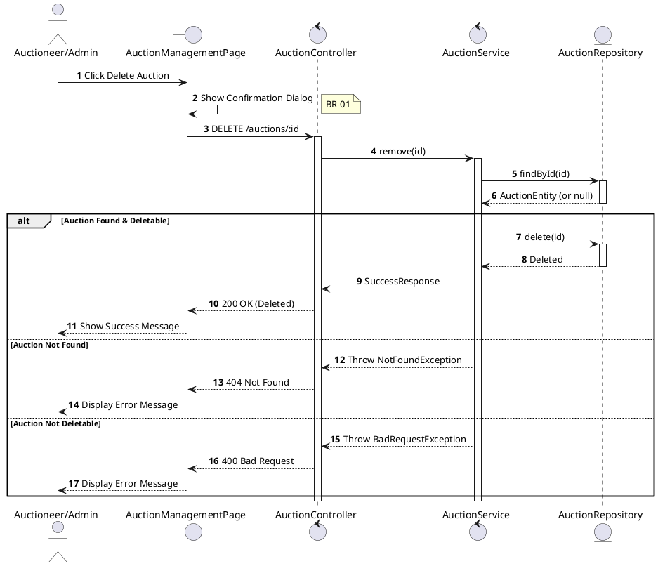
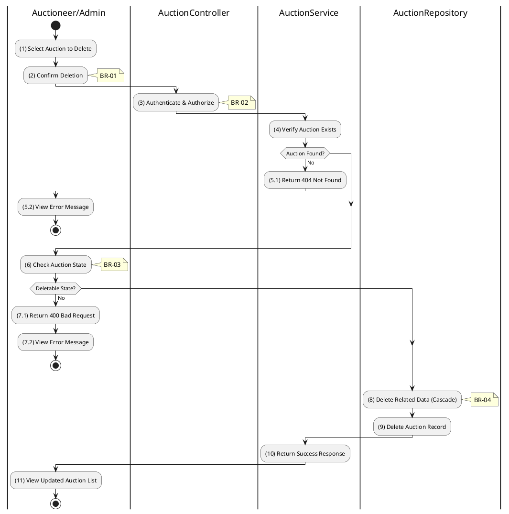

# 3.3.5 Delete Auction

## 1. Use Case Description

| Field              | Description                                                                                                                                                                         |
| ------------------ | ----------------------------------------------------------------------------------------------------------------------------------------------------------------------------------- |
| **Name**           | Delete Auction                                                                                                                                                                      |
| **Description**    | This use case allows the Auctioneer/Admin to delete an existing Auction from the system.                                                                                            |
| **Actor**          | Auctioneer, Admin                                                                                                                                                                   |
| **Trigger**        | When the Auctioneer/Admin clicks on the 'Delete Auction' button and confirms deletion.                                                                                              |
| **Pre-condition**  | • Auctioneer/Admin's device must be connected to the internet. • Auctioneer/Admin is signed in with their account. • Auction exists and is in appropriate state for deletion. |
| **Post-condition** | The Auction and its related data are removed from the system.                                                                                                                       |

## 2. Sequence Flow (MVC)

## 3. Activities Flow (Swimlanes)

## 4. Business Rules

| Activity | BR Code   | Description                                                                                                                                                                                                                                                                                                                                                                                                                                                                                                                                                                                                                                                                                                                                                                                                                                                                     |
| :------- | :-------- | :------------------------------------------------------------------------------------------------------------------------------------------------------------------------------------------------------------------------------------------------------------------------------------------------------------------------------------------------------------------------------------------------------------------------------------------------------------------------------------------------------------------------------------------------------------------------------------------------------------------------------------------------------------------------------------------------------------------------------------------------------------------------------------------------------------------------------------------------------------------------------ |
| **(1)**  | **BR-01** | **Displaying Rules (Confirmation):** ❖ The system displays a confirmation modal, `Display_Modal('ConfirmationBox')`. (Refer to “ConfirmationBox” view in “View Description” file). ❖ It presents **MSG 11** ("Delete auction? Action cannot be undone.") to the Admin. ❖ The system awaits Admin confirmation before proceeding with the irreversible deletion.                                                                                                                                                                                                                                                                                                                                                                                                                                                                                       |
| **(3)**  | **BR-02** | **Authorization Rules (Back-end):** ❖ The system checks the authenticated user's role via `AuctionService.remove()` to ensure they have the necessary permissions. ❖ If the input is not valid: ⮚ If the user's role is not 'auctioneer', 'admin', or 'super_admin', the system returns a 403 Forbidden status.                                                                                                                                                                                                                                                                                                                                                                                                                                                                                                                                                  |
| **(6)**  | **BR-03** | **State Locking Rules (Back-end):** ❖ The system verifies the auction’s status by checking the [status] field in the “AUCTION” table. ❖ If the input is not valid: ⮚ If the [status] is not 'scheduled', the system returns a 400 Bad Request. ⮚ The system displays a message indicating that active or ended auctions cannot be deleted.                                                                                                                                                                                                                                                                                                                                                                                                                                                                                                      |
| **(8)**  | **BR-04** | **Processing Rules (Cascade Delete):** ❖ The system relies on database cascade rules. ❖ Upon deletion of the main auction record, related entries in tables such as “AUCTION_PARTICIPANT”, “AUCTION_BID”, and “AUCTION_COST” are automatically removed via foreign key constraints. ❖ This ensures data integrity and prevents orphaned records.                                                                                                                                                                                                                                                                                                                                                                                                                                                                                                                |
| **(11)** | **BR-05** | **Storing Rules (Back-end):** ❖ The system removes the record from the “AUCTION” table by calling `AuctionService.remove(id)`. ❖ This is a hard delete, permanently removing the record. ❖ System moves to step (11) and displays successful notification (Refer to **MSG 7**).                                                                                                                                                                                                                                                                                                                                                                                                                                                                                                                                                                  |