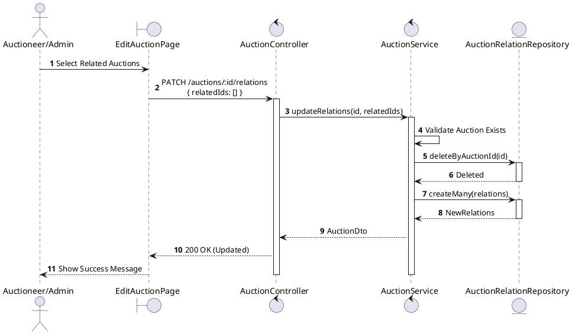
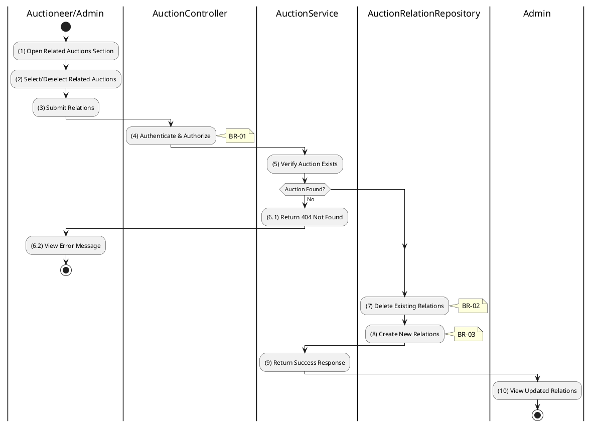

# 3.3.6 Update Auction Relations

## 1. Use Case Description

| Field              | Description                                                                                                                                |
| ------------------ | ------------------------------------------------------------------------------------------------------------------------------------------ |
| **Name**           | Update Auction Relations                                                                                                                   |
| **Description**    | This use case allows the Auctioneer/Admin to update related auctions for a specific auction.                                               |
| **Actor**          | Auctioneer, Admin                                                                                                                          |
| **Trigger**        | When the Auctioneer/Admin submits related auction updates via `PATCH /auctions/:id/relations`.                                             |
| **Pre-condition**  | • Auctioneer/Admin's device must be connected to the internet. • Auctioneer/Admin is signed in with their account. • Auction exists. |
| **Post-condition** | The auction's relations are updated in the database.                                                                                       |

## 2. Sequence Flow (MVC)

## 3. Activities Flow (Swimlanes)

## 4. Business Rules

| Activity | BR Code   | Description                                                                                                                                                                                                                                                                                                                                                                                                                                                                                                                                                                                                                                                                                                                                                                                                                                                                     |
| :------- | :-------- | :------------------------------------------------------------------------------------------------------------------------------------------------------------------------------------------------------------------------------------------------------------------------------------------------------------------------------------------------------------------------------------------------------------------------------------------------------------------------------------------------------------------------------------------------------------------------------------------------------------------------------------------------------------------------------------------------------------------------------------------------------------------------------------------------------------------------------------------------------------------------------ |
| **(1)**  | **BR-01** | **Displaying Rules (Relations Section):** ❖ The system renders a “UpdateRelationsModal” via `Display_Modal()` to allow editing of related auctions. ❖ It displays a multi-select list of all auctions (excluding the current one). ❖ Any currently related auctions are pre-selected in the list.                                                                                                                                                                                                                                                                                                                                                                                                                                                                                                                                                                              |
| **(4)**  | **BR-02** | **Authorization Rules (Back-end):** ❖ The system checks the authenticated user's role via `AuctionService.updateRelations()` to ensure they have the necessary permissions. ❖ If the input is not valid: ⮚ If the user's role is not 'auctioneer', 'admin', or 'super_admin', the system returns a 403 Forbidden status.                                                                                                                                                                                                                                                                                                                                                                                                                                                                                                                                                  |
| **(7)**  | **BR-03** | **Processing Rules (Replace Strategy):** ❖ The system employs a “replace strategy” for managing auction relations. ❖ It first deletes all existing records from the “AUCTION_RELATION” table associated with the `auctionId` by calling `AuctionRelationRepository.deleteByAuctionId(id)`. ❖ Then, it proceeds to create new relation entries based on the provided list of related auction IDs.                                                                                                                                                                                                                                                                                                                                                                                                                                                                          |
| **(8)**  | **BR-04** | **Storing Rules (Back-end):** ❖ For each [relatedId] in the submitted list, the system inserts a new record into the “AUCTION_RELATION” table. ❖ It specifies the `auctionId` (current auction) and `relatedAuctionId`. ❖ The system supports bidirectional linking for related auctions. ❖ System moves to step (10) and displays successful notification (Refer to **MSG 7**).                                                                                                                                                                                                                                                                                                                                                                                                                                                                                     |
| **(10)** | **BR-05** | **Displaying Rules (Success Confirmation):** ❖ The system refreshes the related auctions section on the page by calling `Refresh_Component('RelatedAuctions')`. ❖ A success toast notification confirms that the relations have been updated.                                                                                                                                                                                                                                                                                                                                                                                                                                                                                                                                                                                                        |