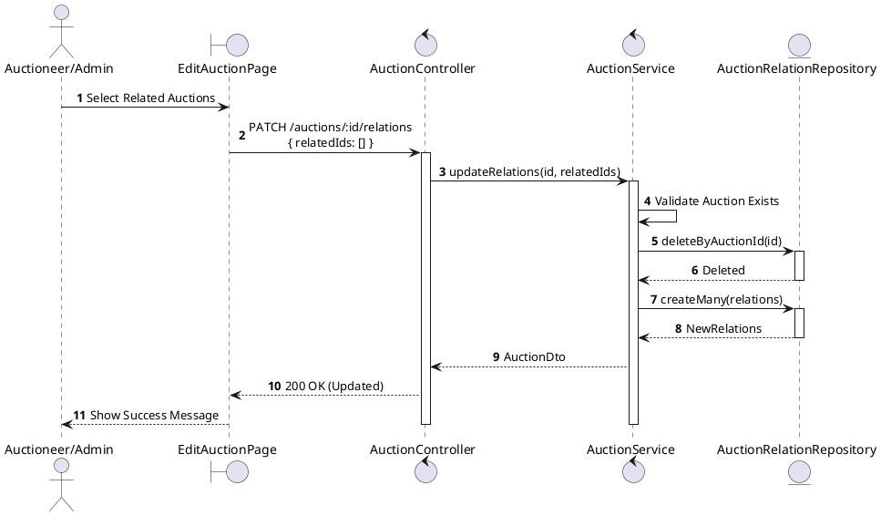
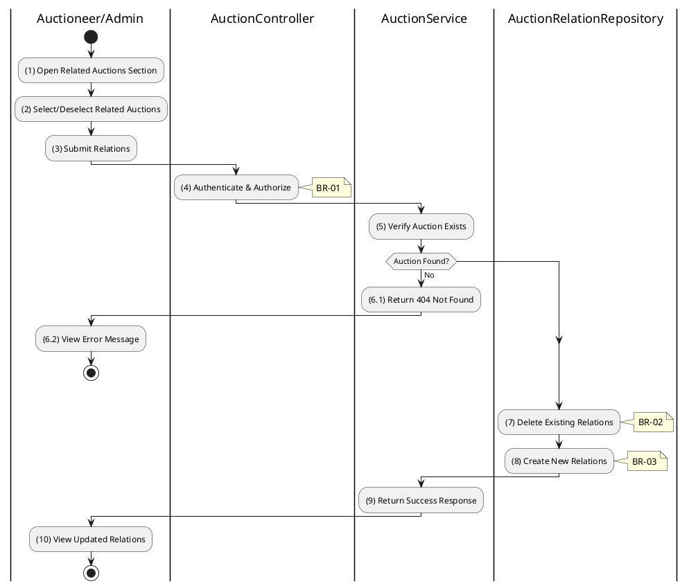

# 3.3.6 Update Auction Relations

## 1. Use Case Description

| Field              | Description                                                                                                                                |
| ------------------ | ------------------------------------------------------------------------------------------------------------------------------------------ |
| **Name**           | Update Auction Relations                                                                                                                   |
| **Description**    | This use case allows the Auctioneer/Admin to update related auctions for a specific auction.                                               |
| **Actor**          | Auctioneer, Admin                                                                                                                          |
| **Trigger**        | When the Auctioneer/Admin submits related auction updates via `PATCH /auctions/:id/relations`.                                             |
| **Pre-condition**  | • Auctioneer/Admin's device must be connected to the internet. • Auctioneer/Admin is signed in with their account. • Auction exists. |
| **Post-condition** | The auction's relations are updated in the database.                                                                                       |

## 2. Sequence Flow (MVC)

## 3. Activities Flow (Swimlanes)

## 4. Business Rules

| Activity | BR Code   | Description                                                                                                                                                                                              |
| :------- | :-------- | :------------------------------------------------------------------------------------------------------------------------------------------------------------------------------------------------------- |
| **(1)**  | **BR-01** | **Displaying Rule (Relations Section):** System displays searchable/selectable list of other auctions. Currently related auctions are pre-selected. User can select/deselect auctions.          |
| **(4)**  | **BR-02** | **Validation Rule (Authorization - Back-end):** System checks if requestor role is `auctioneer`, `admin`, or `super_admin`. If unauthorized: $\rightarrow$ System displays MSG 5 ("Forbidden"). |
| **(7)**  | **BR-03** | **Processing Rule (Replace Strategy):** System uses replace strategy for relations. Deletes all existing relations for the auction. Creates new relations from provided IDs.                    |
| **(8)**  | **BR-04** | **Storing Rule:** System saves to `AUCTION_RELATION` table: - `auctionId = [current auction]` - `relatedAuctionId = [each selected auction]` Supports bidirectional linking.                 |
| **(10)** | **BR-05** | **Displaying Rule (Success Confirmation):** System displays MSG 7 ("Relations updated successfully") on the View. System refreshes related auctions section.                                       |
