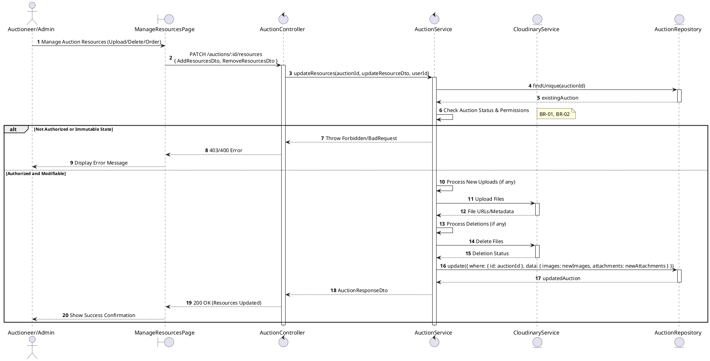
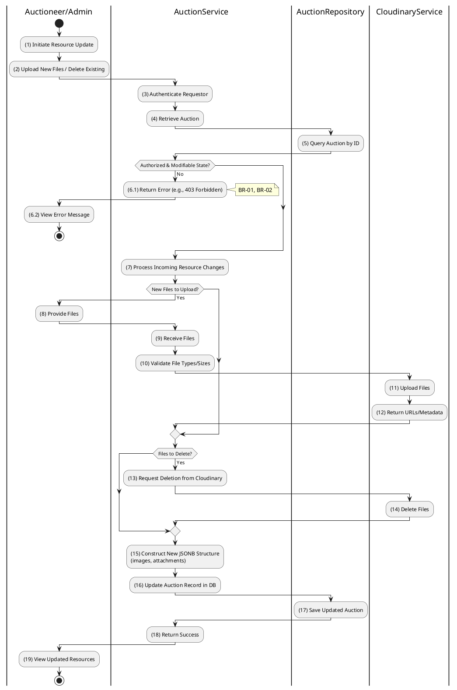

# 3.3.5 Update Auction Resources

## 1. Use Case Description

| Field              | Description                                                                                                               |
| ------------------ | ------------------------------------------------------------------------------------------------------------------------- |
| **Name**           | Update Auction Resources                                                                                                  |
| **Description**    | This use case allows the Auctioneer/Admin to update existing Auction Resource information in the system.                  |
| **Actor**          | Auctioneer/Admin                                                                                                          |
| **Trigger**        | When the Auctioneer/Admin clicks on the [Icon Edit] button on the right of each item on the ManageResourcesPage datagrid. |
| **Pre-condition**  | • Auctioneer/Admin's device must be connected to the internet. • Auctioneer/Admin is signed in with their account.     |
| **Post-condition** | The Auction Resource information will be updated in the system and display new record on ManageResourcesPage datagrid.    |

## 2. Sequence Flow (MVC)

## 3. Activities Flow (Swimlanes)

## 4. Business Rules

| Activity  | BR Code   | Description                                                                                                                                                                                                                                                                                                                                                                                                                                                                                                                                                                                                                                                                                                                                                                                                                                      |
| :-------- | :-------- | :------------------------------------------------------------------------------------------------------------------------------------------------------------------------------------------------------------------------------------------------------------------------------------------------------------------------------------------------------------------------------ |
| **(1)**   | **BR-01** | **Displaying Rules:** ❖ The system renders a “ManageResourcesPage” via `Display_View(auction)` to manage auction-related files. ❖ It displays lists of both [Images] (with thumbnails and names) and [Attachments]. ❖ The interface includes dedicated buttons for [Upload] and [Delete] resources.                                                                                                                                                                                                                                                                                                                                                                    |
| **(2)**   | **BR-02** | **Validation Rules (Front-end):** ❖ When the Admin/Auctioneer uploads files, the system validates the file characteristics via `ValidateFile(File)`. ❖ If the input is not valid: ⮚ If the [FileType] is not JPG, PNG, or PDF, the system displays **MSG 4** (Invalid Type). ⮚ If the [FileSize] exceeds 5MB, the system displays **MSG 4** (File too large).                                                                                                                                                                                                                                                                                                                                    |
| **(6.1)** | **BR-03** | **State Locking Rules (Back-end):** ❖ The system calls `AuctionService.updateResources()` and checks the auction’s [status]. ❖ If the input is not valid: ⮚ If the [status] is 'live' or 'finalized', the system returns a 400 Bad Request. ⮚ The system displays **MSG 13** (Cannot modify resources) to the user.                                                                                                                                                                                                                                                                                                                         |
| **(10)**  | **BR-04** | **Processing Rules (Cloud Upload):** ❖ The system initiates file uploads by calling `CloudinaryService.upload()` for any new files. ❖ Upon successful upload, Cloudinary returns a secure URL and a Public ID for each file.                                                                                                                                                                                                                                                                                                                                                                                                                                          |
| **(16)**  | **BR-05** | **Storing Rules (Back-end):** ❖ When changes are confirmed, the system calls `AuctionService.updateResources(id, dto)` to update the “AUCTION” table. ❖ It updates the [images] and [attachments] JSONB fields with the new array structures. ❖ If the cloud operation or database update fails, the system displays **MSG 9** (System Error). ❖ System moves to step (19) and displays successful notification (Refer to **MSG 7**).                                                                                                                                                                                                                                                                                                                                                                                                                   |

