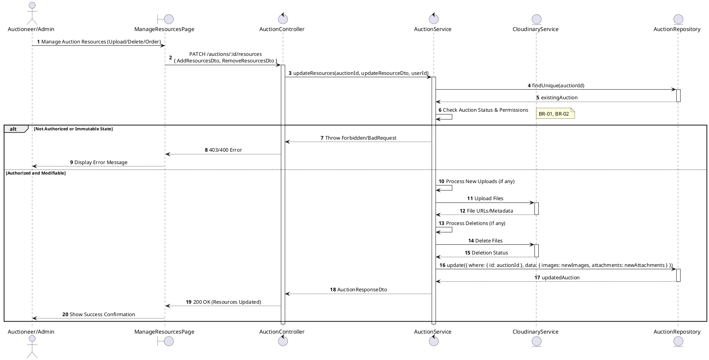
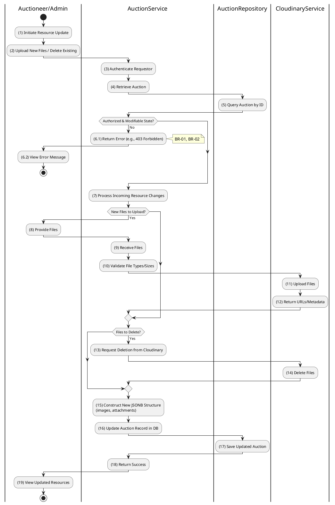

# 3.3.5 Update Auction Resources

## 1. Use Case Description

| Field              | Description                                                                                                               |
| ------------------ | ------------------------------------------------------------------------------------------------------------------------- |
| **Name**           | Update Auction Resources                                                                                                  |
| **Description**    | This use case allows the Auctioneer/Admin to update existing Auction Resource information in the system.                  |
| **Actor**          | Auctioneer/Admin                                                                                                          |
| **Trigger**        | When the Auctioneer/Admin clicks on the [Icon Edit] button on the right of each item on the ManageResourcesPage datagrid. |
| **Pre-condition**  | • Auctioneer/Admin's device must be connected to the internet. • Auctioneer/Admin is signed in with their account.     |
| **Post-condition** | The Auction Resource information will be updated in the system and display new record on ManageResourcesPage datagrid.    |

## 2. Sequence Flow (MVC)

## 3. Activities Flow (Swimlanes)

## 4. Business Rules

| Activity  | BR Code   | Description                                                                                                                                                                                                                                                                                                                                                                     |
| :-------- | :-------- | :------------------------------------------------------------------------------------------------------------------------------------------------------------------------------------------------------------------------------------------------------------------------------------------------------------------------------------------------------------------------------ |
| **(1)**   | **BR-01** | **Querying Rule:** System queries data in the table 'AUCTION' in the database (Refer to 'AUCTION' table in 'DB Sheet' file) based on the selected auction ID. Call method `displayAuctionResources(images, attachments)` to populate resource management view.                                                                                                            |
| **(2)**   | **BR-02** | **Displaying Rule:** The system displays a 'ManageResourcesPage' screen. (Refer to 'ManageResourcesPage' view in 'View Description' file). Screen is populated with current images and attachments, with options to upload/delete/reorder.                                                                                                                                |
| **(6.1)** | **BR-03** | **Validation Rule (State Locking):** System checks auction status before allowing resource changes. If status is 'live' or 'finalized' → display **MSG 13** (Cannot modify resources), return 400.                                                                                                                                                                        |
| **(10)**  | **BR-04** | **Validation Rule (Front-end - File Constraints):** When user uploads files, system validates file types (JPG, PNG, PDF) and size limits (max 5MB). If invalid file type → display **MSG 4** (Invalid file format). If file too large → display **MSG 4** (File size exceeded).                                                                                        |
| **(16)**  | **BR-05** | **Validation Rule (Back-end/Save):** When user clicks 'Save' button, send data via function `updateResources(auctionId, resourceDto)`. Upload new files to Cloudinary, delete removed files. Update `images` and `attachments` JSONB fields in table `AUCTION`. If success → show **MSG 7**, update view. If cloud operation fails → show **MSG 9** (System Error). |
