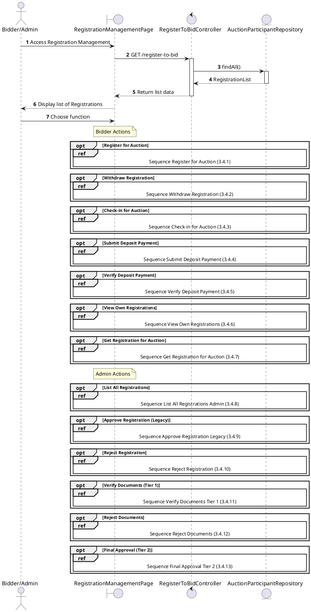
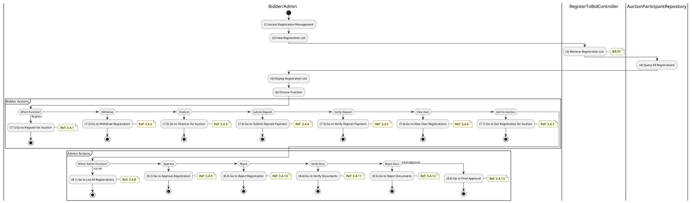

# Use Case 3.4.0: Manage Registration to Bid

## 1. Use Case Description

| Field              | Content                                                                                                                                                     |
| :----------------- | :---------------------------------------------------------------------------------------------------------------------------------------------------------- |
| **Name**           | Manage Registration to Bid                                                                                                                                  |
| **Description**    | This use case allows the **Bidder/Admin** to choose one of the corresponding functions of CRUD to adjust **Registration to Bid** information in the system. |
| **Actor**          | **Bidder**, **Admin**, **Auctioneer**                                                                                                                       |
| **Trigger**        | When the **Bidder/Admin** clicks on the "**Registration to Bid**" button on the navigation sidebar.                                                         |
| **Pre-condition**  | 1. **Bidder/Admin**'s device must be connected to the internet. 2. **Bidder/Admin** is signed in with their account.                                     |
| **Post-condition** | The **Registration to Bid** information is updated to the corresponding function that the **Bidder/Admin** executes.                                        |

---

## 2. Sequence Flow

---

## 3. Activities Flow (Swimlanes)

---

## 4. Business Rules

| Activity | BR Code   | Description                                                                                                                                                                 |
| :------- | :-------- | :-------------------------------------------------------------------------------------------------------------------------------------------------------------------------- |
| **(5)**  | **BR-01** | **Displaying Rule:** The system displays a "**Registration to Bid Management**" screen. (Refer to "**Registration to Bid Management**" view in "View Description" file). |
| **(6)**  | **BR-02** | **Choosing Rule:** **Bidder/Admin** can only choose one feature at a time to use.                                                                                        |

---

## 5. Related Child Use Cases

### Bidder Actions

| Use Case ID | Use Case Name                | Description                                      |
| :---------- | :--------------------------- | :----------------------------------------------- |
| 3.4.1       | Register for Auction         | Submit registration to participate in an auction |
| 3.4.2       | Withdraw Registration        | Cancel a pending registration                    |
| 3.4.3       | Check-in for Auction         | Check-in before auction starts                   |
| 3.4.4       | Submit Deposit Payment       | Submit deposit payment for registration          |
| 3.4.5       | Verify Deposit Payment       | Verify the deposit payment transaction           |
| 3.4.6       | View Own Registrations       | View all registrations made by the bidder        |
| 3.4.7       | Get Registration for Auction | Get specific registration for an auction         |

### Admin Actions

| Use Case ID | Use Case Name          | Description                                  |
| :---------- | :--------------------- | :------------------------------------------- |
| 3.4.8       | List All Registrations | View all registrations in the system         |
| 3.4.9       | Approve Registration   | Approve a bidder's registration (Legacy)     |
| 3.4.10      | Reject Registration    | Reject a bidder's registration               |
| 3.4.11      | Verify Documents       | Verify submitted documents (Tier 1 approval) |
| 3.4.12      | Reject Documents       | Reject submitted documents                   |
| 3.4.13      | Final Approval         | Grant final approval after deposit (Tier 2)  |
