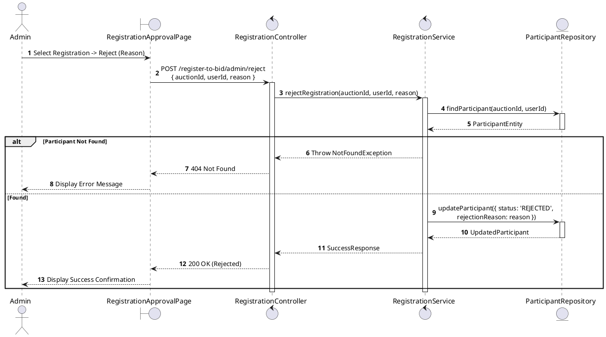
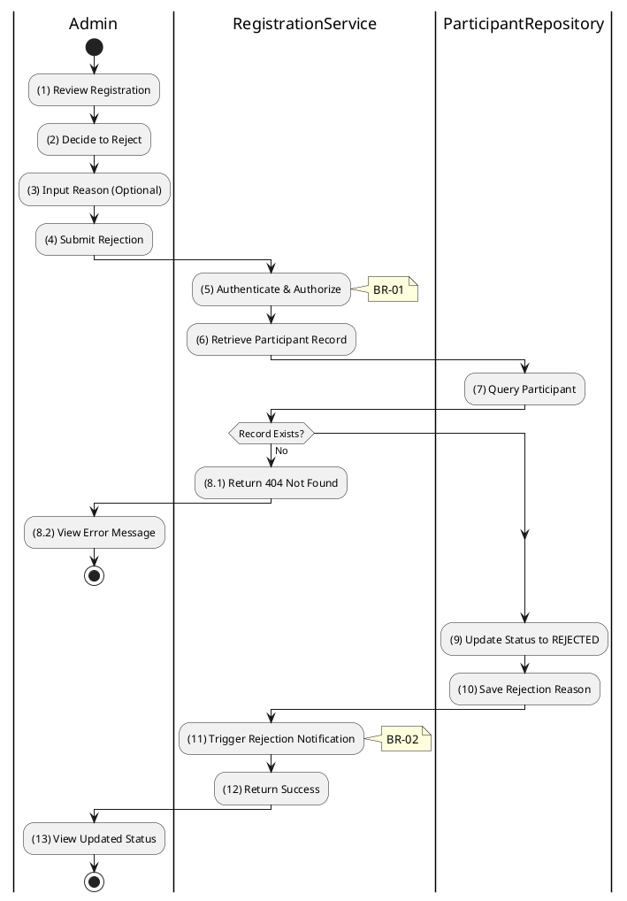

# 3.4.10 Reject Registration

## 1. Use Case Description

| Field              | Description                                                                                                             |
| ------------------ | ----------------------------------------------------------------------------------------------------------------------- |
| **Name**           | Reject Registration                                                                                                     |
| **Description**    | This use case allows the Admin to update existing Registration information in the system.                               |
| **Actor**          | Admin                                                                                                                   |
| **Trigger**        | When the Admin clicks on the 'Reject' button on the RegistrationApprovalPage.                                           |
| **Pre-condition**  | • Admin's device must be connected to the internet. • Admin is signed in with their account.                         |
| **Post-condition** | The Registration information will be updated in the system and display new record on RegistrationApprovalPage datagrid. |

## 2. Sequence Flow (MVC)

## 3. Activities Flow (Swimlanes)

## 4. Business Rules

| Activity      | BR Code   | Description                                                                                                                                                                                                                                                                                                                             |
| :------------ | :-------- | :-------------------------------------------------------------------------------------------------------------------------------------------------------------------------------------------------------------------------------------------------------------------------------------------------------------------------------------- |
| **(1)**       | **BR-01** | **Displaying Rule (Registration Approval Page):** When Admin reviews a registration, system displays `RegistrationApprovalPage`. System displays registration details, bidder info, and submitted documents. System displays "Reject" button with reason input field.                                                          |
| **(2)-(4)**   | **BR-02** | **Validation Rule (Input - Front-end):** When Admin enters rejection reason, system uses `Text_change()` method. System enables "Submit Rejection" button when reason is provided. On submit, system displays MSG 11 ("Are you sure you want to reject this registration?").                                                   |
| **(5)**       | **BR-03** | **Validation Rule (Authorization - Back-end):** System checks if requestor role is `admin` or `auctioneer` in `USERS` table. If unauthorized: $\rightarrow$ System displays MSG 5 ("Forbidden") on the View.                                                                                                                   |
| **(7)-(8.1)** | **BR-04** | **Validation Rule (Record Existence - Back-end):** System retrieves data from the 'AUCTION_PARTICIPANT' table in the database (Refer to 'AUCTION_PARTICIPANT' table in 'DB Sheet' file) based on the auction ID and user ID. If record not found: $\rightarrow$ System displays MSG 20 ("Registration not found") on the View. |
| **(9)-(10)**  | **BR-05** | **Storing Rule:** System saves to `AUCTION_PARTICIPANT` table: - `status = 'REJECTED'` - `rejectionReason = [input reason]` - `rejectedAt = now()`                                                                                                                                                                          |
| **(11)**      | **BR-06** | **Processing Rule (Notification):** System triggers email notification to bidder with rejection reason. Notification explains why registration was denied.                                                                                                                                                                        |
| **(13)**      | **BR-07** | **Displaying Rule (Success Confirmation):** System displays MSG 7 ("Registration rejected successfully") on the View. System refreshes registration list showing updated `REJECTED` status.                                                                                                                                       |
